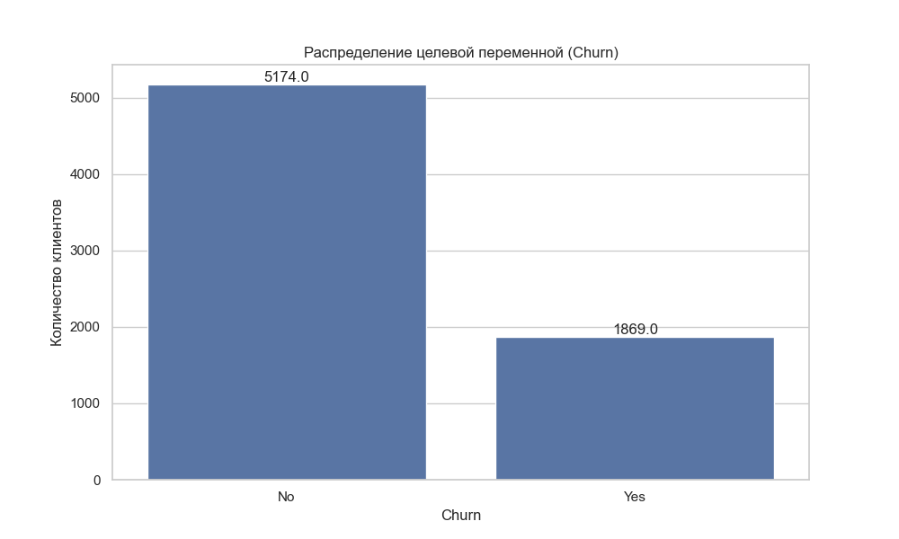

# 2.1. Обзор методов машинного обучения для прогнозирования оттока клиентов

Прогнозирование оттока клиентов является одной из ключевых задач в телекоммуникационной отрасли, где привлечение нового клиента может стоить в 5-10 раз дороже, чем удержание существующего. В данном разделе представлен обзор основных методов машинного обучения, применяемых для решения этой задачи, их сильные и слабые стороны, а также специфика применения в телекоммуникационной сфере.

## 2.1.1. Постановка задачи прогнозирования оттока как задачи бинарной классификации

Прогнозирование оттока клиентов математически формулируется как задача бинарной классификации, где:

- **Входные данные (X)**: Набор признаков, характеризующих клиента (демографические данные, информация о контракте, история использования услуг и т.д.)
- **Выходные данные (y)**: Бинарная метка класса, где 1 означает, что клиент уйдет (отток), 0 - клиент останется

Формально, задача состоит в построении функции $f: X \rightarrow \{0, 1\}$, которая максимально точно предсказывает вероятность оттока для каждого клиента на основе имеющихся данных.

Особенностями задачи прогнозирования оттока клиентов являются:

1. **Несбалансированность классов**: Обычно число уходящих клиентов (положительный класс) значительно меньше числа остающихся клиентов (отрицательный класс), что требует специальных методов обработки несбалансированных данных.

2. **Временная составляющая**: Поведение клиентов меняется со временем, что требует учета временной динамики и регулярного переобучения моделей.

3. **Интерпретируемость результатов**: Для бизнеса важно не только спрогнозировать отток, но и понять причины, по которым клиенты уходят, что накладывает требования к интерпретируемости моделей.

4. **Экономический аспект**: Разные ошибки классификации имеют различную стоимость (ложноположительные и ложноотрицательные прогнозы), что требует соответствующей настройки моделей.

*Рисунок 2.1.1 - Распределение классов в задаче прогнозирования оттока клиентов*

## 2.1.2. Классификация методов машинного обучения для прогнозирования оттока

Методы машинного обучения, применяемые для прогнозирования оттока клиентов, можно разделить на несколько категорий:

### Линейные модели

1. **Логистическая регрессия**:
   - *Принцип работы*: Моделирует вероятность принадлежности к определенному классу, используя логистическую функцию для преобразования линейной комбинации признаков в вероятность.
   - *Преимущества*: Высокая интерпретируемость, вычислительная эффективность, возможность получения вероятностных оценок.
   - *Недостатки*: Ограниченная способность моделировать нелинейные зависимости, чувствительность к мультиколлинеарности.
   - *Применимость к задаче оттока*: Хорошо подходит как базовая модель и для понимания ключевых факторов оттока.

### Модели на основе деревьев решений

1. **Дерево решений**:
   - *Принцип работы*: Строит иерархическую структуру правил "если-то", последовательно разделяя данные на подмножества на основе значений признаков.
   - *Преимущества*: Высокая интерпретируемость, способность работать с нелинейными зависимостями, нечувствительность к масштабированию данных.
   - *Недостатки*: Склонность к переобучению, нестабильность (высокая дисперсия).
   - *Применимость к задаче оттока*: Полезно для понимания сегментов клиентов с высоким риском оттока и визуализации решающих правил.

2. **Случайный лес (Random Forest)**:
   - *Принцип работы*: Ансамбль деревьев решений, где каждое дерево обучается на случайной подвыборке данных и признаков.
   - *Преимущества*: Высокая точность, устойчивость к переобучению, способность работать с большим числом признаков.
   - *Недостатки*: Меньшая интерпретируемость, вычислительная сложность, сложность настройки гиперпараметров.
   - *Применимость к задаче оттока*: Хорошо работает для получения точных прогнозов и выявления важности признаков.

3. **Градиентный бустинг (XGBoost, LightGBM, CatBoost)**:
   - *Принцип работы*: Последовательное построение ансамбля слабых моделей (обычно деревьев), где каждая новая модель компенсирует ошибки предыдущих.
   - *Преимущества*: Высокая точность, способность работать с разнородными данными, хорошие возможности для настройки.
   - *Недостатки*: Сложность настройки, вычислительная интенсивность, риск переобучения.
   - *Применимость к задаче оттока*: Обычно демонстрирует наилучшие результаты для задач прогнозирования оттока на табличных данных.

### Другие методы

1. **Метод опорных векторов (SVM)**:
   - *Принцип работы*: Находит оптимальную гиперплоскость, максимизирующую разделение между классами в пространстве признаков.
   - *Преимущества*: Эффективность в пространствах высокой размерности, возможность использования различных ядер для нелинейных задач.
   - *Недостатки*: Вычислительная сложность для больших наборов данных, сложность интерпретации.
   - *Применимость к задаче оттока*: Менее популярен для оттока из-за сложности интерпретации и настройки.

2. **Нейронные сети**:
   - *Принцип работы*: Многослойные нелинейные модели, имитирующие структуру нейронных связей в мозге.
   - *Преимущества*: Высокая гибкость и способность моделировать сложные зависимости, хорошая работа с большими объемами данных.
   - *Недостатки*: Низкая интерпретируемость, требовательность к объему данных, вычислительная сложность.
   - *Применимость к задаче оттока*: Подходит для сложных сценариев с большим количеством разнородных данных, особенно при наличии неструктурированных данных (тексты, аудио).

3. **Наивный байесовский классификатор**:
   - *Принцип работы*: Применяет теорему Байеса для расчета вероятности принадлежности к классу на основе условной независимости признаков.
   - *Преимущества*: Вычислительная эффективность, хорошая работа с высокоразмерными данными, простота реализации.
   - *Недостатки*: Предположение о независимости признаков часто нарушается на практике.
   - *Применимость к задаче оттока*: Ограниченное применение из-за предположения о независимости признаков.

## 2.1.3. Специфика применения машинного обучения в телекоммуникационной отрасли

Телекоммуникационная отрасль имеет ряд особенностей, которые необходимо учитывать при разработке моделей прогнозирования оттока клиентов:

1. **Разнородность данных**: Телеком-компании собирают различные типы данных о клиентах, включая:
   - Демографические данные (возраст, пол, местоположение)
   - Контрактная информация (тип контракта, срок, тарифный план)
   - Данные об использовании услуг (объем звонков, SMS, интернет-трафик)
   - Биллинговая информация (стоимость услуг, история платежей)
   - Данные о взаимодействии с клиентской поддержкой (обращения, жалобы)

2. **Временная динамика**: Поведение клиентов и рыночная среда быстро меняются, что требует:
   - Регулярного переобучения моделей
   - Анализа дрейфа данных
   - Учета сезонности и циклических паттернов

3. **Конкурентная среда**: Высокий уровень конкуренции влияет на отток клиентов:
   - Маркетинговые кампании конкурентов могут вызывать всплески оттока
   - Появление новых тарифных планов или технологий может изменить поведение клиентов
   - Доступная информация о конкурентных предложениях влияет на решения клиентов

4. **Регуляторные ограничения**: Телекоммуникационная отрасль строго регулируется, что накладывает ограничения на:
   - Использование персональных данных клиентов
   - Хранение и обработку данных
   - Применение автоматизированных методов принятия решений

## 2.1.4. Процесс разработки модели прогнозирования оттока

Типичный процесс разработки модели прогнозирования оттока клиентов включает следующие этапы:

1. **Сбор и подготовка данных**:
   - Извлечение данных из различных источников (CRM, биллинг, система обслуживания клиентов)
   - Очистка и предобработка данных (обработка пропущенных значений, выбросов)
   - Преобразование и кодирование категориальных признаков
   - Создание новых признаков на основе имеющихся данных (feature engineering)

2. **Исследовательский анализ данных**:
   - Анализ распределения признаков и целевой переменной
   - Выявление корреляций между признаками
   - Визуализация данных для лучшего понимания зависимостей
   - Определение ключевых факторов, влияющих на отток

3. **Выбор и обучение моделей**:
   - Выбор нескольких моделей-кандидатов с учетом особенностей задачи
   - Настройка гиперпараметров моделей (кросс-валидация, поиск по сетке)
   - Обучение моделей на тренировочной выборке
   - Учет несбалансированности классов (взвешивание классов, SMOTE и др.)

4. **Оценка и сравнение моделей**:
   - Использование подходящих метрик (AUC-ROC, точность, полнота, F1-мера)
   - Анализ кривых ROC и Precision-Recall
   - Оценка экономической эффективности моделей (стоимость ложных срабатываний)
   - Интерпретация результатов и важности признаков

5. **Внедрение и мониторинг**:
   - Интеграция модели в производственную среду
   - Разработка интерфейса для конечных пользователей (маркетологов, аналитиков)
   - Мониторинг производительности модели с течением времени
   - Регулярное переобучение модели для учета изменений в данных

## 2.1.5. Современные тенденции в прогнозировании оттока клиентов

Современные исследования и практические подходы к прогнозированию оттока клиентов включают следующие тенденции:

1. **Интегрированные подходы к моделированию**:
   - Объединение различных моделей в ансамбли для повышения точности
   - Сочетание статистических методов и машинного обучения
   - Гибридные подходы, объединяющие предметные знания и автоматическое обучение

2. **Учет временной динамики**:
   - Использование рекуррентных нейронных сетей (RNN, LSTM) для моделирования последовательных данных
   - Применение моделей выживаемости (survival analysis) для прогнозирования времени до оттока
   - Разработка моделей раннего предупреждения оттока

3. **Расширение источников данных**:
   - Интеграция данных из социальных сетей и внешних источников
   - Анализ текстовых данных (жалобы, отзывы, обращения в поддержку)
   - Учет данных о использовании мобильных приложений и веб-сервисов компании

4. **Объяснимый искусственный интеллект (XAI)**:
   - Применение методов интерпретации моделей (SHAP, LIME)
   - Разработка интерпретируемых моделей без потери точности
   - Визуализация решений модели для лучшего понимания бизнес-пользователями

5. **Персонализированные стратегии удержания**:
   - Сегментация клиентов на основе риска оттока и ценности для компании
   - Разработка персонализированных предложений для удержания
   - Оптимизация маркетинговых кампаний с учетом прогнозов оттока

## 2.1.6. Выводы

Прогнозирование оттока клиентов в телекоммуникационной отрасли является комплексной задачей, требующей применения различных методов машинного обучения и тщательного анализа данных. Ключевыми факторами успеха в этой задаче являются:

1. **Выбор подходящих методов**: Для телекоммуникационных данных наиболее эффективными обычно оказываются ансамблевые методы (случайный лес, градиентный бустинг), однако для интерпретации результатов полезно также использовать более простые модели, такие как логистическая регрессия.

2. **Правильная подготовка данных**: Особое внимание следует уделять обработке несбалансированных данных, созданию информативных признаков и учету временной динамики.

3. **Оценка эффективности моделей**: Необходимо использовать метрики, учитывающие бизнес-контекст и стоимость ошибок разного типа.

4. **Интерпретация результатов**: Для практического применения важно не только получить точные прогнозы, но и понять причины оттока для разработки эффективных стратегий удержания.

В следующих разделах будут более детально рассмотрены конкретные алгоритмы классификации, методы оценки и интерпретации моделей, которые применяются для решения задачи прогнозирования оттока клиентов телекоммуникационной компании. 