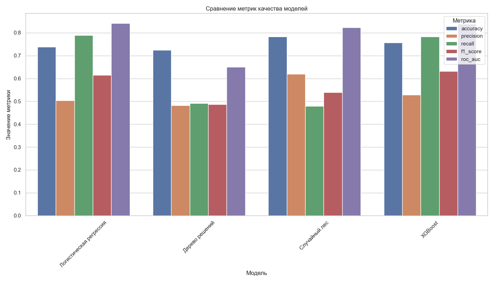

# 2.2. Алгоритмы классификации для прогнозирования оттока

В данном разделе рассматриваются основные алгоритмы классификации, которые наиболее эффективны при решении задачи прогнозирования оттока клиентов. Каждый алгоритм имеет свои особенности, преимущества и ограничения, что делает их более или менее подходящими для конкретных сценариев применения.

## 2.2.1. Линейные модели: логистическая регрессия

Логистическая регрессия — один из базовых и широко используемых алгоритмов для задач бинарной классификации, включая прогнозирование оттока клиентов. Несмотря на название "регрессия", этот метод применяется именно для задач классификации.

### Математическая формулировка

Логистическая регрессия моделирует вероятность принадлежности объекта к определенному классу с помощью логистической функции:

$$P(y=1|X) = \frac{1}{1 + e^{-(\beta_0 + \beta_1 x_1 + \beta_2 x_2 + ... + \beta_n x_n)}} = \frac{1}{1 + e^{-(\beta_0 + \mathbf{\beta} \cdot \mathbf{X})}}$$

где:
- $P(y=1|X)$ — вероятность того, что клиент уйдет (класс 1)
- $\beta_0$ — свободный член (bias)
- $\beta_1, \beta_2, ..., \beta_n$ — коэффициенты для каждого признака
- $x_1, x_2, ..., x_n$ — значения признаков клиента

Для определения оптимальных значений коэффициентов $\beta$ используется максимизация функции правдоподобия или минимизация функции потерь (обычно кросс-энтропии):

$$Loss = -\frac{1}{N} \sum_{i=1}^{N} [y_i \log(p_i) + (1-y_i) \log(1-p_i)]$$

где $N$ — количество наблюдений, $y_i$ — фактический класс, $p_i$ — предсказанная вероятность.

### Регуляризация

Для предотвращения переобучения в логистической регрессии применяются методы регуляризации:

- **L1-регуляризация (Lasso)**: добавляет штраф, пропорциональный абсолютной величине коэффициентов, способствует отбору признаков
- **L2-регуляризация (Ridge)**: добавляет штраф, пропорциональный квадрату коэффициентов, уменьшает их величину
- **Elastic Net**: комбинация L1 и L2 регуляризации

### Преимущества и ограничения

**Преимущества:**
- Интерпретируемость (коэффициенты модели указывают на влияние каждого признака)
- Вычислительная эффективность
- Низкая склонность к переобучению
- Выходные значения уже представляют вероятности

**Ограничения:**
- Предполагает линейную зависимость между признаками и логарифмом шансов
- Не улавливает сложные нелинейные взаимодействия между признаками
- Требует предварительной обработки категориальных переменных

*Рисунок 2.2.1 - Принцип работы логистической регрессии для задачи бинарной классификации*

## 2.2.2. Деревья решений и их ансамбли

### Одиночные деревья решений

Дерево решений — непараметрический метод обучения с учителем, который создает модель в виде древовидной структуры, где каждый внутренний узел представляет собой проверку значения признака, каждая ветвь — исход проверки, а каждый лист — класс или распределение классов.

**Алгоритм построения дерева решений:**

1. Выбор признака и порогового значения для разделения данных
2. Разделение данных на подмножества в соответствии с выбранным признаком
3. Рекурсивное применение алгоритма к полученным подмножествам
4. Остановка, когда достигнут критерий остановки (максимальная глубина, минимальное количество образцов и т.д.)

Для выбора оптимального признака и порогового значения используются различные метрики, такие как:
- **Энтропия** и **информационный выигрыш**
- **Индекс Джини**
- **Ошибка классификации**

**Преимущества:**
- Интуитивно понятны и легко интерпретируются
- Не требуют нормализации данных
- Могут работать с категориальными и числовыми признаками
- Автоматически выполняют отбор признаков

**Ограничения:**
- Склонность к переобучению
- Нестабильность (небольшие изменения в данных могут привести к совершенно иному дереву)
- Предвзятость к признакам с большим числом уровней

*Рисунок 2.2.2 - Пример дерева решений для задачи прогнозирования оттока клиентов*

### Случайный лес (Random Forest)

Случайный лес — ансамблевый метод, который строит множество деревьев решений на различных подмножествах данных и объединяет их предсказания для улучшения общей производительности и уменьшения переобучения.

**Ключевые особенности:**
- **Бэггинг (Bagging)**: каждое дерево обучается на случайной выборке с возвращением из исходного набора данных
- **Случайный выбор признаков**: при каждом разделении рассматривается только случайное подмножество признаков
- **Агрегирование результатов**: финальное предсказание формируется путем усреднения вероятностей или голосования

**Преимущества:**
- Более высокая точность по сравнению с одиночными деревьями
- Меньшая склонность к переобучению
- Хорошо работает с большим числом признаков
- Оценка важности признаков

**Ограничения:**
- Менее интерпретируем, чем одиночное дерево решений
- Вычислительно более затратный
- Не так эффективен при сильно несбалансированных данных без дополнительных методов

*Рисунок 2.2.3 - Принцип работы случайного леса*

### Градиентный бустинг и XGBoost

Градиентный бустинг — ансамблевый метод, который последовательно строит модели, каждая из которых пытается исправить ошибки предыдущих моделей. XGBoost (eXtreme Gradient Boosting) — высокоэффективная реализация градиентного бустинга.

**Принцип работы градиентного бустинга:**
1. Построение начальной простой модели (обычно неглубокое дерево решений)
2. Вычисление ошибок (остатков) текущей модели
3. Построение новой модели, которая предсказывает эти ошибки
4. Обновление ансамбля, добавляя новую модель с определенным весом (скоростью обучения)
5. Повторение шагов 2-4 заданное количество раз

**Особенности XGBoost:**
- Регуляризация для предотвращения переобучения
- Параллельная обработка
- Обработка разреженных данных
- Встроенная кросс-валидация
- Возможность остановки обучения, когда нет улучшения

**Преимущества:**
- Высокая точность предсказаний
- Работа с различными типами данных
- Устойчивость к выбросам
- Хорошая масштабируемость

**Ограничения:**
- Требуется тщательная настройка гиперпараметров
- Склонность к переобучению без правильной регуляризации
- Меньшая интерпретируемость по сравнению с одиночными деревьями

*Рисунок 2.2.4 - Схема работы XGBoost для прогнозирования оттока клиентов*

## 2.2.3. Сравнительный анализ подходов к классификации

При выборе алгоритма для прогнозирования оттока клиентов необходимо учитывать несколько факторов:

| Алгоритм | Точность | Интерпретируемость | Скорость обучения | Устойчивость к переобучению | Работа с несбалансированными данными |
|----------|----------|---------------------|-------------------|------------------------------|--------------------------------------|
| Логистическая регрессия | Средняя | Высокая | Высокая | Средняя | Требует дополнительных методов |
| Дерево решений | Средняя | Высокая | Высокая | Низкая | Средняя |
| Случайный лес | Высокая | Средняя | Средняя | Высокая | Средняя |
| XGBoost | Очень высокая | Низкая | Низкая | Высокая | Высокая |

При прогнозировании оттока клиентов в телекоммуникационной отрасли наиболее часто используются ансамблевые методы, такие как XGBoost и случайный лес, из-за их высокой точности и способности улавливать сложные нелинейные зависимости. Однако логистическая регрессия также широко применяется, особенно когда важна интерпретируемость модели.

Важно отметить, что в реальных бизнес-задачах выбор алгоритма часто является компромиссом между точностью и интерпретируемостью, а также зависит от специфики конкретных данных и бизнес-требований.

*Рисунок 2.2.5 - Сравнение производительности различных моделей для прогнозирования оттока клиентов* 