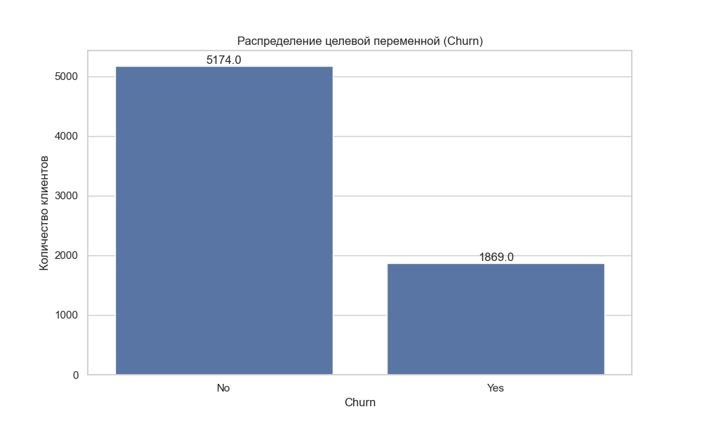

# 2.3. Оценка качества моделей машинного обучения

Для обеспечения надежности и применимости моделей машинного обучения в задаче прогнозирования оттока клиентов необходимо провести их комплексную оценку. В данном разделе рассматриваются основные метрики и методы оценки качества моделей, позволяющие выбрать наиболее подходящую модель для решения бизнес-задачи.

## 2.3.1. Метрики качества бинарной классификации

Поскольку прогнозирование оттока клиентов является задачей бинарной классификации (клиент либо уходит, либо остается), для оценки качества моделей используются специфические метрики.

### Матрица ошибок (Confusion Matrix)

Матрица ошибок — это таблица, которая позволяет визуализировать качество работы алгоритма классификации. В контексте прогнозирования оттока клиентов она имеет следующую структуру:

```
                 │ Предсказание
                 │ Не уйдет (0) │ Уйдет (1)
────────────────┼──────────────┼─────────────
Фактически      │              │
Не ушел (0)     │      TN      │     FP
────────────────┼──────────────┼─────────────
Ушел (1)        │      FN      │     TP
```

Где:
- **TN (True Negative)** — клиент не ушел, и модель корректно это предсказала
- **FP (False Positive)** — клиент не ушел, но модель ошибочно предсказала его уход
- **FN (False Negative)** — клиент ушел, но модель ошибочно предсказала, что он останется
- **TP (True Positive)** — клиент ушел, и модель корректно это предсказала

### Основные метрики

На основе матрицы ошибок рассчитываются следующие метрики:

1. **Accuracy (Точность)** — доля правильных прогнозов:
   ```
   Accuracy = (TP + TN) / (TP + TN + FP + FN)
   ```
   
   Ограничения: не рекомендуется использовать как единственную метрику при несбалансированных данных, что характерно для задачи прогнозирования оттока.

2. **Precision (Точность в узком смысле)** — доля клиентов, фактически ушедших, среди всех, кого модель отметила как уходящих:
   ```
   Precision = TP / (TP + FP)
   ```
   
   Бизнес-интерпретация: эффективность затрат на удержание клиентов (высокий Precision означает меньше затрат на удержание клиентов, которые не собирались уходить).

3. **Recall (Полнота)** — доля клиентов, корректно идентифицированных моделью как уходящие, среди всех фактически ушедших:
   ```
   Recall = TP / (TP + FN)
   ```
   
   Бизнес-интерпретация: способность модели выявлять потенциально ушедших клиентов (высокий Recall означает, что компания не упускает возможности по удержанию).

4. **F1-score** — гармоническое среднее Precision и Recall:
   ```
   F1 = 2 * (Precision * Recall) / (Precision + Recall)
   ```
   
   Преимущество: балансирует между Precision и Recall, что важно, когда необходимо учитывать оба аспекта.

5. **Specificity (Специфичность)** — доля клиентов, корректно идентифицированных как неуходящие, среди всех фактически оставшихся:
   ```
   Specificity = TN / (TN + FP)
   ```

6. **Balanced Accuracy** — среднее арифметическое Recall и Specificity:
   ```
   Balanced Accuracy = (Recall + Specificity) / 2
   ```
   
   Преимущество: учитывает баланс между классами, что особенно важно при несбалансированных данных.

### ROC-кривая и AUC

ROC-кривая (Receiver Operating Characteristic) — графическое представление эффективности бинарной классификационной модели при различных порогах отсечения. Она строится путем отображения True Positive Rate (TPR, или Recall) против False Positive Rate (FPR, или 1 - Specificity) при различных порогах классификации.

AUC (Area Under the ROC Curve) — площадь под ROC-кривой, которая является агрегированной мерой производительности модели:
- AUC = 0.5 означает, что модель не лучше случайного угадывания
- AUC = 1.0 означает идеальную модель
- Значения AUC между 0.7 и 0.8 считаются приемлемыми
- Значения AUC между 0.8 и 0.9 считаются отличными
- Значения AUC выше 0.9 считаются выдающимися


*Рисунок 2.3.1. Пример ROC-кривой для различных моделей прогнозирования оттока клиентов*

### Precision-Recall кривая

Precision-Recall кривая — альтернативный способ визуализации качества бинарной классификации, который особенно полезен при несбалансированных данных. Она показывает зависимость между Precision и Recall при различных порогах отсечения.

Площадь под Precision-Recall кривой (PR AUC) может быть более информативной метрикой, чем ROC AUC, в контексте прогнозирования оттока, когда количество ушедших клиентов (положительный класс) значительно меньше количества оставшихся (отрицательный класс).


*Рисунок 2.3.2. Пример Precision-Recall кривой для различных моделей прогнозирования оттока клиентов*

### Пороговая оптимизация

В бизнес-контексте прогнозирования оттока необходимо учитывать различную стоимость ошибок классификации:
- **Стоимость ложного позитива (FP)**: затраты на удержание клиента, который не собирался уходить
- **Стоимость ложного негатива (FN)**: упущенная прибыль от клиента, который ушел, но не был определен как потенциально уходящий

Пороговая оптимизация позволяет найти оптимальный порог классификации, который минимизирует общую бизнес-стоимость ошибок:

```
Общая стоимость = (Стоимость FP * Количество FP) + (Стоимость FN * Количество FN)
```

## 2.3.2. Работа с несбалансированными данными

Задача прогнозирования оттока клиентов часто сталкивается с проблемой несбалансированности классов, так как доля ушедших клиентов обычно значительно меньше, чем доля оставшихся.



*Рисунок 2.3.3. Типичная несбалансированность классов в данных об оттоке клиентов*

### Методы оценки при несбалансированных данных

Для корректной оценки моделей на несбалансированных данных рекомендуется использовать:

1. **Precision, Recall, F1-score** вместо общей Accuracy
2. **Precision-Recall AUC** вместо или в дополнение к ROC AUC
3. **Balanced Accuracy** вместо обычной Accuracy
4. **Специфические метрики для несбалансированных данных**:
   - Cohen's Kappa — статистика, которая измеряет соглашение между фактическими и предсказанными классификациями, учитывая случайную возможность согласия
   - Matthews Correlation Coefficient (MCC) — коэффициент, который учитывает все четыре элемента матрицы ошибок и хорошо работает даже при сильно несбалансированных классах

### Методы работы с несбалансированными данными

Для улучшения качества моделей на несбалансированных данных применяются различные методы:

1. **Методы уровня данных**:
   - **Undersampling (Недовыборка)**: уменьшение количества экземпляров мажоритарного класса
   - **Oversampling (Перевыборка)**: увеличение количества экземпляров миноритарного класса
   - **SMOTE (Synthetic Minority Over-sampling Technique)**: генерация синтетических примеров миноритарного класса
   - **Комбинированные методы**: SMOTE + Tomek Links, SMOTE + ENN

2. **Методы уровня алгоритма**:
   - **Взвешивание классов**: назначение большего веса миноритарному классу при обучении
   - **Настройка порога**: оптимизация порога принятия решения для несбалансированных данных
   - **Ансамблевые методы с фокусом на миноритарный класс**: EasyEnsemble, BalanceCascade

3. **Методы уровня оценки**:
   - **Stratified K-Fold Cross-Validation**: сохранение соотношения классов во всех фолдах кросс-валидации
   - **Метрики, устойчивые к несбалансированности**: PR AUC, F1-score, MCC

```
Процесс ресэмплинга данных:

1. Undersampling:
   Исходные данные: [класс 0: 9000 примеров] [класс 1: 1000 примеров]
   После недовыборки: [класс 0: 1000 примеров] [класс 1: 1000 примеров]

2. Oversampling:
   Исходные данные: [класс 0: 9000 примеров] [класс 1: 1000 примеров]
   После перевыборки: [класс 0: 9000 примеров] [класс 1: 9000 примеров]

3. SMOTE:
   Исходные данные: [класс 0: 9000 примеров] [класс 1: 1000 примеров]
   После SMOTE: [класс 0: 9000 примеров] [класс 1: 9000 примеров (из них 8000 синтетические)]
```

## 2.3.3. Валидация и оценка моделей

### Кросс-валидация

Кросс-валидация — метод оценки обобщающей способности модели, который включает разбиение данных на несколько частей и последовательное использование одной из частей в качестве тестовой выборки, а остальных — в качестве обучающей.

Наиболее распространенные стратегии кросс-валидации:

1. **K-Fold Cross-Validation**: данные разбиваются на K равных частей, модель обучается K раз, каждый раз используя (K-1) частей для обучения и оставшуюся часть для тестирования.

2. **Stratified K-Fold Cross-Validation**: аналогично K-Fold, но при разбиении сохраняется соотношение классов в каждой части, что особенно важно при несбалансированных данных.

3. **Time Series Cross-Validation**: специализированный метод для временных рядов, учитывающий временную зависимость данных.

Преимущества кросс-валидации:
- Более надежная оценка качества модели
- Снижение риска переобучения
- Возможность оценки стабильности модели

### Временное разделение данных

В контексте прогнозирования оттока клиентов часто используется временное разделение данных, при котором модель обучается на исторических данных и тестируется на более поздних данных. Это позволяет лучше имитировать реальный сценарий использования модели.

Временное разделение может быть реализовано следующим образом:
- **Обучающая выборка**: данные за период T1-T2
- **Валидационная выборка**: данные за период T2-T3
- **Тестовая выборка**: данные за период T3-T4

Где T1 < T2 < T3 < T4, и каждый период представляет определенный временной интервал (например, месяцы или кварталы).

Этот подход учитывает возможные временные сдвиги в данных и помогает оценить, насколько хорошо модель будет работать на будущих, еще не наблюдаемых данных.

### Валидация с учетом бизнес-метрик

При оценке моделей прогнозирования оттока важно учитывать не только технические метрики, но и бизнес-показатели, такие как:

1. **Return on Investment (ROI)** программы удержания клиентов:
   ```
   ROI = (Прибыль от удержанных клиентов - Затраты на удержание) / Затраты на удержание
   ```

2. **Чистая прибыль** от программы удержания:
   ```
   Чистая прибыль = Прибыль от удержанных клиентов - Затраты на удержание
   ```

3. **Коэффициент удержания** в результате применения модели:
   ```
   Коэффициент удержания = Количество удержанных клиентов / Количество клиентов с высоким риском оттока
   ```

### Бутстрап-валидация

Бутстрап-валидация — метод оценки стабильности модели, при котором многократно формируются случайные подвыборки с возвращением из исходных данных, и для каждой подвыборки обучается и оценивается отдельная модель.

Этот метод позволяет:
- Оценить доверительные интервалы для метрик качества модели
- Выявить нестабильность модели при небольших изменениях в данных
- Сравнить несколько моделей с учетом вариабельности их результатов

## 2.3.4. Сравнение моделей и выбор оптимальной

### Статистическое сравнение моделей

Для обоснованного выбора между несколькими моделями машинного обучения используются статистические тесты, позволяющие определить, является ли разница в производительности моделей статистически значимой:

1. **Парный t-тест**: сравнивает средние значения метрик двух моделей, полученные на одинаковых разбиениях данных
2. **Тест Вилкоксона**: непараметрический аналог t-теста, который менее чувствителен к выбросам
3. **Тест Фридмана с пост-хок анализом**: для одновременного сравнения трех и более моделей

### Комплексное сравнение моделей

При выборе оптимальной модели для прогнозирования оттока клиентов важно учитывать несколько факторов:

1. **Прогностическая способность**:
   - AUC ROC и PR AUC
   - F1-score и Balanced Accuracy
   - Калибровка вероятностных прогнозов

2. **Вычислительная эффективность**:
   - Время обучения
   - Время прогнозирования
   - Требования к памяти

3. **Интерпретируемость**:
   - Внутренняя интерпретируемость модели
   - Возможность объяснения прогнозов
   - Важность признаков

4. **Стабильность**:
   - Устойчивость к изменениям в данных
   - Стабильность во времени
   - Робастность к выбросам и шуму

5. **Практическая применимость**:
   - Интеграция с существующими системами
   - Возможность переобучения и обновления
   - Соответствие бизнес-требованиям

Для комплексного сравнения моделей часто используется подход "радар-диаграммы" или "паутины", где каждый из вышеперечисленных аспектов представлен как отдельная ось, и модели сравниваются по всем параметрам одновременно.

### Принципы выбора модели в зависимости от бизнес-задачи

Выбор оптимальной модели для прогнозирования оттока клиентов должен учитывать специфику бизнес-задачи:

1. **Массовые кампании по удержанию**:
   - Высокий приоритет: Precision (для минимизации затрат на клиентов, которые не собирались уходить)
   - Рекомендуемые модели: те, что обеспечивают высокую Precision (даже за счет Recall)

2. **Персонализированные программы удержания для высококачественных клиентов**:
   - Высокий приоритет: Recall (для минимизации риска потери ценных клиентов)
   - Рекомендуемые модели: те, что обеспечивают высокий Recall (даже за счет Precision)

3. **Балансирование между затратами на удержание и потерями от оттока**:
   - Высокий приоритет: F1-score или показатели, основанные на бизнес-стоимости ошибок
   - Рекомендуемые модели: хорошо калиброванные модели, позволяющие гибко настраивать порог классификации

4. **Объяснение факторов оттока для улучшения услуг**:
   - Высокий приоритет: интерпретируемость
   - Рекомендуемые модели: логистическая регрессия, деревья решений или модели с хорошими методами пост-интерпретации (SHAP, LIME)

## 2.3.5. Выводы

Оценка качества моделей машинного обучения для прогнозирования оттока клиентов — многогранный процесс, требующий учета технических метрик, бизнес-показателей и практических аспектов применения модели. Ключевые выводы:

1. Для задачи прогнозирования оттока клиентов необходимо использовать комплекс метрик, включая Precision, Recall, F1-score, ROC AUC и PR AUC, не ограничиваясь только Accuracy.

2. Несбалансированность классов требует применения специальных методов как на уровне данных (ресэмплинг), так и на уровне алгоритмов (взвешивание классов) и оценки (стратифицированная кросс-валидация).

3. Временная валидация особенно важна в контексте прогнозирования оттока, чтобы учесть возможные временные изменения в поведении клиентов.

4. Выбор оптимальной модели должен учитывать не только техническую производительность, но и бизнес-требования, интерпретируемость и вычислительную эффективность.

5. Калибровка вероятностных прогнозов и оптимизация порога классификации могут значительно повысить бизнес-ценность модели прогнозирования оттока.

В следующем разделе будут рассмотрены методы интерпретации моделей машинного обучения, которые позволяют не только предсказывать отток клиентов, но и понимать его причины, что критически важно для разработки эффективных стратегий удержания. 