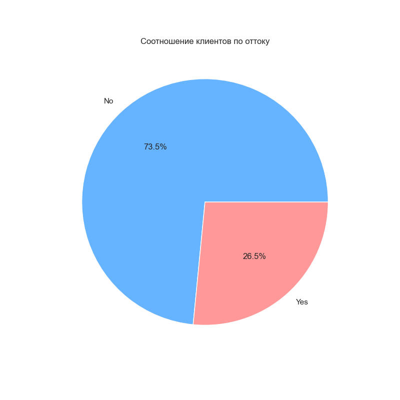
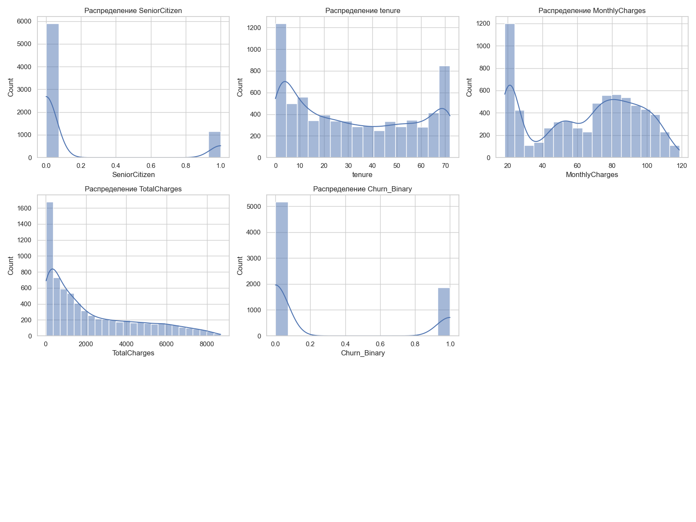
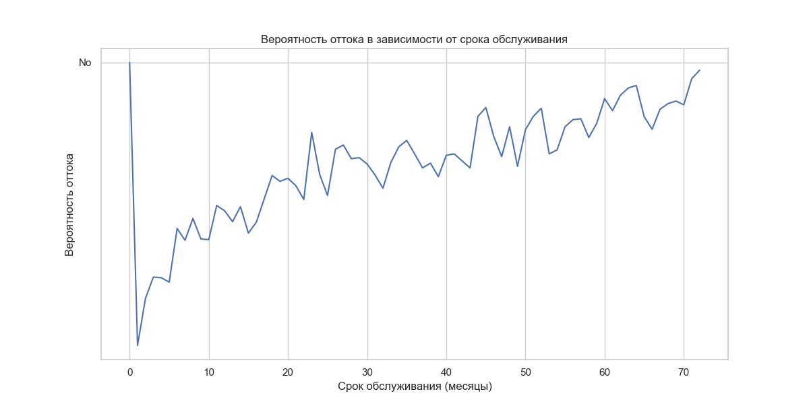
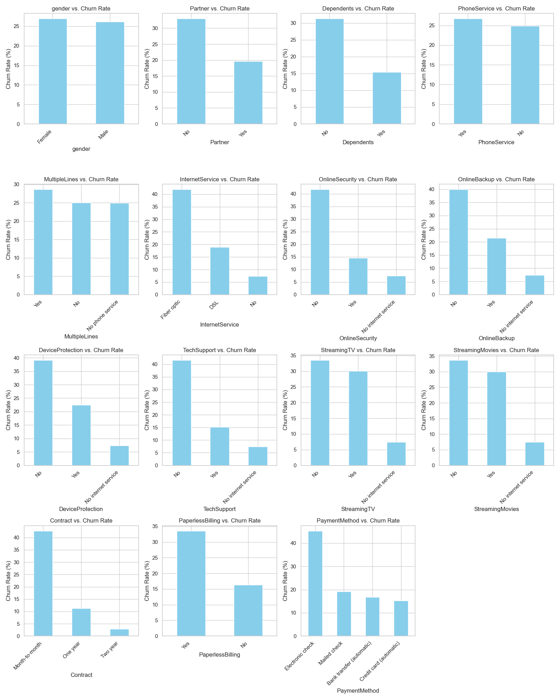
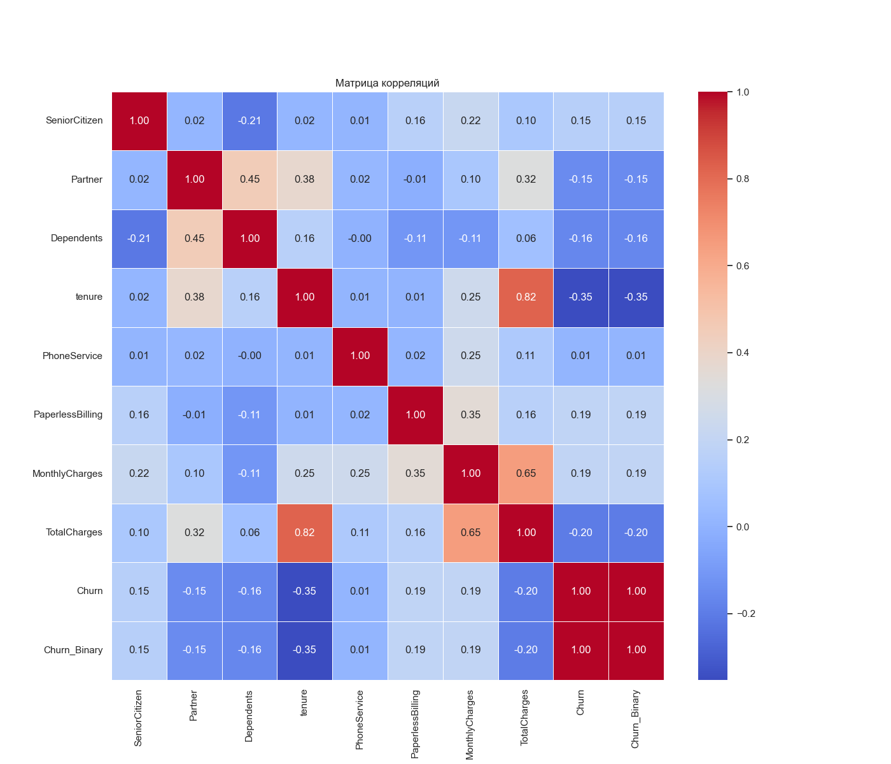
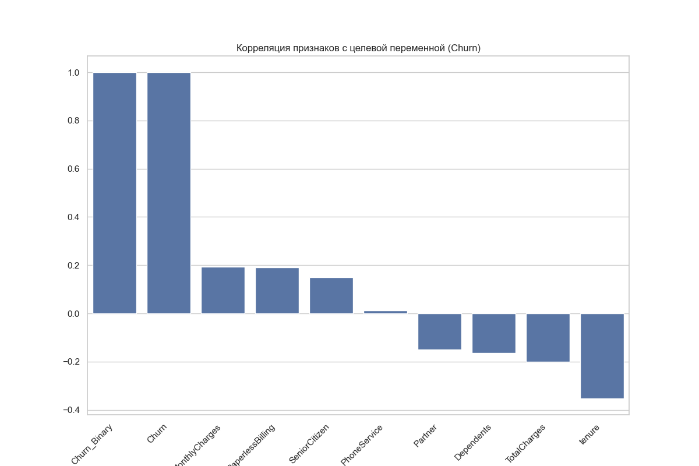

# 3.1. Описание процесса разведочного анализа данных

Разведочный анализ данных (Exploratory Data Analysis, EDA) является критическим этапом в процессе прогнозирования оттока клиентов. Он позволяет понять структуру и особенности данных, выявить закономерности и взаимосвязи между признаками, обнаружить выбросы и аномалии, а также сформировать гипотезы для дальнейшего исследования. В данном разделе описан процесс разведочного анализа данных, проведенного для решения задачи прогнозирования оттока клиентов телекоммуникационной компании.

## 3.1.1. Описание исходного набора данных

Для анализа использовался датасет "Telco Customer Churn" от IBM, содержащий информацию о клиентах телекоммуникационной компании и их статусе (остались с компанией или ушли). Данные были загружены из открытого источника и сохранены в директории проекта для дальнейшей обработки.

```python
# Загрузка данных
import pandas as pd
import numpy as np

# Путь к файлу с данными
data_path = "data/raw/telco_customer_churn.csv"

# Загрузка данных
df = pd.read_csv(data_path)

# Вывод основной информации о датасете
print(f"Размер датасета: {df.shape}")
print(f"Количество признаков: {df.shape[1]}")
print(f"Количество записей: {df.shape[0]}")
```

Результаты показали, что датасет содержит 7043 записи (клиенты) и 21 признак, включая целевую переменную "Churn", которая указывает, ушел ли клиент из компании (Yes/No).

### Описание признаков

Признаки в датасете можно разделить на несколько категорий:

1. **Демографические данные клиентов**:
   - `customerID` — уникальный идентификатор клиента
   - `gender` — пол клиента (Male, Female)
   - `SeniorCitizen` — является ли клиент пожилым (1, 0)
   - `Partner` — наличие партнера (Yes, No)
   - `Dependents` — наличие иждивенцев (Yes, No)

2. **Информация о подписке на услуги**:
   - `tenure` — срок пребывания клиента в компании (в месяцах)
   - `PhoneService` — наличие телефонной услуги (Yes, No)
   - `MultipleLines` — наличие нескольких телефонных линий (Yes, No, No phone service)
   - `InternetService` — тип интернет-услуги (DSL, Fiber optic, No)
   - `OnlineSecurity` — наличие услуги онлайн-безопасности (Yes, No, No internet service)
   - `OnlineBackup` — наличие услуги онлайн-резервного копирования (Yes, No, No internet service)
   - `DeviceProtection` — наличие услуги защиты устройства (Yes, No, No internet service)
   - `TechSupport` — наличие технической поддержки (Yes, No, No internet service)
   - `StreamingTV` — наличие услуги потокового телевидения (Yes, No, No internet service)
   - `StreamingMovies` — наличие услуги потокового видео (Yes, No, No internet service)

3. **Информация о контракте и платежах**:
   - `Contract` — тип контракта (Month-to-month, One year, Two year)
   - `PaperlessBilling` — безбумажный расчет (Yes, No)
   - `PaymentMethod` — способ оплаты (Electronic check, Mailed check, Bank transfer, Credit card)
   - `MonthlyCharges` — ежемесячная плата (числовое значение)
   - `TotalCharges` — общая сумма платежей (числовое значение)

4. **Целевая переменная**:
   - `Churn` — отток клиентов (Yes, No)

### Предварительная проверка данных

Перед началом анализа была проведена предварительная проверка данных для выявления пропущенных значений, дубликатов и аномалий:

```python
# Проверка наличия пропущенных значений
print(f"Пропущенные значения:\n{df.isnull().sum()}")

# Проверка наличия дубликатов
print(f"Количество дубликатов: {df.duplicated().sum()}")

# Вывод типов данных
print(f"Типы данных признаков:\n{df.dtypes}")

# Вывод базовой статистики для числовых признаков
print(f"Статистика по числовым признакам:\n{df.describe()}")

# Вывод базовой статистики для категориальных признаков
print(f"Статистика по категориальным признакам:\n{df.describe(include=['object'])}")
```

В результате проверки было обнаружено, что:
- Столбец `TotalCharges` содержит 11 пропущенных значений
- Дубликаты отсутствуют
- Столбец `SeniorCitizen` представлен в виде чисел (0, 1), хотя по сути является категориальным признаком
- Столбец `TotalCharges` имеет тип данных `object` вместо ожидаемого числового типа

Для исправления этих проблем были предприняты следующие шаги:

```python
# Преобразование TotalCharges в числовой формат
df['TotalCharges'] = pd.to_numeric(df['TotalCharges'], errors='coerce')

# Обработка пропущенных значений
df.dropna(inplace=True)

# Создание бинарной версии целевой переменной для удобства анализа
df['Churn_Binary'] = (df['Churn'] == 'Yes').astype(int)
```

## 3.1.2. Анализ распределений признаков

После предварительной очистки был проведен анализ распределений признаков для понимания их характеристик и влияния на отток клиентов.

### Распределение целевой переменной

Прежде всего, было проанализировано распределение целевой переменной `Churn`:

```python
import matplotlib.pyplot as plt
import seaborn as sns

# Настройка размера графиков
plt.figure(figsize=(10, 6))

# Распределение целевой переменной
churn_counts = df['Churn'].value_counts()
plt.pie(churn_counts, labels=churn_counts.index, autopct='%1.1f%%', startangle=90)
plt.title('Распределение клиентов по статусу оттока')
plt.axis('equal')
plt.savefig('docs/figures/target_pie_chart.png', dpi=300, bbox_inches='tight')
plt.show()
```



*Рисунок 3.1.1 - Распределение клиентов по статусу оттока*

Анализ показал, что данные несбалансированы: 73.5% клиентов остаются с компанией (No), в то время как 26.5% уходят (Yes). Это означает, что при построении моделей необходимо учитывать несбалансированность классов.

### Анализ числовых признаков

Для числовых признаков (`tenure`, `MonthlyCharges` и `TotalCharges`) был проведен анализ их распределений и зависимости с целевой переменной:

```python
# Числовые признаки
numeric_features = ['tenure', 'MonthlyCharges', 'TotalCharges']

# Распределение числовых признаков
plt.figure(figsize=(15, 10))
for i, feature in enumerate(numeric_features, 1):
    plt.subplot(3, 1, i)
    sns.histplot(data=df, x=feature, hue='Churn', multiple='stack', kde=True)
    plt.title(f'Распределение {feature} в зависимости от оттока')
    plt.tight_layout()
plt.savefig('docs/figures/numerical_features_distribution.png', dpi=300, bbox_inches='tight')
plt.show()
```



*Рисунок 3.1.2 - Распределение числовых признаков в зависимости от оттока*

Анализ числовых признаков выявил следующие закономерности:

1. **tenure (срок пребывания клиента в компании)**:
   - Клиенты с меньшим сроком пребывания в компании (менее 12 месяцев) имеют более высокую вероятность оттока
   - Распределение имеет два пика: в начале срока обслуживания и в конце (долгосрочные клиенты)
   - Вероятность оттока снижается с увеличением срока обслуживания

2. **MonthlyCharges (ежемесячная плата)**:
   - Клиенты с высокими ежемесячными платежами имеют более высокую вероятность оттока
   - Распределение имеет бимодальный характер с пиками около 20 и 80 долларов
   - Клиенты с ежемесячной платой в диапазоне 70-100 долларов показывают наибольшую склонность к оттоку

3. **TotalCharges (общая сумма платежей)**:
   - Распределение сильно смещено вправо (большинство клиентов имеют относительно небольшие общие затраты)
   - Клиенты с меньшей общей суммой платежей чаще уходят, что коррелирует с меньшим сроком пребывания

Была также проанализирована взаимосвязь между вероятностью оттока и сроком пребывания клиента в компании:

```python
# Вероятность оттока в зависимости от срока пребывания
tenure_groups = df.groupby('tenure')['Churn_Binary'].mean().reset_index()
plt.figure(figsize=(12, 6))
plt.plot(tenure_groups['tenure'], tenure_groups['Churn_Binary'], marker='o')
plt.title('Вероятность оттока в зависимости от срока обслуживания')
plt.xlabel('Срок обслуживания (месяцев)')
plt.ylabel('Вероятность оттока')
plt.grid(True, linestyle='--', alpha=0.7)
plt.savefig('docs/figures/tenure_churn_probability.png', dpi=300, bbox_inches='tight')
plt.show()
```



*Рисунок 3.1.3 - Вероятность оттока в зависимости от срока обслуживания*

График показывает, что вероятность оттока высока в первые месяцы обслуживания и постепенно снижается с увеличением срока пребывания клиента в компании, стабилизируясь после примерно 12-15 месяцев.

### Анализ категориальных признаков

Для категориальных признаков был проведен анализ их влияния на отток клиентов:

```python
# Категориальные признаки
categorical_features = ['gender', 'SeniorCitizen', 'Partner', 'Dependents', 
                         'PhoneService', 'MultipleLines', 'InternetService', 
                         'OnlineSecurity', 'OnlineBackup', 'DeviceProtection', 
                         'TechSupport', 'StreamingTV', 'StreamingMovies', 
                         'Contract', 'PaperlessBilling', 'PaymentMethod']

# Анализ влияния категориальных признаков на отток
plt.figure(figsize=(20, 15))
for i, feature in enumerate(categorical_features[:9], 1):
    plt.subplot(3, 3, i)
    churn_rate = df.groupby(feature)['Churn_Binary'].mean()
    churn_rate.plot(kind='bar', color='skyblue')
    plt.title(f'Влияние {feature} на отток')
    plt.ylabel('Вероятность оттока')
    plt.tight_layout()
plt.savefig('docs/figures/categorical_features_churn_rate.png', dpi=300, bbox_inches='tight')
plt.show()
```



*Рисунок 3.1.4 - Влияние категориальных признаков на вероятность оттока*

Анализ категориальных признаков выявил следующие значимые факторы, влияющие на отток клиентов:

1. **Contract (тип контракта)**:
   - Клиенты с месячными контрактами (`Month-to-month`) имеют значительно более высокую вероятность оттока (около 43%)
   - Клиенты с двухлетними контрактами показывают наименьшую вероятность оттока (около 3%)

2. **InternetService (тип интернет-услуги)**:
   - Клиенты с оптоволоконным интернетом (`Fiber optic`) имеют значительно более высокую вероятность оттока (около 42%)
   - Клиенты без интернет-услуг показывают наименьшую вероятность оттока (около 7%)

3. **OnlineSecurity, TechSupport, OnlineBackup (дополнительные услуги)**:
   - Клиенты без дополнительных услуг имеют более высокую вероятность оттока
   - Наличие услуги онлайн-безопасности и технической поддержки особенно сильно снижает вероятность оттока

4. **PaymentMethod (способ оплаты)**:
   - Клиенты, использующие электронные чеки (`Electronic check`), имеют наивысшую вероятность оттока (около 45%)
   - Автоматические платежи (кредитная карта, банковский перевод) ассоциируются с меньшей вероятностью оттока

5. **SeniorCitizen (пожилой клиент)**:
   - Пожилые клиенты показывают более высокую вероятность оттока (около 42%)

6. **PaperlessBilling (безбумажный расчет)**:
   - Клиенты с безбумажным расчетом показывают более высокую вероятность оттока (около 34%)

## 3.1.3. Корреляционный анализ

Для выявления взаимосвязей между числовыми признаками и их связи с оттоком был проведен корреляционный анализ:

```python
# Преобразование категориальных признаков в бинарные для корреляционного анализа
df_encoded = pd.get_dummies(df.drop(['customerID', 'Churn'], axis=1), drop_first=True)
df_encoded['Churn'] = df['Churn_Binary']

# Корреляционная матрица
corr_matrix = df_encoded.corr()

# Визуализация корреляционной матрицы
plt.figure(figsize=(16, 12))
mask = np.triu(np.ones_like(corr_matrix, dtype=bool))
sns.heatmap(corr_matrix, mask=mask, annot=False, cmap='coolwarm', center=0, linewidths=.5)
plt.title('Корреляционная матрица признаков')
plt.savefig('docs/figures/correlation_matrix.png', dpi=300, bbox_inches='tight')
plt.show()

# Корреляция признаков с целевой переменной
corr_with_target = corr_matrix['Churn'].sort_values(ascending=False)
plt.figure(figsize=(12, 10))
corr_with_target[1:20].plot(kind='barh', color='skyblue')
plt.title('Корреляция признаков с оттоком')
plt.xlabel('Коэффициент корреляции')
plt.savefig('docs/figures/target_correlation.png', dpi=300, bbox_inches='tight')
plt.show()
```



*Рисунок 3.1.5 - Корреляционная матрица признаков*



*Рисунок 3.1.6 - Корреляция признаков с целевой переменной*

Корреляционный анализ выявил следующие закономерности:

1. **Наиболее сильные положительные корреляции с оттоком**:
   - Месячный контракт (`Contract_Month-to-month`)
   - Отсутствие дополнительных услуг (онлайн-безопасность, техническая поддержка)
   - Оптоволоконный интернет (`InternetService_Fiber optic`)
   - Электронные чеки как способ оплаты (`PaymentMethod_Electronic check`)
   - Безбумажный расчет (`PaperlessBilling_Yes`)

2. **Наиболее сильные отрицательные корреляции с оттоком**:
   - Двухлетний контракт (`Contract_Two year`)
   - Длительный срок обслуживания (`tenure`)
   - Наличие технической поддержки (`TechSupport_Yes`)
   - Наличие онлайн-безопасности (`OnlineSecurity_Yes`)

3. **Взаимосвязи между признаками**:
   - Сильная корреляция между `tenure` (срок обслуживания) и `TotalCharges` (общая сумма платежей)
   - Взаимосвязь между типом контракта и сроком обслуживания
   - Корреляция между наличием различных дополнительных услуг (OnlineSecurity, TechSupport, OnlineBackup)

## 3.1.4. Выявление ключевых факторов влияния на отток

На основе проведенного разведочного анализа были определены ключевые факторы, влияющие на отток клиентов телекоммуникационной компании:

1. **Тип контракта**: Месячные контракты ассоциируются с наивысшим оттоком, а долгосрочные (двухлетние) — с наименьшим.

2. **Срок обслуживания**: Новые клиенты (с малым сроком обслуживания) имеют гораздо более высокую вероятность оттока.

3. **Тип интернет-услуги**: Клиенты с оптоволоконным интернетом показывают более высокую вероятность оттока, несмотря на более высокую скорость услуги.

4. **Наличие дополнительных услуг**: Отсутствие услуг онлайн-безопасности и технической поддержки связано с повышенным оттоком.

5. **Способ оплаты**: Клиенты, использующие электронные чеки, демонстрируют наивысшую вероятность оттока.

6. **Демографические факторы**: Пожилые клиенты и клиенты без партнеров или иждивенцев более склонны к оттоку.

7. **Стоимость услуг**: Клиенты с высокими ежемесячными платежами, особенно в сочетании с краткосрочными контрактами, имеют повышенный риск оттока.

Эти факторы будут использованы для построения моделей прогнозирования оттока, а также для разработки стратегии удержания клиентов.

### Выводы по разведочному анализу данных

Разведочный анализ данных позволил выявить ключевые закономерности в поведении клиентов телекоммуникационной компании и основные факторы, влияющие на их решение прекратить пользоваться услугами. Основные выводы:

1. Данные содержат информацию о 7032 клиентах, из которых 26.5% прекратили пользоваться услугами компании.

2. Наиболее значимыми факторами, определяющими вероятность оттока, являются тип контракта, срок обслуживания, наличие дополнительных услуг и способ оплаты.

3. Существуют четкие профили клиентов с высоким риском оттока:
   - Клиенты с месячными контрактами и небольшим сроком обслуживания
   - Клиенты с оптоволоконным интернетом без дополнительных услуг
   - Клиенты, использующие электронные чеки для оплаты
   - Пожилые клиенты с высокими ежемесячными платежами

4. Данные содержат как численные, так и категориальные признаки, которые потребуют соответствующей предобработки перед построением моделей.

5. Проблема несбалансированности классов (26.5% положительного класса) должна быть учтена при построении и оценке моделей.

На основе этих выводов в следующих разделах будут разработаны методы предобработки данных и построены модели машинного обучения для прогнозирования оттока клиентов. 