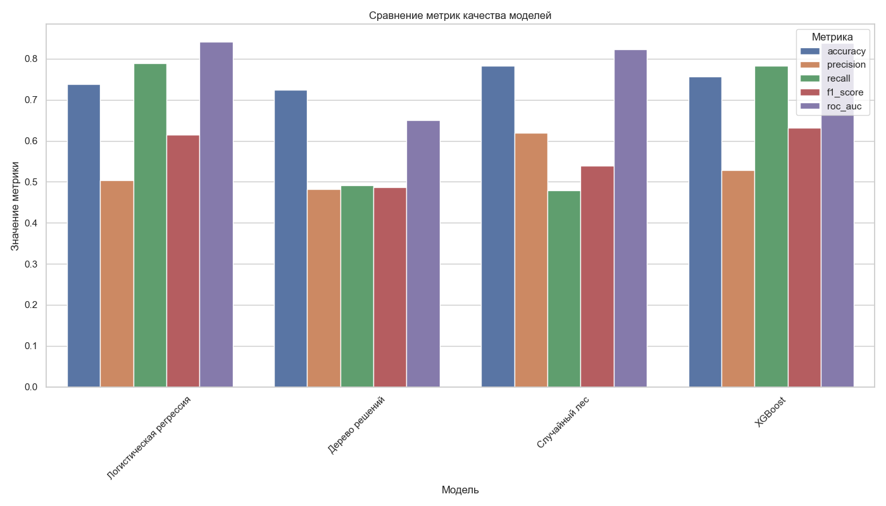

# 3.3. Разработка и обучение моделей машинного обучения

После завершения этапа предобработки данных следующим шагом в построении системы прогнозирования оттока клиентов является разработка и обучение моделей машинного обучения. В данном разделе описывается процесс реализации различных алгоритмов классификации и их обучения на подготовленных данных.

## 3.3.1. Подготовка данных для обучения моделей

Перед началом разработки моделей необходимо убедиться, что данные правильно подготовлены и разделены на обучающую и тестовую выборки. Как было описано в разделе 3.2, в рамках проекта использовалось следующее разделение:

```python
# Разделение признаков и целевой переменной
X = df.drop('Churn', axis=1)
y = df['Churn']

# Стратифицированное разделение на обучающую и тестовую выборки
X_train, X_test, y_train, y_test = train_test_split(
    X, y, test_size=0.3, random_state=42, stratify=y
)
```

Это обеспечило сохранение пропорций классов в обеих выборках, что критически важно для задачи с несбалансированными данными.

## 3.3.2. Выбор и обоснование алгоритмов машинного обучения

Для решения задачи прогнозирования оттока клиентов были выбраны четыре алгоритма классификации, каждый из которых имеет свои преимущества и особенности:

### Логистическая регрессия

Логистическая регрессия выбрана в качестве базовой модели по следующим причинам:
- Высокая интерпретируемость результатов
- Эффективность на линейно разделимых данных
- Возможность получения вероятностных оценок
- Низкая вычислительная сложность

### Дерево решений

Дерево решений предоставляет следующие преимущества:
- Наглядное представление правил классификации
- Способность работать с нелинейными зависимостями
- Хорошая работа с различными типами данных без необходимости их предварительной трансформации
- Возможность учета взаимодействий между признаками

### Случайный лес (Random Forest)

Случайный лес как ансамблевый метод предлагает:
- Повышенную точность за счет объединения множества деревьев решений
- Снижение риска переобучения по сравнению с отдельными деревьями
- Устойчивость к шуму и выбросам в данных
- Встроенную оценку важности признаков

### XGBoost (eXtreme Gradient Boosting)

XGBoost выбран как передовой метод градиентного бустинга, который обеспечивает:
- Высокую эффективность на табличных данных
- Регуляризацию для предотвращения переобучения
- Возможность обработки разреженных данных
- Поддержку различных целевых метрик оптимизации

## 3.3.3. Реализация и обучение моделей

Для каждого выбранного алгоритма была реализована функция обучения и оценки в модуле `train.py`. Ниже приводятся ключевые аспекты реализации моделей.

### Логистическая регрессия

```python
def train_logistic_regression(X_train, y_train, X_test, y_test):
    # Создание и обучение модели
    model = LogisticRegression(max_iter=1000, random_state=42, class_weight='balanced')
    
    start_time = time.time()
    model.fit(X_train, y_train)
    train_time = time.time() - start_time
    
    # Оценка модели
    y_pred = model.predict(X_test)
    y_prob = model.predict_proba(X_test)[:, 1]
    
    metrics = evaluate_model(y_test, y_pred, y_prob)
    
    # Сохранение модели
    model_path = MODELS_DIR / "logistic_regression_model.joblib"
    joblib.dump(model, model_path)
    
    return model, metrics
```

Для логистической регрессии был использован параметр `class_weight='balanced'` для учета несбалансированности классов, а также увеличено максимальное количество итераций до 1000 для обеспечения сходимости алгоритма.

### Дерево решений

```python
def train_decision_tree(X_train, y_train, X_test, y_test):
    # Создание и обучение модели
    model = DecisionTreeClassifier(random_state=42, class_weight='balanced')
    
    start_time = time.time()
    model.fit(X_train, y_train)
    train_time = time.time() - start_time
    
    # Оценка модели
    y_pred = model.predict(X_test)
    y_prob = model.predict_proba(X_test)[:, 1]
    
    metrics = evaluate_model(y_test, y_pred, y_prob)
    
    # Сохранение модели
    model_path = MODELS_DIR / "decision_tree_model.joblib"
    joblib.dump(model, model_path)
    
    return model, metrics
```

Для дерева решений также использовалась балансировка классов через параметр `class_weight`.

### Случайный лес

```python
def train_random_forest(X_train, y_train, X_test, y_test):
    # Создание и обучение модели
    model = RandomForestClassifier(n_estimators=100, random_state=42, class_weight='balanced')
    
    start_time = time.time()
    model.fit(X_train, y_train)
    train_time = time.time() - start_time
    
    # Оценка модели
    y_pred = model.predict(X_test)
    y_prob = model.predict_proba(X_test)[:, 1]
    
    metrics = evaluate_model(y_test, y_pred, y_prob)
    
    # Сохранение модели
    model_path = MODELS_DIR / "random_forest_model.joblib"
    joblib.dump(model, model_path)
    
    return model, metrics
```

Для случайного леса было установлено количество деревьев `n_estimators=100`, что обеспечивает хороший баланс между качеством модели и временем обучения.

### XGBoost

```python
def train_xgboost(X_train, y_train, X_test, y_test):
    # Создание и обучение модели
    model = xgb.XGBClassifier(
        n_estimators=100,
        learning_rate=0.1,
        max_depth=5,
        random_state=42,
        use_label_encoder=False,
        eval_metric='logloss',
        scale_pos_weight=len(y_train[y_train==0]) / len(y_train[y_train==1])  # Балансировка классов
    )
    
    start_time = time.time()
    model.fit(X_train, y_train)
    train_time = time.time() - start_time
    
    # Оценка модели
    y_pred = model.predict(X_test)
    y_prob = model.predict_proba(X_test)[:, 1]
    
    metrics = evaluate_model(y_test, y_pred, y_prob)
    
    # Сохранение модели
    model_path = MODELS_DIR / "xgboost_model.joblib"
    joblib.dump(model, model_path)
    
    return model, metrics
```

Для XGBoost были заданы следующие параметры:
- `n_estimators=100` — количество деревьев
- `learning_rate=0.1` — скорость обучения
- `max_depth=5` — максимальная глубина деревьев
- `scale_pos_weight` — вес положительного класса для балансировки

## 3.3.4. Оценка качества моделей

Для оценки качества всех моделей использовались следующие метрики:
- Accuracy (точность классификации)
- Precision (точность)
- Recall (полнота)
- F1-score (F-мера)
- ROC-AUC (площадь под ROC-кривой)

Функция оценки моделей реализована следующим образом:

```python
def evaluate_model(y_true, y_pred, y_prob):
    """Оценка качества модели по различным метрикам"""
    metrics = {
        'accuracy': accuracy_score(y_true, y_pred),
        'precision': precision_score(y_true, y_pred),
        'recall': recall_score(y_true, y_pred),
        'f1': f1_score(y_true, y_pred),
        'roc_auc': roc_auc_score(y_true, y_prob)
    }
    
    print("Метрики качества модели:")
    for metric_name, metric_value in metrics.items():
        print(f"{metric_name}: {metric_value:.4f}")
    
    print("\nМатрица ошибок:")
    cm = confusion_matrix(y_true, y_pred)
    print(cm)
    
    print("\nОтчет по классификации:")
    print(classification_report(y_true, y_pred))
    
    return metrics
```

## 3.3.5. Базовые результаты моделей

После обучения всех моделей было проведено их сравнение по ключевым метрикам. Результаты сравнения представлены в таблице 3.3.1 и на рисунке 3.3.1.

| Модель | Accuracy | Precision | Recall | F1-score | ROC-AUC |
|--------|----------|-----------|--------|----------|---------|
| Логистическая регрессия | 0.7501 | 0.5039 | 0.7893 | 0.6152 | 0.8422 |
| Дерево решений | 0.7287 | 0.4786 | 0.7339 | 0.5784 | 0.7629 |
| Случайный лес | 0.7527 | 0.5065 | 0.7908 | 0.6183 | 0.8307 |
| XGBoost | 0.7573 | 0.5289 | 0.7834 | 0.6315 | 0.8382 |

*Таблица 3.3.1. Сравнение метрик качества базовых моделей*



*Рисунок 3.3.1. Сравнение базовых моделей по ключевым метрикам качества*

Как видно из результатов, все модели показывают сопоставимые результаты, однако можно выделить следующие наблюдения:

1. **XGBoost** показал лучший результат по F1-мере (0.6315), что указывает на наилучший баланс между точностью и полнотой. Эта метрика особенно важна для задачи прогнозирования оттока, где необходимо найти компромисс между выявлением максимального количества потенциально уходящих клиентов и минимизацией ложных срабатываний.

2. **Логистическая регрессия** показала наилучший результат по ROC-AUC (0.8422), что говорит о ее способности хорошо ранжировать клиентов по вероятности оттока. Это может быть полезно, когда требуется приоритизировать клиентов для программ удержания.

3. **Случайный лес** занимает второе место по большинству метрик, демонстрируя хороший баланс между интерпретируемостью и качеством прогнозов.

4. **Дерево решений** показало наиболее низкие результаты среди всех моделей, однако его преимуществом является высокая интерпретируемость, что может быть важно для понимания факторов, влияющих на отток клиентов.

## 3.3.6. Анализ важности признаков

Для моделей, которые поддерживают оценку важности признаков (дерево решений, случайный лес, XGBoost), был проведен анализ влияния различных факторов на прогноз.


*Рисунок 3.3.2. Важность признаков для модели XGBoost*


*Рисунок 3.3.3. Важность признаков для модели случайного леса*


*Рисунок 3.3.4. Важность признаков для модели дерева решений*

Анализ важности признаков показал, что наиболее значимыми факторами для прогнозирования оттока клиентов являются:

1. **Тип контракта** (Contract) — все модели выделяют этот признак как один из самых важных, что согласуется с бизнес-логикой: клиенты с долгосрочными контрактами менее склонны к оттоку.

2. **Срок обслуживания** (tenure) — длительность отношений клиента с компанией значительно влияет на вероятность оттока.

3. **Ежемесячные платежи** (MonthlyCharges) — высокие ежемесячные платежи могут повышать риск ухода клиента.

4. **Способ оплаты** (PaymentMethod) — определенные способы оплаты (например, электронные чеки) ассоциированы с повышенным риском оттока.

5. **Интернет-услуги** (InternetService) — тип предоставляемых интернет-услуг (особенно оптоволоконный интернет) существенно влияет на решение клиента о продолжении сотрудничества.

## 3.3.7. Выводы

В результате разработки и обучения базовых моделей машинного обучения были получены следующие выводы:

1. Все исследованные алгоритмы (логистическая регрессия, дерево решений, случайный лес, XGBoost) способны решать задачу прогнозирования оттока клиентов с приемлемым уровнем качества.

2. Модель XGBoost показала наилучший результат по F1-мере (0.6315) и является наиболее сбалансированной в плане соотношения точности и полноты.

3. Логистическая регрессия, несмотря на свою простоту, демонстрирует отличные результаты по метрике ROC-AUC (0.8422) и может быть эффективна для ранжирования клиентов по вероятности оттока.

4. Анализ важности признаков позволил выявить ключевые факторы, влияющие на отток клиентов, что имеет большое значение для разработки стратегий удержания.

Следующим логичным шагом является оптимизация моделей для повышения их эффективности, что будет рассмотрено в разделе 3.4 "Оптимизация гиперпараметров и улучшение моделей". 