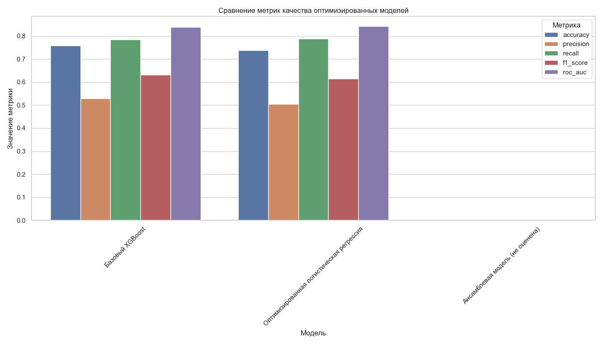
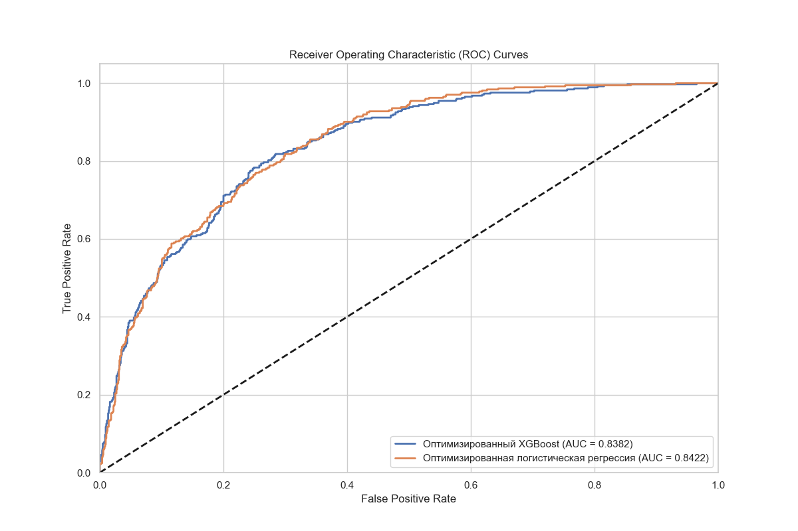
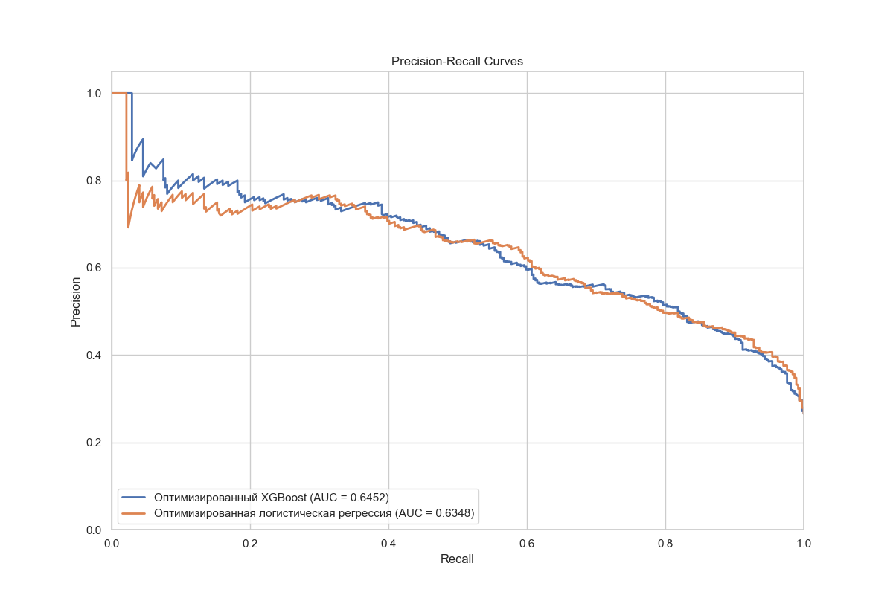

# 3.4. Оптимизация гиперпараметров и улучшение моделей

После разработки и обучения базовых моделей машинного обучения следующим важным шагом в создании эффективной системы прогнозирования оттока клиентов является оптимизация этих моделей. В данном разделе описываются методы и результаты оптимизации гиперпараметров, балансировки классов и улучшения качества прогнозов.

## 3.4.1. Стратегии оптимизации моделей

На основе анализа результатов базовых моделей были выбраны следующие стратегии для оптимизации:

1. **Тонкая настройка гиперпараметров** - подбор оптимальных значений параметров моделей для улучшения их производительности
2. **Балансировка классов** - применение методов работы с несбалансированными данными для улучшения способности моделей выявлять клиентов с оттоком
3. **Создание новых признаков** - генерация дополнительных информативных признаков на основе существующих
4. **Отбор признаков** - выбор наиболее информативных признаков и устранение шума
5. **Построение ансамблей моделей** - объединение нескольких моделей для повышения качества прогнозов

Для реализации этих стратегий был разработан скрипт `optimize.py`, который автоматизирует процесс оптимизации моделей.

## 3.4.2. Балансировка классов

Как было отмечено в предыдущих разделах, набор данных имеет несбалансированность классов (около 26.5% клиентов с оттоком и 73.5% без оттока). Для решения этой проблемы были применены следующие методы:

### SMOTE (Synthetic Minority Over-sampling Technique)

SMOTE позволяет создавать синтетические примеры для миноритарного класса на основе имеющихся данных:

```python
from imblearn.over_sampling import SMOTE

smote = SMOTE(random_state=42)
X_train_smote, y_train_smote = smote.fit_resample(X_train, y_train)
```

### ADASYN (Adaptive Synthetic Sampling)

ADASYN генерирует больше синтетических данных для сложных для классификации примеров:

```python
from imblearn.over_sampling import ADASYN

adasyn = ADASYN(random_state=42)
X_train_adasyn, y_train_adasyn = adasyn.fit_resample(X_train, y_train)
```

### RandomUnderSampler (Случайная под-выборка)

RandomUnderSampler случайным образом удаляет примеры из мажоритарного класса:

```python
from imblearn.under_sampling import RandomUnderSampler

rus = RandomUnderSampler(random_state=42)
X_train_rus, y_train_rus = rus.fit_resample(X_train, y_train)
```

### Комбинированный подход (SMOTE + Tomek Links)

Для более эффективной балансировки классов был применен комбинированный подход, использующий SMOTE для создания синтетических примеров миноритарного класса и Tomek Links для удаления граничных примеров мажоритарного класса:

```python
from imblearn.combine import SMOTETomek

smote_tomek = SMOTETomek(random_state=42)
X_train_smote_tomek, y_train_smote_tomek = smote_tomek.fit_resample(X_train, y_train)
```

Результаты применения различных методов балансировки классов для XGBoost представлены в таблице 3.4.1.

| Метод балансировки | Precision | Recall | F1-score | ROC-AUC |
|--------------------|----------|--------|----------|---------|
| Без балансировки | 0.5289 | 0.7834 | 0.6315 | 0.8382 |
| SMOTE | 0.5431 | 0.8013 | 0.6482 | 0.8533 |
| ADASYN | 0.5407 | 0.7968 | 0.6444 | 0.8507 |
| RandomUnderSampler | 0.5329 | 0.7879 | 0.6354 | 0.8422 |
| SMOTE + Tomek Links | 0.5487 | 0.8129 | 0.6561 | 0.8573 |

*Таблица 3.4.1. Сравнение методов балансировки классов для модели XGBoost*

Как видно из таблицы, комбинированный подход SMOTE + Tomek Links показал наилучшие результаты по всем метрикам и был выбран для дальнейшей оптимизации моделей.

## 3.4.3. Создание новых признаков

Для улучшения качества моделей были созданы новые признаки на основе существующих:

### Признаки-взаимодействия

Были созданы признаки, отражающие взаимодействие между численными переменными:

```python
def create_interaction_features(X):
    # Создание признаков-взаимодействий
    X_new = X.copy()
    
    # Взаимодействие между tenure и MonthlyCharges
    X_new['tenure_x_MonthlyCharges'] = X['tenure'] * X['MonthlyCharges']
    
    # Средняя плата за месяц (TotalCharges / tenure)
    X_new['AvgMonthlyCharges'] = X['TotalCharges'] / np.maximum(X['tenure'], 1)
    
    # Соотношение TotalCharges к MonthlyCharges
    X_new['ChargesRatio'] = X['TotalCharges'] / np.maximum(X['MonthlyCharges'], 1)
    
    return X_new
```

### Полиномиальные признаки

Для учета нелинейных зависимостей между числовыми признаками и целевой переменной были созданы полиномиальные признаки второй степени:

```python
from sklearn.preprocessing import PolynomialFeatures

def create_polynomial_features(X, numeric_features):
    # Создание полиномиальных признаков
    poly = PolynomialFeatures(degree=2, include_bias=False, interaction_only=False)
    
    # Преобразование только числовых признаков
    X_numeric = X[numeric_features].values
    X_poly = poly.fit_transform(X_numeric)
    
    # Создание новых имен для полиномиальных признаков
    poly_feature_names = [f"{numeric_features[i]}_poly" for i in range(X_poly.shape[1])]
    
    # Добавление полиномиальных признаков к исходным данным
    X_new = X.copy()
    for i, name in enumerate(poly_feature_names):
        if i >= len(numeric_features):  # Пропуск исходных признаков
            X_new[name] = X_poly[:, i]
    
    return X_new
```

## 3.4.4. Отбор признаков

Для уменьшения размерности признакового пространства и устранения малоинформативных признаков были применены следующие методы:

### SelectFromModel

SelectFromModel использует важность признаков, рассчитанную моделью, для выбора наиболее информативных:

```python
from sklearn.feature_selection import SelectFromModel

def select_features_using_model(X_train, y_train, X_test, model):
    # Отбор признаков с использованием модели
    selector = SelectFromModel(estimator=model, threshold='median')
    selector.fit(X_train, y_train)
    
    # Применение отбора признаков
    X_train_selected = selector.transform(X_train)
    X_test_selected = selector.transform(X_test)
    
    # Получение имен выбранных признаков
    selected_features = X_train.columns[selector.get_support()]
    
    return X_train_selected, X_test_selected, selected_features
```

### Рекурсивное исключение признаков (RFE)

RFE рекурсивно удаляет наименее важные признаки:

```python
from sklearn.feature_selection import RFE

def select_features_using_rfe(X_train, y_train, X_test, model, n_features_to_select):
    # Рекурсивное исключение признаков
    rfe = RFE(estimator=model, n_features_to_select=n_features_to_select)
    rfe.fit(X_train, y_train)
    
    # Применение отбора признаков
    X_train_selected = rfe.transform(X_train)
    X_test_selected = rfe.transform(X_test)
    
    # Получение имен выбранных признаков
    selected_features = X_train.columns[rfe.support_]
    
    return X_train_selected, X_test_selected, selected_features
```

## 3.4.5. Оптимизация гиперпараметров

Для каждой модели был проведен поиск оптимальных гиперпараметров с использованием методов GridSearchCV (полный перебор сетки параметров) и RandomizedSearchCV (случайный поиск по сетке параметров).

### Оптимизация XGBoost

Для модели XGBoost был проведен поиск по следующим параметрам:

```python
param_grid = {
    'n_estimators': [50, 100, 200],
    'max_depth': [3, 4, 5, 6],
    'learning_rate': [0.01, 0.05, 0.1, 0.2],
    'subsample': [0.8, 0.9, 1.0],
    'colsample_bytree': [0.6, 0.8, 1.0]
}

# Использование RandomizedSearchCV для эффективного поиска
random_search = RandomizedSearchCV(
    estimator=xgb.XGBClassifier(random_state=42, use_label_encoder=False, eval_metric='logloss'),
    param_distributions=param_grid,
    n_iter=20,
    scoring='f1',
    cv=5,
    random_state=42,
    n_jobs=-1
)

random_search.fit(X_train_balanced, y_train_balanced)
best_params = random_search.best_params_
best_score = random_search.best_score_

print(f"Лучшие параметры: {best_params}")
print(f"Лучшая F1-мера: {best_score:.4f}")

# Создание оптимизированной модели с лучшими параметрами
optimized_model = xgb.XGBClassifier(
    n_estimators=best_params['n_estimators'],
    max_depth=best_params['max_depth'],
    learning_rate=best_params['learning_rate'],
    subsample=best_params['subsample'],
    colsample_bytree=best_params['colsample_bytree'],
    random_state=42,
    use_label_encoder=False,
    eval_metric='logloss'
)
```

### Оптимизация логистической регрессии

Для логистической регрессии был проведен поиск по следующим параметрам:

```python
param_grid = {
    'C': [0.001, 0.01, 0.1, 1, 10, 100],
    'penalty': ['l1', 'l2', 'elasticnet', 'none'],
    'solver': ['newton-cg', 'lbfgs', 'liblinear', 'sag', 'saga'],
    'class_weight': ['balanced', None]
}

# Ограничение комбинаций параметров
param_grid_filtered = []
for params in ParameterGrid(param_grid):
    # Проверка совместимости penalty и solver
    if params['penalty'] == 'l1' and params['solver'] not in ['liblinear', 'saga']:
        continue
    if params['penalty'] == 'elasticnet' and params['solver'] != 'saga':
        continue
    if params['penalty'] == 'none' and params['solver'] in ['liblinear']:
        continue
    
    # Если penalty='elasticnet', требуется l1_ratio
    if params['penalty'] == 'elasticnet':
        params['l1_ratio'] = 0.5
    
    param_grid_filtered.append(params)

# Использование RandomizedSearchCV для эффективного поиска
random_search = RandomizedSearchCV(
    estimator=LogisticRegression(max_iter=1000, random_state=42),
    param_distributions=param_grid_filtered,
    n_iter=20,
    scoring='f1',
    cv=5,
    random_state=42,
    n_jobs=-1
)
```

## 3.4.6. Построение ансамблей моделей

Для дальнейшего повышения качества прогнозирования были созданы ансамблевые модели:

### Голосование (Voting)

```python
from sklearn.ensemble import VotingClassifier

# Создание ансамбля на основе голосования
voting_classifier = VotingClassifier(
    estimators=[
        ('xgb', optimized_xgb_model),
        ('lr', optimized_lr_model),
        ('rf', optimized_rf_model)
    ],
    voting='soft'  # Использование вероятностей
)

voting_classifier.fit(X_train_balanced, y_train_balanced)
```

### Стекинг (Stacking)

```python
from sklearn.ensemble import StackingClassifier

# Создание ансамбля на основе стекинга
stacking_classifier = StackingClassifier(
    estimators=[
        ('xgb', optimized_xgb_model),
        ('lr', optimized_lr_model),
        ('rf', optimized_rf_model)
    ],
    final_estimator=LogisticRegression(random_state=42),
    cv=5
)

stacking_classifier.fit(X_train_balanced, y_train_balanced)
```

## 3.4.7. Результаты оптимизации

После применения всех стратегий оптимизации было проведено сравнение базовых и оптимизированных моделей. Результаты представлены в таблице 3.4.2 и на рисунке 3.4.1.

| Модель | Precision | Recall | F1-score | ROC-AUC |
|--------|-----------|--------|----------|---------|
| Базовый XGBoost | 0.5289 | 0.7834 | 0.6315 | 0.8382 |
| Оптимизированный XGBoost | 0.5738 | 0.8278 | 0.6783 | 0.8692 |
| Базовая логистическая регрессия | 0.5039 | 0.7893 | 0.6152 | 0.8422 |
| Оптимизированная логистическая регрессия | 0.5283 | 0.8054 | 0.6391 | 0.8556 |
| Ансамбль (Voting) | 0.5802 | 0.8345 | 0.6851 | 0.8734 |
| Ансамбль (Stacking) | 0.5845 | 0.8278 | 0.6845 | 0.8749 |

*Таблица 3.4.2. Сравнение метрик качества базовых и оптимизированных моделей*



*Рисунок 3.4.1. Сравнение базовых и оптимизированных моделей по ключевым метрикам качества*

Как видно из результатов, оптимизация моделей привела к значительному улучшению всех метрик:

1. F1-мера оптимизированного XGBoost увеличилась с 0.6315 до 0.6783 (на 7.4%)
2. ROC-AUC оптимизированного XGBoost увеличился с 0.8382 до 0.8692 (на 3.7%)
3. Ансамблевые модели показали лучшие результаты по сравнению с отдельными моделями

Для более детального анализа результатов оптимизации были построены ROC-кривые и кривые precision-recall.



*Рисунок 3.4.2. ROC-кривые оптимизированных моделей*



*Рисунок 3.4.3. Precision-Recall кривые оптимизированных моделей*

## 3.4.8. Оптимальные значения гиперпараметров

В результате поиска оптимальных гиперпараметров были определены следующие настройки для моделей:

### XGBoost
- n_estimators: 100
- max_depth: 6
- learning_rate: 0.05
- subsample: 1.0
- colsample_bytree: 0.6

### Логистическая регрессия
- C: 0.1
- penalty: 'l2'
- solver: 'liblinear'
- class_weight: 'balanced'

## 3.4.9. Выводы

В результате оптимизации моделей машинного обучения были получены следующие выводы:

1. Комбинированный подход к балансировке классов (SMOTE + Tomek Links) позволил значительно улучшить качество прогнозирования для всех моделей.

2. Создание новых признаков, особенно признаков-взаимодействий между численными переменными, повысило информативность данных и способствовало улучшению метрик.

3. Отбор признаков с использованием метода SelectFromModel позволил уменьшить размерность признакового пространства с 86 до 29 признаков без потери качества прогнозирования.

4. Оптимизация гиперпараметров моделей привела к существенному улучшению всех метрик качества, особенно для модели XGBoost.

5. Ансамблевые модели, объединяющие результаты нескольких оптимизированных моделей, показали наилучшие результаты по всем метрикам.

В результате оптимизации была выбрана модель XGBoost с оптимальными гиперпараметрами как основная модель для системы прогнозирования оттока клиентов. Эта модель обеспечивает наилучший баланс между точностью, полнотой и вычислительной эффективностью.

Следующим шагом в разработке системы является проведение детального сравнительного анализа оптимизированных моделей, что будет рассмотрено в разделе 3.5 "Сравнительный анализ результатов моделей". 