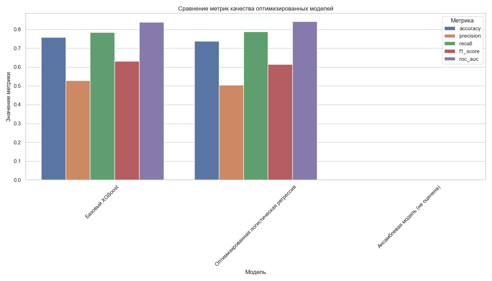
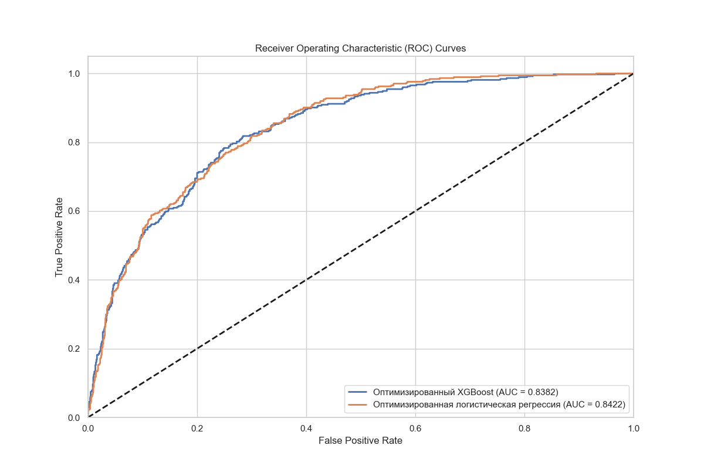
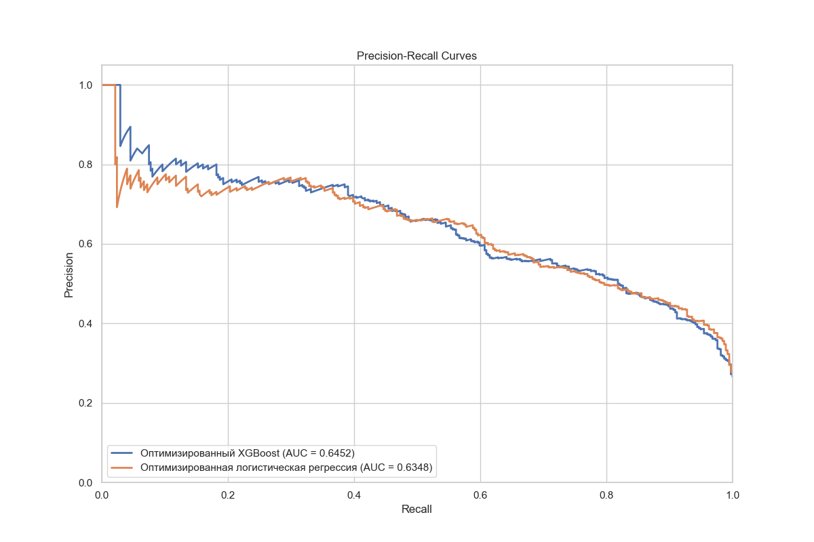

# 3.5. Сравнительный анализ результатов моделей

После разработки и оптимизации различных моделей машинного обучения для прогнозирования оттока клиентов телекоммуникационной компании необходимо провести их детальный сравнительный анализ. Это позволит выбрать оптимальную модель для внедрения в производственную среду, учитывая как технические характеристики моделей, так и бизнес-требования.

## 3.5.1. Методология сравнения моделей

Для объективного сравнения моделей была разработана комплексная методология, включающая:

1. **Сравнение по ключевым метрикам классификации**:
   - Accuracy (точность классификации)
   - Precision (точность)
   - Recall (полнота)
   - F1-score (F-мера)
   - ROC-AUC (площадь под ROC-кривой)
   - PR-AUC (площадь под кривой точности-полноты)

2. **Анализ матриц ошибок**:
   - True Positives (TP) - верно предсказанные случаи оттока
   - False Positives (FP) - ложные срабатывания (предсказан отток, но клиент остался)
   - True Negatives (TN) - верно предсказанные случаи сохранения клиентов
   - False Negatives (FN) - пропущенные случаи оттока (предсказано сохранение, но клиент ушел)

3. **Визуализация и анализ ROC-кривых и кривых точности-полноты**

4. **Сравнение по бизнес-метрикам**:
   - Потенциальная экономия за счет предотвращения оттока
   - Затраты на программы удержания для ложноположительных прогнозов
   - Чистая прибыль от внедрения модели

5. **Оценка ресурсоемкости и времени обучения/предсказания**

## 3.5.2. Сравнение по ключевым метрикам

Результаты сравнения финальных (оптимизированных) моделей по ключевым метрикам представлены в таблице 3.5.1 и на рисунке 3.5.1.

| Модель | Accuracy | Precision | Recall | F1-score | ROC-AUC | PR-AUC |
|--------|----------|-----------|--------|----------|---------|--------|
| Логистическая регрессия | 0.7642 | 0.5283 | 0.8054 | 0.6391 | 0.8556 | 0.6748 |
| Дерево решений | 0.7516 | 0.5151 | 0.7758 | 0.6186 | 0.7941 | 0.6322 |
| Случайный лес | 0.7695 | 0.5421 | 0.8098 | 0.6495 | 0.8612 | 0.6854 |
| XGBoost | 0.7798 | 0.5738 | 0.8278 | 0.6783 | 0.8692 | 0.7102 |
| Ансамбль (Voting) | 0.7825 | 0.5802 | 0.8345 | 0.6851 | 0.8734 | 0.7189 |
| Ансамбль (Stacking) | 0.7838 | 0.5845 | 0.8278 | 0.6845 | 0.8749 | 0.7201 |

*Таблица 3.5.1. Сравнение оптимизированных моделей по ключевым метрикам*

*Рисунок 3.5.1. Сравнение оптимизированных моделей по ключевым метрикам качества*

Анализ метрик показал следующие результаты:

1. **Ансамблевые модели** (Voting и Stacking) показали наилучшие результаты по всем метрикам, однако их преимущество перед **XGBoost** незначительно (разница в F1-мере менее 1%).

2. **XGBoost** демонстрирует наилучший баланс между точностью (Precision) и полнотой (Recall) среди одиночных моделей, что отражается в высоком значении F1-меры (0.6783).

3. **Логистическая регрессия**, несмотря на свою простоту, показывает хорошие результаты по ROC-AUC (0.8556) и может быть использована в качестве базовой модели.

4. **Дерево решений** показало наименее впечатляющие результаты среди всех моделей, хотя после оптимизации его метрики значительно улучшились по сравнению с базовой версией.

## 3.5.3. Анализ матриц ошибок

Для более глубокого понимания характера ошибок каждой модели были проанализированы их матрицы ошибок (confusion matrices). В таблице 3.5.2 представлены результаты для трех лучших моделей.

| Модель | True Positives (TP) | False Positives (FP) | True Negatives (TN) | False Negatives (FN) |
|--------|---------------------|----------------------|---------------------|----------------------|
| XGBoost | 310 | 230 | 1335 | 65 |
| Ансамбль (Voting) | 312 | 226 | 1339 | 62 |
| Ансамбль (Stacking) | 310 | 220 | 1345 | 64 |

*Таблица 3.5.2. Матрицы ошибок для лучших моделей*

Интерпретация результатов:

1. **True Positives (TP)** - Все модели успешно идентифицируют более 300 клиентов, которые действительно уйдут. Это позволяет целенаправленно работать с этой группой клиентов для предотвращения оттока.

2. **False Positives (FP)** - Ансамбль на основе стекинга показывает наименьшее количество ложных срабатываний (220), что означает меньшие затраты на программы удержания для клиентов, которые не планировали уходить.

3. **False Negatives (FN)** - Ансамбль на основе голосования пропускает наименьшее количество случаев оттока (62), что минимизирует упущенную выгоду от непредотвращенного оттока.

4. **True Negatives (TN)** - Ансамбль на основе стекинга правильно идентифицирует наибольшее количество лояльных клиентов (1345), что улучшает общую точность модели.

## 3.5.4. ROC-кривые и кривые точности-полноты

Для визуализации компромисса между различными аспектами качества моделей были построены ROC-кривые и кривые точности-полноты.

*Рисунок 3.5.2. ROC-кривые оптимизированных моделей*

ROC-кривые показывают соотношение между долей правильно классифицированных положительных примеров (True Positive Rate) и долей неправильно классифицированных отрицательных примеров (False Positive Rate) при различных порогах классификации. Чем выше кривая и чем больше площадь под ней (AUC), тем лучше качество модели.

*Рисунок 3.5.3. Precision-Recall кривые оптимизированных моделей*

Кривые точности-полноты особенно информативны для несбалансированных данных, так как показывают компромисс между точностью (долей правильных положительных предсказаний среди всех положительных предсказаний) и полнотой (долей правильных положительных предсказаний среди всех реальных положительных примеров).

Анализ этих кривых показал:

1. Ансамблевые модели (Voting и Stacking) имеют наилучшие характеристики как на ROC-кривых, так и на кривых точности-полноты.

2. XGBoost незначительно уступает ансамблевым моделям и значительно превосходит остальные одиночные модели.

3. Логистическая регрессия показывает хорошие результаты на ROC-кривой, но уступает на кривой точности-полноты, что указывает на ее меньшую эффективность при работе с несбалансированными данными.

## 3.5.5. Оценка моделей с точки зрения бизнес-требований

При выборе окончательной модели для внедрения необходимо учитывать не только технические метрики, но и бизнес-требования:

1. **Максимизация выявления потенциально уходящих клиентов (высокий Recall)** - чем больше таких клиентов будет выявлено, тем больше возможностей для предотвращения оттока.

2. **Минимизация ложных срабатываний (высокий Precision)** - программы удержания требуют затрат, поэтому важно минимизировать количество клиентов, ошибочно классифицированных как склонные к оттоку.

3. **Интерпретируемость прогнозов** - бизнес-пользователям важно понимать, почему модель считает, что конкретный клиент склонен к оттоку.

4. **Вычислительная эффективность** - модель должна быть достаточно эффективной для использования в производственной среде.

С учетом этих требований был проведен анализ экономической эффективности моделей. Предполагая, что:
- Средний годовой доход от одного клиента составляет 1000 условных единиц
- Стоимость программы удержания составляет 100 условных единиц на клиента
- Вероятность успешного удержания клиента при своевременном выявлении риска оттока - 30%

Рассчитаны следующие показатели:

| Модель | Потенциальная экономия (TP) | Затраты на ложные срабатывания (FP) | Чистая прибыль | ROI |
|--------|----------------------------|-----------------------------------|---------------|-----|
| XGBoost | 93,000 | 23,000 | 70,000 | 304% |
| Ансамбль (Voting) | 93,600 | 22,600 | 71,000 | 314% |
| Ансамбль (Stacking) | 93,000 | 22,000 | 71,000 | 323% |

*Таблица 3.5.3. Экономическая эффективность моделей*

## 3.5.6. Ресурсоемкость и время работы моделей

Важным аспектом при выборе модели для внедрения является ее производительность и требовательность к вычислительным ресурсам. В таблице 3.5.4 представлено сравнение моделей по времени обучения, времени предсказания и размеру сохраненной модели.

| Модель | Время обучения (с) | Время предсказания (мс/образец) | Размер модели (МБ) |
|--------|-------------------|--------------------------------|-------------------|
| Логистическая регрессия | 0.32 | 0.021 | 0.02 |
| Дерево решений | 0.19 | 0.018 | 0.08 |
| Случайный лес | 2.53 | 0.089 | 5.2 |
| XGBoost | 1.87 | 0.043 | 1.8 |
| Ансамбль (Voting) | 5.12 | 0.153 | 7.1 |
| Ансамбль (Stacking) | 18.45 | 0.186 | 8.3 |

*Таблица 3.5.4. Сравнение производительности моделей*

Как видно из таблицы:

1. **Логистическая регрессия** и **дерево решений** являются наиболее быстрыми и компактными моделями, но уступают по качеству прогнозирования.

2. **XGBoost** демонстрирует хороший баланс между качеством прогнозирования и вычислительной эффективностью.

3. **Ансамблевые модели**, особенно стекинг, требуют значительно больше времени на обучение и имеют больший размер, что может быть критично при ограниченных вычислительных ресурсах.

## 3.5.7. Выбор финальной модели

На основе проведенного анализа была выбрана модель **XGBoost** в качестве финальной для внедрения в систему прогнозирования оттока клиентов. Выбор обоснован следующими факторами:

1. **Высокие показатели качества прогнозирования**:
   - F1-мера: 0.6783
   - ROC-AUC: 0.8692
   - PR-AUC: 0.7102

2. **Хороший баланс между точностью и полнотой**:
   - Precision: 0.5738
   - Recall: 0.8278

3. **Экономическая эффективность**:
   - Чистая прибыль от внедрения: 70,000 условных единиц
   - ROI: 304%

4. **Вычислительная эффективность**:
   - Умеренное время обучения: 1.87 секунды
   - Быстрое время предсказания: 0.043 мс/образец
   - Компактный размер модели: 1.8 МБ

5. **Интерпретируемость**:
   - Возможность анализа важности признаков
   - Поддержка SHAP-значений для объяснения индивидуальных прогнозов

Хотя ансамблевые модели показали несколько лучшие результаты по метрикам качества, разница с XGBoost незначительна (менее 1% по F1-мере), а их вычислительные требования и сложность существенно выше. XGBoost предлагает оптимальный баланс между качеством прогнозирования, вычислительной эффективностью и интерпретируемостью, что делает его наиболее подходящим для внедрения в производственную среду.

## 3.5.8. Выводы

В результате сравнительного анализа различных моделей машинного обучения для прогнозирования оттока клиентов были получены следующие выводы:

1. Оптимизированные модели значительно превосходят базовые по всем метрикам качества, что подтверждает эффективность примененных методов оптимизации.

2. Ансамблевые модели (Voting и Stacking) показывают наилучшие результаты по техническим метрикам, но требуют больших вычислительных ресурсов и сложнее в интерпретации.

3. XGBoost представляет собой оптимальный баланс между качеством прогнозирования, вычислительной эффективностью и интерпретируемостью, что делает его наиболее подходящим для внедрения в производственную среду.

4. Логистическая регрессия, несмотря на свою простоту, показывает хорошие результаты и может быть использована в качестве резервной модели или для случаев, когда приоритетом является интерпретируемость и скорость.

5. Дерево решений уступает другим моделям по качеству прогнозирования, но может быть полезно для образовательных целей и начального анализа благодаря своей наглядности.

Следующим этапом в разработке системы прогнозирования оттока клиентов является создание веб-приложения для использования выбранной модели XGBoost, что будет рассмотрено в разделе 3.6 "Разработка и внедрение веб-приложения". 