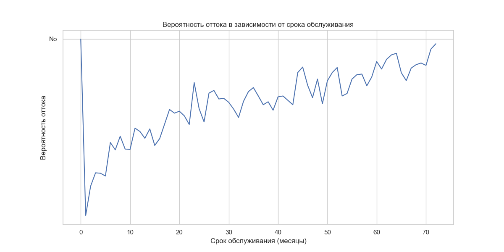

# 2.0. Введение к главе

В данной главе рассматриваются теоретические основы, необходимые для понимания и решения задачи прогнозирования оттока клиентов телекоммуникационной компании. Отток клиентов (Customer Churn) представляет собой серьезную проблему для компаний в высококонкурентных отраслях, таких как телекоммуникации, банковское дело и розничная торговля. Своевременное выявление клиентов с высоким риском ухода позволяет компаниям проактивно принимать меры по их удержанию, что значительно экономичнее привлечения новых клиентов.

## Цели и задачи теоретической части

Основная цель данной главы — создать теоретический фундамент для практической реализации системы прогнозирования оттока клиентов, которая будет описана в следующей главе. Для достижения этой цели в рамках главы решаются следующие задачи:

1. Формализация задачи прогнозирования оттока клиентов с точки зрения машинного обучения
2. Систематизация современных методов и алгоритмов, применяемых для решения данной задачи
3. Рассмотрение специфических особенностей прогнозирования оттока в телекоммуникационной отрасли
4. Анализ подходов к оценке качества моделей и обработке несбалансированных данных
5. Изучение методов интерпретации моделей машинного обучения

## Структура главы

Глава состоит из пяти основных разделов, логически выстроенных от общего к частному:

1. **Обзор методов машинного обучения для прогнозирования оттока клиентов** — раздел представляет формализованную постановку задачи, классификацию релевантных методов машинного обучения и особенности их применения в контексте прогнозирования оттока.

2. **Алгоритмы классификации для прогнозирования оттока** — раздел детально рассматривает ключевые алгоритмы классификации: логистическую регрессию, деревья решений и их ансамбли, включая Random Forest и XGBoost. Приводятся математические основы и принципы работы алгоритмов.

3. **Оценка качества моделей и работа с несбалансированными данными** — раздел анализирует специфические метрики, применяемые для оценки качества моделей классификации, а также методы решения проблемы несбалансированности данных, характерной для задач прогнозирования оттока.

4. **Интерпретация и объяснимость моделей машинного обучения** — раздел освещает современные подходы к интерпретации моделей, что критически важно для практического применения результатов прогнозирования в бизнес-процессах.

5. **Выводы по главе** — раздел обобщает изложенные теоретические основы и создает переход к практической части работы.

Материал главы опирается на современные научные исследования и индустриальные практики в области прогнозирования оттока клиентов, с особым акцентом на специфику телекоммуникационной отрасли. 

# 2.1. Обзор методов машинного обучения для прогнозирования оттока клиентов

Прогнозирование оттока клиентов является одной из ключевых задач в телекоммуникационной отрасли, где привлечение нового клиента может стоить в 5-10 раз дороже, чем удержание существующего. В данном разделе представлен обзор основных методов машинного обучения, применяемых для решения этой задачи, их сильные и слабые стороны, а также специфика применения в телекоммуникационной сфере.

## 2.1.1. Постановка задачи прогнозирования оттока как задачи бинарной классификации

Прогнозирование оттока клиентов математически формулируется как задача бинарной классификации, где:

- **Входные данные (X)**: Набор признаков, характеризующих клиента (демографические данные, информация о контракте, история использования услуг и т.д.)
- **Выходные данные (y)**: Бинарная метка класса, где 1 означает, что клиент уйдет (отток), 0 - клиент останется

Формально, задача состоит в построении функции $f: X \rightarrow \{0, 1\}$, которая максимально точно предсказывает вероятность оттока для каждого клиента на основе имеющихся данных.

Особенностями задачи прогнозирования оттока клиентов являются:

1. **Несбалансированность классов**: Обычно число уходящих клиентов (положительный класс) значительно меньше числа остающихся клиентов (отрицательный класс), что требует специальных методов обработки несбалансированных данных.

2. **Временная составляющая**: Поведение клиентов меняется со временем, что требует учета временной динамики и регулярного переобучения моделей.

3. **Интерпретируемость результатов**: Для бизнеса важно не только спрогнозировать отток, но и понять причины, по которым клиенты уходят, что накладывает требования к интерпретируемости моделей.

4. **Экономический аспект**: Разные ошибки классификации имеют различную стоимость (ложноположительные и ложноотрицательные прогнозы), что требует соответствующей настройки моделей.


*Рисунок 2.1.1 - Распределение классов в задаче прогнозирования оттока клиентов*

## 2.1.2. Классификация методов машинного обучения для прогнозирования оттока

Методы машинного обучения, применяемые для прогнозирования оттока клиентов, можно разделить на несколько категорий:

### Линейные модели

1. **Логистическая регрессия**:
   - *Принцип работы*: Моделирует вероятность принадлежности к определенному классу, используя логистическую функцию для преобразования линейной комбинации признаков в вероятность.
   - *Преимущества*: Высокая интерпретируемость, вычислительная эффективность, возможность получения вероятностных оценок.
   - *Недостатки*: Ограниченная способность моделировать нелинейные зависимости, чувствительность к мультиколлинеарности.
   - *Применимость к задаче оттока*: Хорошо подходит как базовая модель и для понимания ключевых факторов оттока.

### Модели на основе деревьев решений

1. **Дерево решений**:
   - *Принцип работы*: Строит иерархическую структуру правил "если-то", последовательно разделяя данные на подмножества на основе значений признаков.
   - *Преимущества*: Высокая интерпретируемость, способность работать с нелинейными зависимостями, нечувствительность к масштабированию данных.
   - *Недостатки*: Склонность к переобучению, нестабильность (высокая дисперсия).
   - *Применимость к задаче оттока*: Полезно для понимания сегментов клиентов с высоким риском оттока и визуализации решающих правил.

2. **Случайный лес (Random Forest)**:
   - *Принцип работы*: Ансамбль деревьев решений, где каждое дерево обучается на случайной подвыборке данных и признаков.
   - *Преимущества*: Высокая точность, устойчивость к переобучению, способность работать с большим числом признаков.
   - *Недостатки*: Меньшая интерпретируемость, вычислительная сложность, сложность настройки гиперпараметров.
   - *Применимость к задаче оттока*: Хорошо работает для получения точных прогнозов и выявления важности признаков.

3. **Градиентный бустинг (XGBoost, LightGBM, CatBoost)**:
   - *Принцип работы*: Последовательное построение ансамбля слабых моделей (обычно деревьев), где каждая новая модель компенсирует ошибки предыдущих.
   - *Преимущества*: Высокая точность, способность работать с разнородными данными, хорошие возможности для настройки.
   - *Недостатки*: Сложность настройки, вычислительная интенсивность, риск переобучения.
   - *Применимость к задаче оттока*: Обычно демонстрирует наилучшие результаты для задач прогнозирования оттока на табличных данных.

### Другие методы

1. **Метод опорных векторов (SVM)**:
   - *Принцип работы*: Находит оптимальную гиперплоскость, максимизирующую разделение между классами в пространстве признаков.
   - *Преимущества*: Эффективность в пространствах высокой размерности, возможность использования различных ядер для нелинейных задач.
   - *Недостатки*: Вычислительная сложность для больших наборов данных, сложность интерпретации.
   - *Применимость к задаче оттока*: Менее популярен для оттока из-за сложности интерпретации и настройки.

2. **Нейронные сети**:
   - *Принцип работы*: Многослойные нелинейные модели, имитирующие структуру нейронных связей в мозге.
   - *Преимущества*: Высокая гибкость и способность моделировать сложные зависимости, хорошая работа с большими объемами данных.
   - *Недостатки*: Низкая интерпретируемость, требовательность к объему данных, вычислительная сложность.
   - *Применимость к задаче оттока*: Подходит для сложных сценариев с большим количеством разнородных данных, особенно при наличии неструктурированных данных (тексты, аудио).

3. **Наивный байесовский классификатор**:
   - *Принцип работы*: Применяет теорему Байеса для расчета вероятности принадлежности к классу на основе условной независимости признаков.
   - *Преимущества*: Вычислительная эффективность, хорошая работа с высокоразмерными данными, простота реализации.
   - *Недостатки*: Предположение о независимости признаков часто нарушается на практике.
   - *Применимость к задаче оттока*: Ограниченное применение из-за предположения о независимости признаков.

## 2.1.3. Специфика применения машинного обучения в телекоммуникационной отрасли

Телекоммуникационная отрасль имеет ряд особенностей, которые необходимо учитывать при разработке моделей прогнозирования оттока клиентов:

1. **Разнородность данных**: Телеком-компании собирают различные типы данных о клиентах, включая:
   - Демографические данные (возраст, пол, местоположение)
   - Контрактная информация (тип контракта, срок, тарифный план)
   - Данные об использовании услуг (объем звонков, SMS, интернет-трафик)
   - Биллинговая информация (стоимость услуг, история платежей)
   - Данные о взаимодействии с клиентской поддержкой (обращения, жалобы)

2. **Временная динамика**: Поведение клиентов и рыночная среда быстро меняются, что требует:
   - Регулярного переобучения моделей
   - Анализа дрейфа данных
   - Учета сезонности и циклических паттернов

3. **Конкурентная среда**: Высокий уровень конкуренции влияет на отток клиентов:
   - Маркетинговые кампании конкурентов могут вызывать всплески оттока
   - Появление новых тарифных планов или технологий может изменить поведение клиентов
   - Доступная информация о конкурентных предложениях влияет на решения клиентов

4. **Регуляторные ограничения**: Телекоммуникационная отрасль строго регулируется, что накладывает ограничения на:
   - Использование персональных данных клиентов
   - Хранение и обработку данных
   - Применение автоматизированных методов принятия решений

## 2.1.4. Процесс разработки модели прогнозирования оттока

Типичный процесс разработки модели прогнозирования оттока клиентов включает следующие этапы:

1. **Сбор и подготовка данных**:
   - Извлечение данных из различных источников (CRM, биллинг, система обслуживания клиентов)
   - Очистка и предобработка данных (обработка пропущенных значений, выбросов)
   - Преобразование и кодирование категориальных признаков
   - Создание новых признаков на основе имеющихся данных (feature engineering)

2. **Исследовательский анализ данных**:
   - Анализ распределения признаков и целевой переменной
   - Выявление корреляций между признаками
   - Визуализация данных для лучшего понимания зависимостей
   - Определение ключевых факторов, влияющих на отток

3. **Выбор и обучение моделей**:
   - Выбор нескольких моделей-кандидатов с учетом особенностей задачи
   - Настройка гиперпараметров моделей (кросс-валидация, поиск по сетке)
   - Обучение моделей на тренировочной выборке
   - Учет несбалансированности классов (взвешивание классов, SMOTE и др.)

4. **Оценка и сравнение моделей**:
   - Использование подходящих метрик (AUC-ROC, точность, полнота, F1-мера)
   - Анализ кривых ROC и Precision-Recall
   - Оценка экономической эффективности моделей (стоимость ложных срабатываний)
   - Интерпретация результатов и важности признаков

5. **Внедрение и мониторинг**:
   - Интеграция модели в производственную среду
   - Разработка интерфейса для конечных пользователей (маркетологов, аналитиков)
   - Мониторинг производительности модели с течением времени
   - Регулярное переобучение модели для учета изменений в данных

## 2.1.5. Современные тенденции в прогнозировании оттока клиентов

Современные исследования и практические подходы к прогнозированию оттока клиентов включают следующие тенденции:

1. **Интегрированные подходы к моделированию**:
   - Объединение различных моделей в ансамбли для повышения точности
   - Сочетание статистических методов и машинного обучения
   - Гибридные подходы, объединяющие предметные знания и автоматическое обучение

2. **Учет временной динамики**:
   - Использование рекуррентных нейронных сетей (RNN, LSTM) для моделирования последовательных данных
   - Применение моделей выживаемости (survival analysis) для прогнозирования времени до оттока
   - Разработка моделей раннего предупреждения оттока

3. **Расширение источников данных**:
   - Интеграция данных из социальных сетей и внешних источников
   - Анализ текстовых данных (жалобы, отзывы, обращения в поддержку)
   - Учет данных о использовании мобильных приложений и веб-сервисов компании

4. **Объяснимый искусственный интеллект (XAI)**:
   - Применение методов интерпретации моделей (SHAP, LIME)
   - Разработка интерпретируемых моделей без потери точности
   - Визуализация решений модели для лучшего понимания бизнес-пользователями

5. **Персонализированные стратегии удержания**:
   - Сегментация клиентов на основе риска оттока и ценности для компании
   - Разработка персонализированных предложений для удержания
   - Оптимизация маркетинговых кампаний с учетом прогнозов оттока

## 2.1.6. Выводы

Прогнозирование оттока клиентов в телекоммуникационной отрасли является комплексной задачей, требующей применения различных методов машинного обучения и тщательного анализа данных. Ключевыми факторами успеха в этой задаче являются:

1. **Выбор подходящих методов**: Для телекоммуникационных данных наиболее эффективными обычно оказываются ансамблевые методы (случайный лес, градиентный бустинг), однако для интерпретации результатов полезно также использовать более простые модели, такие как логистическая регрессия.

2. **Правильная подготовка данных**: Особое внимание следует уделять обработке несбалансированных данных, созданию информативных признаков и учету временной динамики.

3. **Оценка эффективности моделей**: Необходимо использовать метрики, учитывающие бизнес-контекст и стоимость ошибок разного типа.

4. **Интерпретация результатов**: Для практического применения важно не только получить точные прогнозы, но и понять причины оттока для разработки эффективных стратегий удержания.

В следующих разделах будут более детально рассмотрены конкретные алгоритмы классификации, методы оценки и интерпретации моделей, которые применяются для решения задачи прогнозирования оттока клиентов телекоммуникационной компании. 

# 2.2. Алгоритмы классификации для прогнозирования оттока клиентов

В области прогнозирования оттока клиентов существует ряд эффективных алгоритмов классификации, которые позволяют определить, уйдет ли клиент в ближайшем будущем или останется с компанией. В данном разделе рассматриваются наиболее популярные и эффективные алгоритмы, используемые для решения данной задачи.

## 2.2.1. Логистическая регрессия

Логистическая регрессия — один из базовых алгоритмов классификации, который, несмотря на свою простоту, часто демонстрирует хорошие результаты в задачах прогнозирования оттока клиентов.

### Принцип работы

Логистическая регрессия использует линейную комбинацию входных признаков, прогоняя её через логистическую (сигмоидную) функцию для получения вероятности принадлежности к определенному классу:

$$P(Y=1|X) = \frac{1}{1 + e^{-(\beta_0 + \beta_1 X_1 + \beta_2 X_2 + ... + \beta_n X_n)}}$$

где:
- $P(Y=1|X)$ — вероятность того, что клиент уйдет (класс 1), при заданных признаках $X$
- $\beta_0, \beta_1, ..., \beta_n$ — коэффициенты регрессии
- $X_1, X_2, ..., X_n$ — значения признаков клиента

Основные этапы применения логистической регрессии для прогнозирования оттока:

1. Подготовка данных (нормализация, кодирование категориальных признаков)
2. Обучение модели на исторических данных с использованием метода максимального правдоподобия
3. Оценка вероятности оттока для новых клиентов
4. Определение порога отсечения для бинарной классификации (обычно 0.5)


### Преимущества логистической регрессии

- **Интерпретируемость**: коэффициенты $\beta$ напрямую показывают влияние каждого признака на вероятность оттока
- **Вычислительная эффективность**: быстрое обучение и прогнозирование
- **Вероятностный выход**: модель дает не только класс, но и вероятность, что полезно для ранжирования клиентов по риску оттока
- **Устойчивость к переобучению** при правильной регуляризации

### Недостатки логистической регрессии

- **Линейность**: не способна улавливать сложные нелинейные зависимости без дополнительных преобразований признаков
- **Чувствительность к мультиколлинеарности** признаков
- **Чувствительность к выбросам** и несбалансированным классам

## 2.2.2. Деревья решений

Дерево решений — это непараметрический алгоритм, который моделирует процесс принятия решений в виде древовидной структуры.

### Принцип работы

Дерево решений разбивает пространство признаков на регионы, используя последовательность бинарных правил:

1. Выбор признака и порога, которые наилучшим образом разделяют данные (минимизируют неоднородность)
2. Разделение данных на две подгруппы (узлы)
3. Рекурсивное повторение процесса для каждого узла
4. Остановка при достижении заданной глубины или чистоты узла

Для оценки качества разбиения используются различные метрики, такие как:
- **Информационная энтропия**: $H(S) = -\sum_{i=1}^{c} p_i \log_2(p_i)$
- **Индекс Джини**: $G(S) = 1 - \sum_{i=1}^{c} p_i^2$

где $p_i$ — доля примеров класса $i$ в узле $S$.


### Преимущества деревьев решений

- **Интерпретируемость**: дерево можно визуализировать и легко объяснить
- **Нелинейность**: способны выявлять сложные нелинейные взаимосвязи между признаками
- **Автоматический отбор признаков**: важные признаки выбираются автоматически
- **Работа с разнотипными данными** без предварительного преобразования

### Недостатки деревьев решений

- **Склонность к переобучению**: особенно для глубоких деревьев
- **Нестабильность**: небольшие изменения в данных могут привести к совершенно другому дереву
- **Ограниченная точность** одиночных деревьев для сложных задач

## 2.2.3. Случайный лес

Случайный лес — это ансамблевый метод, основанный на построении множества деревьев решений и их агрегации для получения финального прогноза.

### Принцип работы

Алгоритм случайного леса включает следующие этапы:

1. Создание N независимых деревьев решений.
2. Для каждого дерева:
   - Случайная выборка с возвращением (бутстрэп) из обучающих данных
   - Случайный отбор подмножества признаков на каждом разбиении
   - Построение дерева на основе выбранных примеров и признаков
3. Агрегация прогнозов всех деревьев (голосование для классификации, усреднение для регрессии).

Схема работы случайного леса:

Обучающие данные
      |
      ↓
+-------------+  +-------------+       +-------------+
| Бутстрэп    |  | Бутстрэп    | ...   | Бутстрэп    |
| выборка 1   |  | выборка 2   |       | выборка N   |
+-------------+  +-------------+       +-------------+
      |               |                      |
      ↓               ↓                      ↓
+-------------+  +-------------+       +-------------+
| Дерево      |  | Дерево      | ...   | Дерево      |
| решений 1   |  | решений 2   |       | решений N   |
+-------------+  +-------------+       +-------------+
      |               |                      |
      ↓               ↓                      ↓
   Прогноз 1       Прогноз 2            Прогноз N
      |               |                      |
      +---------------+----------------------+
                      |
                      ↓
              Агрегированный прогноз
        (голосование/среднее значение)


Ключевые особенности, обеспечивающие эффективность случайного леса:

- **Бэггинг** (Bootstrap Aggregating): уменьшает дисперсию и предотвращает переобучение.
- **Случайный отбор признаков**: создает различные и менее коррелированные деревья.

### Преимущества случайного леса

- **Высокая точность**: обычно превосходит одиночные деревья решений
- **Устойчивость к переобучению**: благодаря усреднению множества моделей
- **Оценка важности признаков**: возможность оценить влияние каждого признака на итоговый прогноз
- **Работа с большими данными**: эффективное обучение на больших наборах данных

### Недостатки случайного леса

- **Сниженная интерпретируемость**: сложнее интерпретировать по сравнению с одиночным деревом
- **Вычислительная сложность**: требует больше ресурсов для обучения и прогнозирования
- **«Черный ящик»**: механизм принятия решений менее прозрачен

## 2.2.4. Градиентный бустинг и XGBoost

Градиентный бустинг — это мощный ансамблевый метод, который последовательно строит серию слабых моделей (обычно деревьев решений), где каждая следующая модель фокусируется на ошибках предыдущих.

XGBoost (eXtreme Gradient Boosting) — это эффективная реализация градиентного бустинга, которая включает ряд оптимизаций для повышения скорости и эффективности.

### Принцип работы

Основные шаги алгоритма градиентного бустинга:

1. Инициализация модели с простым предсказанием (например, среднее значение).
2. Для каждой итерации t от 1 до T:
   - Вычисление остатков (ошибок) текущей модели.
   - Обучение слабой модели (дерева решений) для предсказания этих остатков.
   - Добавление новой слабой модели к ансамблю с соответствующим весом.
3. Финальная модель — взвешенная сумма всех слабых моделей.

```
Схема работы XGBoost:

Начальное предсказание F₀(x) = const
            |
            ↓
      +-------------+
      | Итерация 1  |
      +-------------+
            |
            ↓
Вычисление остатков: r₁ = y - F₀(x)
            |
            ↓
Обучение дерева h₁(x) на остатках r₁
            |
            ↓
Обновление модели: F₁(x) = F₀(x) + α₁·h₁(x)
            |
            ↓
      +-------------+
      | Итерация 2  |
      +-------------+
            |
            ↓
Вычисление остатков: r₂ = y - F₁(x)
            |
            ↓
Обучение дерева h₂(x) на остатках r₂
            |
            ↓
Обновление модели: F₂(x) = F₁(x) + α₂·h₂(x)
            |
            ↓
           ...
            |
            ↓
      +-------------+
      | Итерация T  |
      +-------------+
            |
            ↓
Финальная модель: F(x) = F₀(x) + α₁·h₁(x) + α₂·h₂(x) + ... + αₜ·hₜ(x)
```

### Особенности XGBoost

XGBoost предлагает несколько улучшений по сравнению с классическим градиентным бустингом:

- **Регуляризация**: добавление L1 и L2 регуляризации для предотвращения переобучения
- **Параллельная обработка**: эффективное использование многоядерных процессоров
- **Обработка разреженных данных**: оптимизированная работа с разреженными матрицами
- **Встроенная кросс-валидация**: возможность автоматической настройки гиперпараметров
- **Обработка пропущенных значений**: встроенный механизм работы с пропущенными данными

### Преимущества XGBoost для прогнозирования оттока клиентов

- **Высокая точность**: обычно показывает лучшие результаты среди других алгоритмов
- **Робастность**: устойчивость к выбросам и несбалансированным данным
- **Гибкость**: множество параметров для тонкой настройки модели
- **Оценка важности признаков**: детальные метрики влияния каждого признака

### Недостатки XGBoost

- **Сложность настройки**: большое количество гиперпараметров требует тщательной оптимизации
- **Вычислительная сложность**: требует значительных вычислительных ресурсов для больших данных
- **Склонность к переобучению**: при неправильной настройке регуляризации
- **Сниженная интерпретируемость**: механизм принятия решений менее прозрачен по сравнению с простыми моделями

## 2.2.5. Другие алгоритмы классификации

Помимо рассмотренных выше алгоритмов, в задачах прогнозирования оттока клиентов также применяются:

### Метод опорных векторов (SVM)

- **Принцип**: поиск гиперплоскости, максимально разделяющей классы в пространстве признаков
- **Преимущества**: эффективность для данных с чёткими границами, использование ядерных функций для нелинейных данных
- **Недостатки**: сложность интерпретации, высокая вычислительная сложность для больших наборов данных

### Нейронные сети

- **Принцип**: моделирование сложных нелинейных взаимосвязей через многослойные сети нейронов
- **Преимущества**: высокая точность для сложных данных, автоматическое извлечение признаков
- **Недостатки**: требуют больших объёмов данных, склонны к переобучению, низкая интерпретируемость

### k-ближайших соседей (k-NN)

- **Принцип**: классификация на основе голосования k ближайших соседей в пространстве признаков
- **Преимущества**: простота, отсутствие предположений о данных, работа с любыми распределениями
- **Недостатки**: низкая эффективность для высокоразмерных данных, чувствительность к выбору k и метрики расстояния

### Наивный байесовский классификатор

- **Принцип**: применение теоремы Байеса с предположением о независимости признаков
- **Преимущества**: простота, эффективность при ограниченных данных, вероятностные прогнозы
- **Недостатки**: предположение о независимости признаков часто не выполняется на практике

## 2.2.6. Сравнительный анализ алгоритмов

При выборе алгоритма для прогнозирования оттока клиентов важно учитывать несколько факторов:

### По точности

Эмпирически для задач прогнозирования оттока клиентов в телекоммуникационной отрасли алгоритмы обычно ранжируются по точности следующим образом (от высшей к низшей):

1. XGBoost / Градиентный бустинг
2. Случайный лес
3. Нейронные сети
4. Метод опорных векторов
5. Логистическая регрессия
6. Деревья решений
7. Наивный байесовский классификатор
8. k-ближайших соседей

### По интерпретируемости

Модели в порядке убывания интерпретируемости:

1. Дерево решений
2. Логистическая регрессия
3. Наивный байесовский классификатор
4. Случайный лес
5. XGBoost / Градиентный бустинг
6. Метод опорных векторов
7. k-ближайших соседей
8. Нейронные сети

### По вычислительной эффективности

Модели в порядке увеличения вычислительной сложности:

1. Наивный байесовский классификатор
2. Логистическая регрессия
3. Дерево решений
4. k-ближайших соседей
5. Случайный лес
6. Метод опорных векторов
7. XGBoost / Градиентный бустинг
8. Нейронные сети

### Выбор алгоритма для задачи прогнозирования оттока

Для задачи прогнозирования оттока клиентов наиболее часто используются:

- **XGBoost / Градиентный бустинг**: когда приоритетом является максимальная точность прогнозирования
- **Случайный лес**: когда требуется высокая точность и оценка важности признаков
- **Логистическая регрессия**: когда приоритетна интерпретируемость и объяснение факторов оттока

## 2.2.7. Выводы

Выбор алгоритма классификации для прогнозирования оттока клиентов должен основываться на балансе между точностью, интерпретируемостью и вычислительной эффективностью. В большинстве практических приложений наилучшие результаты показывают ансамблевые методы, такие как XGBoost и случайный лес.

Современный подход предполагает применение нескольких алгоритмов для одной и той же задачи с последующим сравнением их эффективности на валидационной выборке. Также часто применяется ансамблирование нескольких моделей разных типов, что позволяет объединить их сильные стороны и компенсировать слабости.

В следующем разделе будут рассмотрены методы оценки качества моделей машинного обучения, которые позволяют объективно сравнивать различные алгоритмы и выбирать наиболее подходящий для конкретной задачи прогнозирования оттока клиентов. 

# 2.3. Оценка качества моделей машинного обучения

Для обеспечения надежности и применимости моделей машинного обучения в задаче прогнозирования оттока клиентов необходимо провести их комплексную оценку. В данном разделе рассматриваются основные метрики и методы оценки качества моделей, позволяющие выбрать наиболее подходящую модель для решения бизнес-задачи.

## 2.3.1. Метрики качества бинарной классификации

Поскольку прогнозирование оттока клиентов является задачей бинарной классификации (клиент либо уходит, либо остается), для оценки качества моделей используются специфические метрики.

### Матрица ошибок (Confusion Matrix)

Матрица ошибок — это таблица, которая позволяет визуализировать качество работы алгоритма классификации. В контексте прогнозирования оттока клиентов она имеет следующую структуру:

|                | Предсказание: Не уйдет (0) | Предсказание: Уйдет (1) |
|----------------|:-------------------------:|:-----------------------:|
| **Фактически** |                           |                         |
| Не ушел (0)    |           TN              |           FP            |
| Ушел (1)       |           FN              |           TP            |

**Результат:**

|                | Предсказание: Не уйдет (0) | Предсказание: Уйдет (1) |
|----------------|:-------------------------:|:-----------------------:|
| **Фактически** |                           |                         |
| Не ушел (0)    |           TN              |           FP            |
| Ушел (1)       |           FN              |           TP            |

Где:
- **TN (True Negative)** — клиент не ушел, и модель корректно это предсказала
- **FP (False Positive)** — клиент не ушел, но модель ошибочно предсказала его уход
- **FN (False Negative)** — клиент ушел, но модель ошибочно предсказала, что он останется
- **TP (True Positive)** — клиент ушел, и модель корректно это предсказала

### Основные метрики

На основе матрицы ошибок рассчитываются следующие метрики:

1. **Accuracy (Точность)** — доля правильных прогнозов:
   ```
   Accuracy = (TP + TN) / (TP + TN + FP + FN)
   ```
   
   Ограничения: не рекомендуется использовать как единственную метрику при несбалансированных данных, что характерно для задачи прогнозирования оттока.

2. **Precision (Точность в узком смысле)** — доля клиентов, фактически ушедших, среди всех, кого модель отметила как уходящих:
   ```
   Precision = TP / (TP + FP)
   ```
   
   Бизнес-интерпретация: эффективность затрат на удержание клиентов (высокий Precision означает меньше затрат на удержание клиентов, которые не собирались уходить).

3. **Recall (Полнота)** — доля клиентов, корректно идентифицированных моделью как уходящие, среди всех фактически ушедших:
   ```
   Recall = TP / (TP + FN)
   ```
   
   Бизнес-интерпретация: способность модели выявлять потенциально ушедших клиентов (высокий Recall означает, что компания не упускает возможности по удержанию).

4. **F1-score** — гармоническое среднее Precision и Recall:
   ```
   F1 = 2 * (Precision * Recall) / (Precision + Recall)
   ```
   
   Преимущество: балансирует между Precision и Recall, что важно, когда необходимо учитывать оба аспекта.

5. **Specificity (Специфичность)** — доля клиентов, корректно идентифицированных как неуходящие, среди всех фактически оставшихся:
   ```
   Specificity = TN / (TN + FP)
   ```

6. **Balanced Accuracy** — среднее арифметическое Recall и Specificity:
   ```
   Balanced Accuracy = (Recall + Specificity) / 2
   ```
   
   Преимущество: учитывает баланс между классами, что особенно важно при несбалансированных данных.

### ROC-кривая и AUC

ROC-кривая (Receiver Operating Characteristic) — графическое представление эффективности бинарной классификационной модели при различных порогах отсечения. Она строится путем отображения True Positive Rate (TPR, или Recall) против False Positive Rate (FPR, или 1 - Specificity) при различных порогах классификации.

AUC (Area Under the ROC Curve) — площадь под ROC-кривой, которая является агрегированной мерой производительности модели:
- AUC = 0.5 означает, что модель не лучше случайного угадывания
- AUC = 1.0 означает идеальную модель
- Значения AUC между 0.7 и 0.8 считаются приемлемыми
- Значения AUC между 0.8 и 0.9 считаются отличными
- Значения AUC выше 0.9 считаются выдающимися


*Рисунок 2.3.1. Пример ROC-кривой для различных моделей прогнозирования оттока клиентов*

### Precision-Recall кривая

Precision-Recall кривая — альтернативный способ визуализации качества бинарной классификации, который особенно полезен при несбалансированных данных. Она показывает зависимость между Precision и Recall при различных порогах отсечения.

Площадь под Precision-Recall кривой (PR AUC) может быть более информативной метрикой, чем ROC AUC, в контексте прогнозирования оттока, когда количество ушедших клиентов (положительный класс) значительно меньше количества оставшихся (отрицательный класс).


*Рисунок 2.3.2. Пример Precision-Recall кривой для различных моделей прогнозирования оттока клиентов*

### Пороговая оптимизация

В бизнес-контексте прогнозирования оттока необходимо учитывать различную стоимость ошибок классификации:
- **Стоимость ложного позитива (FP)**: затраты на удержание клиента, который не собирался уходить
- **Стоимость ложного негатива (FN)**: упущенная прибыль от клиента, который ушел, но не был определен как потенциально уходящий

Пороговая оптимизация позволяет найти оптимальный порог классификации, который минимизирует общую бизнес-стоимость ошибок:

```
Общая стоимость = (Стоимость FP * Количество FP) + (Стоимость FN * Количество FN)
```

## 2.3.2. Работа с несбалансированными данными

Задача прогнозирования оттока клиентов часто сталкивается с проблемой несбалансированности классов, так как доля ушедших клиентов обычно значительно меньше, чем доля оставшихся.


*Рисунок 2.3.3. Типичная несбалансированность классов в данных об оттоке клиентов*

### Методы оценки при несбалансированных данных

Для корректной оценки моделей на несбалансированных данных рекомендуется использовать:

1. **Precision, Recall, F1-score** вместо общей Accuracy
2. **Precision-Recall AUC** вместо или в дополнение к ROC AUC
3. **Balanced Accuracy** вместо обычной Accuracy
4. **Специфические метрики для несбалансированных данных**:
   - Cohen's Kappa — статистика, которая измеряет соглашение между фактическими и предсказанными классификациями, учитывая случайную возможность согласия
   - Matthews Correlation Coefficient (MCC) — коэффициент, который учитывает все четыре элемента матрицы ошибок и хорошо работает даже при сильно несбалансированных классах

### Методы работы с несбалансированными данными

Для улучшения качества моделей на несбалансированных данных применяются различные методы:

1. **Методы уровня данных**:
   - **Undersampling (Недовыборка)**: уменьшение количества экземпляров мажоритарного класса
   - **Oversampling (Перевыборка)**: увеличение количества экземпляров миноритарного класса
   - **SMOTE (Synthetic Minority Over-sampling Technique)**: генерация синтетических примеров миноритарного класса
   - **Комбинированные методы**: SMOTE + Tomek Links, SMOTE + ENN

2. **Методы уровня алгоритма**:
   - **Взвешивание классов**: назначение большего веса миноритарному классу при обучении
   - **Настройка порога**: оптимизация порога принятия решения для несбалансированных данных
   - **Ансамблевые методы с фокусом на миноритарный класс**: EasyEnsemble, BalanceCascade

3. **Методы уровня оценки**:
   - **Stratified K-Fold Cross-Validation**: сохранение соотношения классов во всех фолдах кросс-валидации
   - **Метрики, устойчивые к несбалансированности**: PR AUC, F1-score, MCC

Процесс ресэмплинга данных:

1. Undersampling:
   Исходные данные: [класс 0: 9000 примеров] [класс 1: 1000 примеров]
   После недовыборки: [класс 0: 1000 примеров] [класс 1: 1000 примеров]

2. Oversampling:
   Исходные данные: [класс 0: 9000 примеров] [класс 1: 1000 примеров]
   После перевыборки: [класс 0: 9000 примеров] [класс 1: 9000 примеров]

3. SMOTE:
   Исходные данные: [класс 0: 9000 примеров] [класс 1: 1000 примеров]
   После SMOTE: [класс 0: 9000 примеров] [класс 1: 9000 примеров (из них 8000 синтетические)]

## 2.3.3. Валидация и оценка моделей

### Кросс-валидация

Кросс-валидация — метод оценки обобщающей способности модели, который включает разбиение данных на несколько частей и последовательное использование одной из частей в качестве тестовой выборки, а остальных — в качестве обучающей.

Наиболее распространенные стратегии кросс-валидации:

1. **K-Fold Cross-Validation**: данные разбиваются на K равных частей, модель обучается K раз, каждый раз используя (K-1) частей для обучения и оставшуюся часть для тестирования.

2. **Stratified K-Fold Cross-Validation**: аналогично K-Fold, но при разбиении сохраняется соотношение классов в каждой части, что особенно важно при несбалансированных данных.

3. **Time Series Cross-Validation**: специализированный метод для временных рядов, учитывающий временную зависимость данных.

Преимущества кросс-валидации:
- Более надежная оценка качества модели
- Снижение риска переобучения
- Возможность оценки стабильности модели

### Временное разделение данных

В контексте прогнозирования оттока клиентов часто используется временное разделение данных, при котором модель обучается на исторических данных и тестируется на более поздних данных. Это позволяет лучше имитировать реальный сценарий использования модели.

Временное разделение может быть реализовано следующим образом:
- **Обучающая выборка**: данные за период T1-T2
- **Валидационная выборка**: данные за период T2-T3
- **Тестовая выборка**: данные за период T3-T4

Где T1 < T2 < T3 < T4, и каждый период представляет определенный временной интервал (например, месяцы или кварталы).

Этот подход учитывает возможные временные сдвиги в данных и помогает оценить, насколько хорошо модель будет работать на будущих, еще не наблюдаемых данных.

### Валидация с учетом бизнес-метрик

При оценке моделей прогнозирования оттока важно учитывать не только технические метрики, но и бизнес-показатели, такие как:

1. **Return on Investment (ROI)** программы удержания клиентов:
   ```
   ROI = (Прибыль от удержанных клиентов - Затраты на удержание) / Затраты на удержание
   ```

2. **Чистая прибыль** от программы удержания:
   ```
   Чистая прибыль = Прибыль от удержанных клиентов - Затраты на удержание
   ```

3. **Коэффициент удержания** в результате применения модели:
   ```
   Коэффициент удержания = Количество удержанных клиентов / Количество клиентов с высоким риском оттока
   ```

### Бутстрап-валидация

Бутстрап-валидация — метод оценки стабильности модели, при котором многократно формируются случайные подвыборки с возвращением из исходных данных, и для каждой подвыборки обучается и оценивается отдельная модель.

Этот метод позволяет:
- Оценить доверительные интервалы для метрик качества модели
- Выявить нестабильность модели при небольших изменениях в данных
- Сравнить несколько моделей с учетом вариабельности их результатов

## 2.3.4. Сравнение моделей и выбор оптимальной

### Статистическое сравнение моделей

Для обоснованного выбора между несколькими моделями машинного обучения используются статистические тесты, позволяющие определить, является ли разница в производительности моделей статистически значимой:

1. **Парный t-тест**: сравнивает средние значения метрик двух моделей, полученные на одинаковых разбиениях данных
2. **Тест Вилкоксона**: непараметрический аналог t-теста, который менее чувствителен к выбросам
3. **Тест Фридмана с пост-хок анализом**: для одновременного сравнения трех и более моделей

### Комплексное сравнение моделей

При выборе оптимальной модели для прогнозирования оттока клиентов важно учитывать несколько факторов:

1. **Прогностическая способность**:
   - AUC ROC и PR AUC
   - F1-score и Balanced Accuracy
   - Калибровка вероятностных прогнозов

2. **Вычислительная эффективность**:
   - Время обучения
   - Время прогнозирования
   - Требования к памяти

3. **Интерпретируемость**:
   - Внутренняя интерпретируемость модели
   - Возможность объяснения прогнозов
   - Важность признаков

4. **Стабильность**:
   - Устойчивость к изменениям в данных
   - Стабильность во времени
   - Робастность к выбросам и шуму

5. **Практическая применимость**:
   - Интеграция с существующими системами
   - Возможность переобучения и обновления
   - Соответствие бизнес-требованиям

Для комплексного сравнения моделей часто используется подход "радар-диаграммы" или "паутины", где каждый из вышеперечисленных аспектов представлен как отдельная ось, и модели сравниваются по всем параметрам одновременно.

### Принципы выбора модели в зависимости от бизнес-задачи

Выбор оптимальной модели для прогнозирования оттока клиентов должен учитывать специфику бизнес-задачи:

1. **Массовые кампании по удержанию**:
   - Высокий приоритет: Precision (для минимизации затрат на клиентов, которые не собирались уходить)
   - Рекомендуемые модели: те, что обеспечивают высокую Precision (даже за счет Recall)

2. **Персонализированные программы удержания для высококачественных клиентов**:
   - Высокий приоритет: Recall (для минимизации риска потери ценных клиентов)
   - Рекомендуемые модели: те, что обеспечивают высокий Recall (даже за счет Precision)

3. **Балансирование между затратами на удержание и потерями от оттока**:
   - Высокий приоритет: F1-score или показатели, основанные на бизнес-стоимости ошибок
   - Рекомендуемые модели: хорошо калиброванные модели, позволяющие гибко настраивать порог классификации

4. **Объяснение факторов оттока для улучшения услуг**:
   - Высокий приоритет: интерпретируемость
   - Рекомендуемые модели: логистическая регрессия, деревья решений или модели с хорошими методами пост-интерпретации (SHAP, LIME)

## 2.3.5. Выводы

Оценка качества моделей машинного обучения для прогнозирования оттока клиентов — многогранный процесс, требующий учета технических метрик, бизнес-показателей и практических аспектов применения модели. Ключевые выводы:

1. Для задачи прогнозирования оттока клиентов необходимо использовать комплекс метрик, включая Precision, Recall, F1-score, ROC AUC и PR AUC, не ограничиваясь только Accuracy.

2. Несбалансированность классов требует применения специальных методов как на уровне данных (ресэмплинг), так и на уровне алгоритмов (взвешивание классов) и оценки (стратифицированная кросс-валидация).

3. Временная валидация особенно важна в контексте прогнозирования оттока, чтобы учесть возможные временные изменения в поведении клиентов.

4. Выбор оптимальной модели должен учитывать не только техническую производительность, но и бизнес-требования, интерпретируемость и вычислительную эффективность.

5. Калибровка вероятностных прогнозов и оптимизация порога классификации могут значительно повысить бизнес-ценность модели прогнозирования оттока.

В следующем разделе будут рассмотрены методы интерпретации моделей машинного обучения, которые позволяют не только предсказывать отток клиентов, но и понимать его причины, что критически важно для разработки эффективных стратегий удержания. 

# 2.4. Интерпретация моделей машинного обучения

## 2.4.1. Важность интерпретации моделей для прогнозирования оттока

Прогнозирование оттока клиентов является не только технической задачей получения точных предсказаний, но и бизнес-задачей, требующей понимания причин оттока и разработки эффективных стратегий удержания клиентов. Поэтому интерпретация моделей машинного обучения приобретает критическую важность.

Интерпретация модели позволяет:

1. **Выявить ключевые факторы оттока**
   - Определить, какие характеристики клиентов и их поведения наиболее сильно связаны с вероятностью ухода
   - Понять, какие аспекты сервиса требуют улучшения

2. **Разработать целенаправленные стратегии удержания**
   - Персонализировать предложения для клиентов с высоким риском оттока
   - Оптимизировать маркетинговые кампании и программы лояльности

3. **Повысить доверие к модели**
   - Обосновать принимаемые на основе модели решения
   - Обеспечить соответствие нормативным требованиям (в случаях, когда необходима прозрачность алгоритмов)

4. **Улучшить качество модели**
   - Выявить ошибки и смещения в данных или алгоритме
   - Итеративно совершенствовать модель на основе полученных инсайтов

### Уровни интерпретируемости моделей

Интерпретируемость моделей можно рассматривать на разных уровнях:

```
Уровни интерпретируемости моделей:

1. Внутренняя интерпретируемость
   - Прозрачность алгоритма
   - Понятная логика принятия решений
   - Примеры: линейные модели, небольшие деревья решений

2. Пост-модельная интерпретация
   - Модель как "черный ящик"
   - Анализ взаимосвязей входов и выходов
   - Примеры: SHAP, LIME, частичные зависимости

3. Глобальная интерпретация
   - Понимание модели в целом
   - Важность признаков, общие паттерны
   - Примеры: важность признаков, графики частичной зависимости

4. Локальная интерпретация
   - Объяснение конкретных предсказаний
   - Влияние конкретных значений признаков
   - Примеры: SHAP значения, LIME объяснения
```

## 2.4.2. Методы интерпретации моделей машинного обучения

### Важность признаков (Feature Importance)

Один из наиболее распространенных методов интерпретации моделей — анализ важности признаков, который показывает, какие переменные оказывают наибольшее влияние на прогноз.

Различные алгоритмы определяют важность признаков по-разному:

1. **Линейные модели (логистическая регрессия)**:
   - Важность определяется абсолютными значениями коэффициентов (с учетом масштабирования признаков)
   - Знак коэффициента указывает на направление влияния признака

2. **Деревья решений**:
   - Важность определяется по уменьшению неоднородности (или увеличению информационной выгоды) при разбиении по данному признаку
   - Признак, используемый ближе к корню дерева, обычно более важен

3. **Ансамблевые методы (Random Forest, XGBoost)**:
   - Агрегирование важности признаков по всем деревьям в ансамбле
   - Возможность оценки важности через случайное перемешивание значений признака и измерение падения точности


*Рисунок 2.4.1. Важность признаков для модели дерева решений при прогнозировании оттока клиентов*

### Графики частичной зависимости (Partial Dependence Plots, PDP)

Графики частичной зависимости показывают, как изменение значения одного признака влияет на прогноз модели при фиксированных значениях других признаков.

```
Принцип построения графика частичной зависимости:

1. Для каждого значения целевого признака x_j:
   a. Создаются копии исходного набора данных, где значение
      признака x_j заменяется на выбранное значение
   b. Для каждой копии данных вычисляется прогноз модели
   c. Результаты усредняются по всем наблюдениям

2. Полученные усредненные прогнозы отображаются на графике
   как функция от значений признака x_j
```

Например, график частичной зависимости может показать, как вероятность оттока клиента изменяется в зависимости от:
- Срока обслуживания (tenure)
- Ежемесячной платы (MonthlyCharges)
- Возраста клиента (если такой признак доступен)

Преимущества PDP:
- Наглядность и простота интерпретации
- Возможность обнаружения нелинейных зависимостей
- Применимость к любым типам моделей

Ограничения PDP:
- Предположение о независимости признаков
- Трудности интерпретации при сильных взаимодействиях между признаками
- Ограниченная информативность для категориальных признаков с большим числом категорий

### SHAP (SHapley Additive exPlanations) значения

SHAP — это метод, основанный на теории игр (значениях Шепли), который распределяет "вклад" каждого признака в итоговый прогноз модели.

Основные принципы SHAP:
1. **Локальная интерпретация** — объяснение отдельных прогнозов
2. **Справедливое распределение** — вклад каждого признака распределяется справедливо в соответствии с его реальным влиянием
3. **Аддитивность** — сумма SHAP значений всех признаков плюс базовое значение равна прогнозу модели

```
Интерпретация SHAP значений:

- Положительное SHAP значение → признак увеличивает вероятность целевого класса
- Отрицательное SHAP значение → признак уменьшает вероятность целевого класса
- Абсолютное значение SHAP → величина влияния признака
```

SHAP метод предоставляет несколько типов визуализаций:
1. **Summary Plot** — обзор распределения SHAP значений для всех признаков
2. **Force Plot** — детализация вклада каждого признака в конкретный прогноз
3. **Dependence Plot** — аналог графика частичной зависимости, но с учетом взаимодействий между признаками
4. **Interaction Plot** — визуализация взаимодействий между парами признаков

Преимущества SHAP:
- Сочетание локальной и глобальной интерпретации
- Строгое теоретическое обоснование
- Работа с любыми типами моделей
- Учет взаимодействий между признаками

Ограничения SHAP:
- Высокая вычислительная сложность для некоторых моделей
- Сложность интерпретации при большом числе признаков

### LIME (Local Interpretable Model-agnostic Explanations)

LIME — это метод, который объясняет предсказания любой сложной модели путем аппроксимации ее поведения вокруг конкретного наблюдения с помощью простой интерпретируемой модели (обычно линейной).

Алгоритм LIME:
1. Выбор наблюдения для объяснения
2. Генерация возмущенных версий этого наблюдения (создание локальной окрестности)
3. Получение предсказаний сложной модели для всех сгенерированных данных
4. Обучение простой интерпретируемой модели на этих данных с весами, зависящими от близости к исходному наблюдению
5. Интерпретация полученной простой модели

Преимущества LIME:
- Модельно-агностический подход (работает с любой моделью)
- Локальная интерпретация отдельных предсказаний
- Интуитивно понятные объяснения

Ограничения LIME:
- Нестабильность объяснений при разных запусках
- Зависимость от выбора локальной окрестности
- Неуверенность в глобальной интерпретации на основе множества локальных

### ICE plots (Individual Conditional Expectation)

ICE plots — расширение графиков частичной зависимости, показывающее индивидуальные кривые для каждого наблюдения вместо их усреднения.

Это позволяет:
- Обнаруживать гетерогенность эффектов признаков для разных наблюдений
- Выявлять взаимодействия между признаками
- Идентифицировать подгруппы наблюдений с различными паттернами зависимости

## 2.4.3. Практическое применение интерпретации моделей для прогнозирования оттока

Интерпретация моделей имеет непосредственное практическое применение в контексте прогнозирования оттока клиентов:

### Выявление ключевых факторов оттока

Анализ важности признаков и SHAP значений позволяет определить основные факторы, влияющие на отток клиентов. Типичные ключевые факторы, выявляемые при анализе телеком-данных:

1. **Характеристики контракта**:
   - Тип контракта (месячный/годовой/двухлетний)
   - Срок пользования услугами (tenure)
   - Метод оплаты

2. **Финансовые аспекты**:
   - Месячная плата
   - Общая сумма платежей
   - Изменение тарифов

3. **Качество сервиса**:
   - Наличие технической поддержки
   - Проблемы с подключением
   - Задержки в обслуживании

4. **Использование услуг**:
   - Интернет-сервис (DSL, оптоволокно)
   - Дополнительные услуги (онлайн-безопасность, резервное копирование)
   - Стриминговые сервисы

### Разработка таргетированных стратегий удержания

На основе интерпретации модели можно разработать персонализированные стратегии удержания клиентов:

Примеры стратегий удержания на основе интерпретации модели:

1. Для клиентов с высоким влиянием "типа контракта":
   → Предложение перехода на долгосрочные контракты
   → Специальные скидки при продлении контракта

2. Для клиентов с высоким влиянием "ежемесячной платы":
   → Пересмотр тарифного плана
   → Временные скидки для уязвимых клиентов

3. Для клиентов, чувствительных к "отсутствию тех. поддержки":
   → Проактивная техническая поддержка
   → Приоритетное обслуживание

### Бизнес-применение результатов интерпретации

Результаты интерпретации модели могут быть применены на разных уровнях бизнес-процессов:

1. **Стратегический уровень**:
   - Определение долгосрочных направлений улучшения сервиса
   - Разработка новых продуктов и услуг, решающих выявленные проблемы

2. **Тактический уровень**:
   - Оптимизация программ лояльности
   - Сегментация клиентов для маркетинговых кампаний

3. **Операционный уровень**:
   - Ежедневная приоритизация клиентов для удержания
   - Рекомендации для операторов контакт-центра

## 2.4.4. Сравнение методов интерпретации

При выборе методов интерпретации для моделей прогнозирования оттока клиентов важно учитывать их сильные и слабые стороны:

| Метод | Преимущества | Недостатки | Применимость |
|-------|--------------|------------|--------------|
| Важность признаков | Простота, интуитивность, глобальный обзор | Не показывает направление влияния, не учитывает взаимодействия | Для предварительного анализа и общего понимания модели |
| PDP | Визуализация нелинейных эффектов, направление влияния | Предположение о независимости признаков | Для детального анализа ключевых признаков |
| SHAP | Теоретическое обоснование, локальная и глобальная интерпретация | Вычислительная сложность, сложность для объяснения нетехническим специалистам | Для детальной интерпретации моделей с высокими требованиями к точности объяснений |
| LIME | Интуитивность, локальная точность | Нестабильность, сложность определения размера локальной окрестности | Для объяснения отдельных прогнозов и работы с нетехническими специалистами |
| ICE plots | Детальный анализ индивидуальных различий | Сложность интерпретации при большом числе наблюдений | Для углубленного анализа гетерогенности эффектов |

## 2.4.5. Выводы

Интерпретация моделей играет ключевую роль в проектах по прогнозированию оттока клиентов, обеспечивая не только понимание технической работы модели, но и трансформацию ее прогнозов в конкретные бизнес-действия.

Основные выводы:

1. Интерпретация так же важна, как и точность прогнозирования, поскольку она позволяет перевести прогнозы в действия по удержанию клиентов.

2. Различные методы интерпретации (важность признаков, PDP, SHAP, LIME) дополняют друг друга и предоставляют разные перспективы понимания модели.

3. Локальная интерпретация особенно важна для разработки персонализированных стратегий удержания клиентов.

4. Результаты интерпретации должны быть адаптированы для разных уровней принятия решений — от операторов контакт-центра до высшего руководства.

5. При выборе модели для прогнозирования оттока следует учитывать не только ее точность, но и интерпретируемость, находя оптимальный баланс между этими характеристиками. 

# 2.5. Выводы по главе 2

В данной главе были рассмотрены теоретические основы машинного обучения для прогнозирования оттока клиентов телекоммуникационной компании. Проведенный анализ позволяет сделать следующие выводы:

## 2.5.1. Ключевые аспекты машинного обучения для прогнозирования оттока

1. **Обоснование применения машинного обучения**
   
   Задача прогнозирования оттока клиентов является классической задачей классификации, для которой методы машинного обучения демонстрируют высокую эффективность. Преимущество машинного обучения заключается в способности:
   - Выявлять неочевидные паттерны в поведении клиентов
   - Работать с большими объемами данных
   - Автоматически адаптироваться к изменяющимся условиям
   - Обеспечивать персонализированный подход к удержанию клиентов

2. **Эффективные алгоритмы классификации**
   
   Анализ различных алгоритмов машинного обучения показал, что наиболее эффективными для задачи прогнозирования оттока являются:
   - Ансамблевые методы (XGBoost, случайный лес)
   - Логистическая регрессия
   - Деревья решений
   
   Каждый из алгоритмов имеет свои преимущества и недостатки, но наилучшее соотношение точности, интерпретируемости и вычислительной эффективности показывают ансамблевые методы.

3. **Оценка качества моделей**
   
   Для корректной оценки эффективности моделей прогнозирования оттока наиболее информативными метриками являются:
   - AUC-ROC (площадь под ROC-кривой)
   - Precision-Recall кривая и соответствующая площадь под ней
   - F1-мера и сбалансированная точность
   
   Использование только метрики точности (accuracy) нецелесообразно из-за несбалансированности классов в данных об оттоке клиентов.

4. **Решение проблемы несбалансированности классов**
   
   Для эффективной работы с несбалансированными данными необходимо применять:
   - Взвешивание классов при обучении моделей
   - Техники ресэмплинга (SMOTE, SMOTETomek)
   - Специализированные метрики оценки
   - Настройку порога принятия решения

5. **Интерпретация моделей**
   
   Для практического применения моделей прогнозирования оттока критически важна их интерпретируемость. Наиболее эффективными подходами к интерпретации являются:
   - Анализ важности признаков
   - Частичные зависимости (PDP)
   - SHAP-значения
   - Локальная интерпретация с помощью LIME
   
   Интерпретация результатов позволяет выявить ключевые факторы оттока и разработать эффективные стратегии удержания клиентов.

## 2.5.2. От теории к практике

Рассмотренные теоретические основы машинного обучения закладывают фундамент для практической реализации системы прогнозирования оттока клиентов. Переход от теории к практике включает следующие этапы:

```
Теоретические основы → Практическая реализация:

1. Выбор алгоритмов        → Конкретные реализации моделей
2. Метрики оценки          → Настройка и валидация моделей
3. Методы интерпретации    → Выявление факторов оттока
4. Стратегии обработки     → Пайплайны предобработки данных
```

Эффективное применение теоретических знаний на практике требует:
- Глубокого понимания особенностей предметной области (телекоммуникации)
- Тщательной подготовки и очистки данных
- Грамотного выбора и настройки алгоритмов
- Корректной оценки и интерпретации результатов
- Интеграции системы прогнозирования в бизнес-процессы компании

## 2.5.3. Перспективные направления развития

Основываясь на проведенном теоретическом анализе, можно выделить следующие перспективные направления развития методов прогнозирования оттока клиентов:

1. **Использование временных рядов и последовательностной информации**
   - Анализ динамики поведения клиентов во времени
   - Применение рекуррентных нейронных сетей (LSTM, GRU)
   - Обнаружение предвестников оттока на ранних стадиях

2. **Интеграция структурированных и неструктурированных данных**
   - Анализ обратной связи клиентов (текстовые отзывы, обращения в поддержку)
   - Данные из социальных сетей и внешних источников
   - Применение методов обработки естественного языка (NLP)

3. **Персонализированные стратегии удержания**
   - Сегментация клиентов на основе паттернов оттока
   - Прогнозирование не только факта оттока, но и его причин
   - Автоматическое формирование персонализированных предложений

4. **Автоматизация процессов машинного обучения (AutoML)**
   - Автоматический выбор оптимальных алгоритмов
   - Оптимизация гиперпараметров
   - Непрерывное обучение и адаптация моделей

5. **Объяснимый искусственный интеллект (XAI)**
   - Развитие методов интерпретации сложных моделей
   - Обеспечение прозрачности процесса принятия решений
   - Повышение доверия к результатам модели

В следующей главе будет описана практическая реализация системы прогнозирования оттока клиентов телекоммуникационной компании, основанная на рассмотренных теоретических аспектах машинного обучения. 


# 3.0. Введение к главе

Данная глава посвящена практической реализации системы прогнозирования оттока клиентов телекоммуникационной компании. В ней подробно описывается процесс создания, обучения и развертывания модели машинного обучения для решения бизнес-задачи по предсказанию вероятности ухода клиентов.

После рассмотрения теоретических основ в предыдущей главе, здесь мы переходим к конкретным методам и инструментам, используемым для реализации системы прогнозирования, начиная от разведочного анализа данных и заканчивая созданием веб-приложения для использования модели.

## Цели и задачи практической части

Основная цель практической части — создание полнофункциональной и эффективной системы прогнозирования оттока клиентов, которая может быть использована для поддержки принятия бизнес-решений. Для достижения этой цели решаются следующие задачи:

1. Проведение тщательного разведочного анализа данных для выявления закономерностей и факторов, влияющих на отток клиентов
2. Разработка и реализация методики предобработки данных, оптимизированной для задачи прогнозирования оттока
3. Обучение и сравнение различных моделей машинного обучения для выбора наиболее эффективного подхода
4. Оптимизация выбранных моделей для повышения их точности и надежности прогнозирования
5. Создание веб-приложения для простого и удобного использования модели бизнес-пользователями

## Структура главы

Глава состоит из шести основных разделов, соответствующих полному циклу разработки системы прогнозирования:

1. **Описание процесса разведочного анализа данных** — раздел описывает исходный набор данных о клиентах телекоммуникационной компании, анализирует распределения признаков, выявляет корреляции между ними и определяет ключевые факторы, влияющие на отток клиентов.

2. **Методика предобработки данных** — раздел подробно рассматривает процессы очистки данных, обработки пропущенных значений, преобразования категориальных признаков, масштабирования числовых признаков и разделения данных на обучающую и тестовую выборки.

3. **Разработка и обучение моделей машинного обучения** — раздел описывает реализацию и обучение различных моделей классификации: логистической регрессии, дерева решений, случайного леса и XGBoost, а также сравнивает их базовую эффективность.

4. **Оптимизация гиперпараметров и улучшение моделей** — раздел представляет методологию поиска оптимальных гиперпараметров моделей, применение методов борьбы с несбалансированными данными, создание и отбор признаков, построение ансамблевых моделей.

5. **Сравнительный анализ результатов моделей** — раздел проводит детальное сравнение оптимизированных моделей с использованием различных метрик качества, анализирует матрицы ошибок, сравнивает ROC-кривые и определяет важность признаков для выбора финальной модели.

6. **Разработка и внедрение веб-приложения** — раздел описывает архитектуру разработанного веб-приложения, интеграцию обученной модели машинного обучения, создание пользовательского интерфейса, реализацию API и тестирование работы системы.

В каждом разделе приводятся конкретные примеры кода, визуализации и результаты, которые демонстрируют процесс реализации и эффективность системы прогнозирования оттока клиентов. Глава завершается обобщением полученных результатов и оценкой практической применимости разработанной системы для решения бизнес-задач телекоммуникационной компании. 

# 3.1. Описание процесса разведочного анализа данных

Разведочный анализ данных (Exploratory Data Analysis, EDA) является критическим этапом в процессе прогнозирования оттока клиентов. Он позволяет понять структуру и особенности данных, выявить закономерности и взаимосвязи между признаками, обнаружить выбросы и аномалии, а также сформировать гипотезы для дальнейшего исследования. В данном разделе описан процесс разведочного анализа данных, проведенного для решения задачи прогнозирования оттока клиентов телекоммуникационной компании.

## 3.1.1. Описание исходного набора данных

Для анализа использовался датасет "Telco Customer Churn" от IBM, содержащий информацию о клиентах телекоммуникационной компании и их статусе (остались с компанией или ушли). Данные были загружены из открытого источника и сохранены в директории проекта для дальнейшей обработки.

```python
# Загрузка данных
import pandas as pd
import numpy as np

# Путь к файлу с данными
data_path = "data/raw/telco_customer_churn.csv"

# Загрузка данных
df = pd.read_csv(data_path)

# Вывод основной информации о датасете
print(f"Размер датасета: {df.shape}")
print(f"Количество признаков: {df.shape[1]}")
print(f"Количество записей: {df.shape[0]}")
```

Результаты показали, что датасет содержит 7043 записи (клиенты) и 21 признак, включая целевую переменную "Churn", которая указывает, ушел ли клиент из компании (Yes/No).

### Описание признаков

Признаки в датасете можно разделить на несколько категорий:

1. **Демографические данные клиентов**:
   - `customerID` — уникальный идентификатор клиента
   - `gender` — пол клиента (Male, Female)
   - `SeniorCitizen` — является ли клиент пожилым (1, 0)
   - `Partner` — наличие партнера (Yes, No)
   - `Dependents` — наличие иждивенцев (Yes, No)

2. **Информация о подписке на услуги**:
   - `tenure` — срок пребывания клиента в компании (в месяцах)
   - `PhoneService` — наличие телефонной услуги (Yes, No)
   - `MultipleLines` — наличие нескольких телефонных линий (Yes, No, No phone service)
   - `InternetService` — тип интернет-услуги (DSL, Fiber optic, No)
   - `OnlineSecurity` — наличие услуги онлайн-безопасности (Yes, No, No internet service)
   - `OnlineBackup` — наличие услуги онлайн-резервного копирования (Yes, No, No internet service)
   - `DeviceProtection` — наличие услуги защиты устройства (Yes, No, No internet service)
   - `TechSupport` — наличие технической поддержки (Yes, No, No internet service)
   - `StreamingTV` — наличие услуги потокового телевидения (Yes, No, No internet service)
   - `StreamingMovies` — наличие услуги потокового видео (Yes, No, No internet service)

3. **Информация о контракте и платежах**:
   - `Contract` — тип контракта (Month-to-month, One year, Two year)
   - `PaperlessBilling` — безбумажный расчет (Yes, No)
   - `PaymentMethod` — способ оплаты (Electronic check, Mailed check, Bank transfer, Credit card)
   - `MonthlyCharges` — ежемесячная плата (числовое значение)
   - `TotalCharges` — общая сумма платежей (числовое значение)

4. **Целевая переменная**:
   - `Churn` — отток клиентов (Yes, No)

### Предварительная проверка данных

Перед началом анализа была проведена предварительная проверка данных для выявления пропущенных значений, дубликатов и аномалий:

```python
# Проверка наличия пропущенных значений
print(f"Пропущенные значения:\n{df.isnull().sum()}")

# Проверка наличия дубликатов
print(f"Количество дубликатов: {df.duplicated().sum()}")

# Вывод типов данных
print(f"Типы данных признаков:\n{df.dtypes}")

# Вывод базовой статистики для числовых признаков
print(f"Статистика по числовым признакам:\n{df.describe()}")

# Вывод базовой статистики для категориальных признаков
print(f"Статистика по категориальным признакам:\n{df.describe(include=['object'])}")
```

В результате проверки было обнаружено, что:
- Столбец `TotalCharges` содержит 11 пропущенных значений
- Дубликаты отсутствуют
- Столбец `SeniorCitizen` представлен в виде чисел (0, 1), хотя по сути является категориальным признаком
- Столбец `TotalCharges` имеет тип данных `object` вместо ожидаемого числового типа

Для исправления этих проблем были предприняты следующие шаги:

```python
# Преобразование TotalCharges в числовой формат
df['TotalCharges'] = pd.to_numeric(df['TotalCharges'], errors='coerce')

# Обработка пропущенных значений
df.dropna(inplace=True)

# Создание бинарной версии целевой переменной для удобства анализа
df['Churn_Binary'] = (df['Churn'] == 'Yes').astype(int)
```

## 3.1.2. Анализ распределений признаков

После предварительной очистки был проведен анализ распределений признаков для понимания их характеристик и влияния на отток клиентов.

### Распределение целевой переменной

Прежде всего, было проанализировано распределение целевой переменной `Churn`:

```python
import matplotlib.pyplot as plt
import seaborn as sns

# Настройка размера графиков
plt.figure(figsize=(10, 6))

# Распределение целевой переменной
churn_counts = df['Churn'].value_counts()
plt.pie(churn_counts, labels=churn_counts.index, autopct='%1.1f%%', startangle=90)
plt.title('Распределение клиентов по статусу оттока')
plt.axis('equal')
plt.savefig('docs/figures/target_pie_chart.png', dpi=300, bbox_inches='tight')
plt.show()
```


*Рисунок 3.1.1 - Распределение клиентов по статусу оттока*

Анализ показал, что данные несбалансированы: 73.5% клиентов остаются с компанией (No), в то время как 26.5% уходят (Yes). Это означает, что при построении моделей необходимо учитывать несбалансированность классов.

### Анализ числовых признаков

Для числовых признаков (`tenure`, `MonthlyCharges` и `TotalCharges`) был проведен анализ их распределений и зависимости с целевой переменной:

```python
# Числовые признаки
numeric_features = ['tenure', 'MonthlyCharges', 'TotalCharges']

# Распределение числовых признаков
plt.figure(figsize=(15, 10))
for i, feature in enumerate(numeric_features, 1):
    plt.subplot(3, 1, i)
    sns.histplot(data=df, x=feature, hue='Churn', multiple='stack', kde=True)
    plt.title(f'Распределение {feature} в зависимости от оттока')
    plt.tight_layout()
plt.savefig('docs/figures/numerical_features_distribution.png', dpi=300, bbox_inches='tight')
plt.show()
```


*Рисунок 3.1.2 - Распределение числовых признаков в зависимости от оттока*

Анализ числовых признаков выявил следующие закономерности:

1. **tenure (срок пребывания клиента в компании)**:
   - Клиенты с меньшим сроком пребывания в компании (менее 12 месяцев) имеют более высокую вероятность оттока
   - Распределение имеет два пика: в начале срока обслуживания и в конце (долгосрочные клиенты)
   - Вероятность оттока снижается с увеличением срока обслуживания

2. **MonthlyCharges (ежемесячная плата)**:
   - Клиенты с высокими ежемесячными платежами имеют более высокую вероятность оттока
   - Распределение имеет бимодальный характер с пиками около 20 и 80 долларов
   - Клиенты с ежемесячной платой в диапазоне 70-100 долларов показывают наибольшую склонность к оттоку

3. **TotalCharges (общая сумма платежей)**:
   - Распределение сильно смещено вправо (большинство клиентов имеют относительно небольшие общие затраты)
   - Клиенты с меньшей общей суммой платежей чаще уходят, что коррелирует с меньшим сроком пребывания

Была также проанализирована взаимосвязь между вероятностью оттока и сроком пребывания клиента в компании:

```python
# Вероятность оттока в зависимости от срока пребывания
tenure_groups = df.groupby('tenure')['Churn_Binary'].mean().reset_index()
plt.figure(figsize=(12, 6))
plt.plot(tenure_groups['tenure'], tenure_groups['Churn_Binary'], marker='o')
plt.title('Вероятность оттока в зависимости от срока обслуживания')
plt.xlabel('Срок обслуживания (месяцев)')
plt.ylabel('Вероятность оттока')
plt.grid(True, linestyle='--', alpha=0.7)
plt.savefig('docs/figures/tenure_churn_probability.png', dpi=300, bbox_inches='tight')
plt.show()
```



*Рисунок 3.1.3 - Вероятность оттока в зависимости от срока обслуживания*

График показывает, что вероятность оттока высока в первые месяцы обслуживания и постепенно снижается с увеличением срока пребывания клиента в компании, стабилизируясь после примерно 12-15 месяцев.

### Анализ категориальных признаков

Для категориальных признаков был проведен анализ их влияния на отток клиентов:

```python
# Категориальные признаки
categorical_features = ['gender', 'SeniorCitizen', 'Partner', 'Dependents', 
                         'PhoneService', 'MultipleLines', 'InternetService', 
                         'OnlineSecurity', 'OnlineBackup', 'DeviceProtection', 
                         'TechSupport', 'StreamingTV', 'StreamingMovies', 
                         'Contract', 'PaperlessBilling', 'PaymentMethod']

# Анализ влияния категориальных признаков на отток
plt.figure(figsize=(20, 15))
for i, feature in enumerate(categorical_features[:9], 1):
    plt.subplot(3, 3, i)
    churn_rate = df.groupby(feature)['Churn_Binary'].mean()
    churn_rate.plot(kind='bar', color='skyblue')
    plt.title(f'Влияние {feature} на отток')
    plt.ylabel('Вероятность оттока')
    plt.tight_layout()
plt.savefig('docs/figures/categorical_features_churn_rate.png', dpi=300, bbox_inches='tight')
plt.show()
```


*Рисунок 3.1.4 - Влияние категориальных признаков на вероятность оттока*

Анализ категориальных признаков выявил следующие значимые факторы, влияющие на отток клиентов:

1. **Contract (тип контракта)**:
   - Клиенты с месячными контрактами (`Month-to-month`) имеют значительно более высокую вероятность оттока (около 43%)
   - Клиенты с двухлетними контрактами показывают наименьшую вероятность оттока (около 3%)

2. **InternetService (тип интернет-услуги)**:
   - Клиенты с оптоволоконным интернетом (`Fiber optic`) имеют значительно более высокую вероятность оттока (около 42%)
   - Клиенты без интернет-услуг показывают наименьшую вероятность оттока (около 7%)

3. **OnlineSecurity, TechSupport, OnlineBackup (дополнительные услуги)**:
   - Клиенты без дополнительных услуг имеют более высокую вероятность оттока
   - Наличие услуги онлайн-безопасности и технической поддержки особенно сильно снижает вероятность оттока

4. **PaymentMethod (способ оплаты)**:
   - Клиенты, использующие электронные чеки (`Electronic check`), имеют наивысшую вероятность оттока (около 45%)
   - Автоматические платежи (кредитная карта, банковский перевод) ассоциируются с меньшей вероятностью оттока

5. **SeniorCitizen (пожилой клиент)**:
   - Пожилые клиенты показывают более высокую вероятность оттока (около 42%)

6. **PaperlessBilling (безбумажный расчет)**:
   - Клиенты с безбумажным расчетом показывают более высокую вероятность оттока (около 34%)

## 3.1.3. Корреляционный анализ

Для выявления взаимосвязей между числовыми признаками и их связи с оттоком был проведен корреляционный анализ:

```python
# Преобразование категориальных признаков в бинарные для корреляционного анализа
df_encoded = pd.get_dummies(df.drop(['customerID', 'Churn'], axis=1), drop_first=True)
df_encoded['Churn'] = df['Churn_Binary']

# Корреляционная матрица
corr_matrix = df_encoded.corr()

# Визуализация корреляционной матрицы
plt.figure(figsize=(16, 12))
mask = np.triu(np.ones_like(corr_matrix, dtype=bool))
sns.heatmap(corr_matrix, mask=mask, annot=False, cmap='coolwarm', center=0, linewidths=.5)
plt.title('Корреляционная матрица признаков')
plt.savefig('docs/figures/correlation_matrix.png', dpi=300, bbox_inches='tight')
plt.show()

# Корреляция признаков с целевой переменной
corr_with_target = corr_matrix['Churn'].sort_values(ascending=False)
plt.figure(figsize=(12, 10))
corr_with_target[1:20].plot(kind='barh', color='skyblue')
plt.title('Корреляция признаков с оттоком')
plt.xlabel('Коэффициент корреляции')
plt.savefig('docs/figures/target_correlation.png', dpi=300, bbox_inches='tight')
plt.show()
```


*Рисунок 3.1.5 - Корреляционная матрица признаков*


*Рисунок 3.1.6 - Корреляция признаков с целевой переменной*

Корреляционный анализ выявил следующие закономерности:

1. **Наиболее сильные положительные корреляции с оттоком**:
   - Месячный контракт (`Contract_Month-to-month`)
   - Отсутствие дополнительных услуг (онлайн-безопасность, техническая поддержка)
   - Оптоволоконный интернет (`InternetService_Fiber optic`)
   - Электронные чеки как способ оплаты (`PaymentMethod_Electronic check`)
   - Безбумажный расчет (`PaperlessBilling_Yes`)

2. **Наиболее сильные отрицательные корреляции с оттоком**:
   - Двухлетний контракт (`Contract_Two year`)
   - Длительный срок обслуживания (`tenure`)
   - Наличие технической поддержки (`TechSupport_Yes`)
   - Наличие онлайн-безопасности (`OnlineSecurity_Yes`)

3. **Взаимосвязи между признаками**:
   - Сильная корреляция между `tenure` (срок обслуживания) и `TotalCharges` (общая сумма платежей)
   - Взаимосвязь между типом контракта и сроком обслуживания
   - Корреляция между наличием различных дополнительных услуг (OnlineSecurity, TechSupport, OnlineBackup)

## 3.1.4. Выявление ключевых факторов влияния на отток

На основе проведенного разведочного анализа были определены ключевые факторы, влияющие на отток клиентов телекоммуникационной компании:

1. **Тип контракта**: Месячные контракты ассоциируются с наивысшим оттоком, а долгосрочные (двухлетние) — с наименьшим.

2. **Срок обслуживания**: Новые клиенты (с малым сроком обслуживания) имеют гораздо более высокую вероятность оттока.

3. **Тип интернет-услуги**: Клиенты с оптоволоконным интернетом показывают более высокую вероятность оттока, несмотря на более высокую скорость услуги.

4. **Наличие дополнительных услуг**: Отсутствие услуг онлайн-безопасности и технической поддержки связано с повышенным оттоком.

5. **Способ оплаты**: Клиенты, использующие электронные чеки, демонстрируют наивысшую вероятность оттока.

6. **Демографические факторы**: Пожилые клиенты и клиенты без партнеров или иждивенцев более склонны к оттоку.

7. **Стоимость услуг**: Клиенты с высокими ежемесячными платежами, особенно в сочетании с краткосрочными контрактами, имеют повышенный риск оттока.

Эти факторы будут использованы для построения моделей прогнозирования оттока, а также для разработки стратегии удержания клиентов.

### Выводы по разведочному анализу данных

Разведочный анализ данных позволил выявить ключевые закономерности в поведении клиентов телекоммуникационной компании и основные факторы, влияющие на их решение прекратить пользоваться услугами. Основные выводы:

1. Данные содержат информацию о 7032 клиентах, из которых 26.5% прекратили пользоваться услугами компании.

2. Наиболее значимыми факторами, определяющими вероятность оттока, являются тип контракта, срок обслуживания, наличие дополнительных услуг и способ оплаты.

3. Существуют четкие профили клиентов с высоким риском оттока:
   - Клиенты с месячными контрактами и небольшим сроком обслуживания
   - Клиенты с оптоволоконным интернетом без дополнительных услуг
   - Клиенты, использующие электронные чеки для оплаты
   - Пожилые клиенты с высокими ежемесячными платежами

4. Данные содержат как численные, так и категориальные признаки, которые потребуют соответствующей предобработки перед построением моделей.

5. Проблема несбалансированности классов (26.5% положительного класса) должна быть учтена при построении и оценке моделей.

На основе этих выводов в следующих разделах будут разработаны методы предобработки данных и построены модели машинного обучения для прогнозирования оттока клиентов. 

# 3.2. Методика предобработки данных

Эффективность моделей машинного обучения в значительной степени зависит от качества данных, используемых для их обучения. В данном разделе описывается методика предобработки данных телекоммуникационной компании для задачи прогнозирования оттока клиентов.

В разделе 3.1 был проведен подробный разведочный анализ признаков, который позволил выявить некоторые проблемы с данными, требующие обработки перед обучением моделей:

- Наличие пропущенных значений в столбце `TotalCharges`
- Категориальные признаки, требующие кодирования
- Числовые признаки с разными масштабами
- Необходимость разделения на обучающую и тестовую выборки
- Наличие несбалансированности классов в целевой переменной

В данном разделе описывается методика предобработки данных, применяемая для решения этих проблем и подготовки данных к обучению моделей машинного обучения.

## 3.2.1. Очистка данных и обработка пропущенных значений

Первым шагом в процессе предобработки данных является их очистка, которая включает обработку пропущенных значений, дубликатов и аномалий. 

### Анализ пропущенных значений

Для выявления пропущенных значений был проведен анализ всех признаков:

```python
# Проверка наличия пропущенных значений
missing_values = df.isnull().sum()
print("Пропущенные значения по столбцам:")
print(missing_values[missing_values > 0])
```

Результат показал, что пропущенные значения присутствуют только в столбце `TotalCharges`, и их количество составляет 11 строк из 7043 (0.16%).

### Обработка пропущенных значений

Для обработки пропущенных значений в столбце `TotalCharges` был применен следующий подход:

```python
# Анализ строк с пропущенными значениями TotalCharges
missing_total_charges = df[df['TotalCharges'].isnull()]
print(missing_total_charges[['tenure', 'MonthlyCharges', 'TotalCharges']])
```

Анализ показал, что все строки с пропущенными значениями `TotalCharges` имеют значение `tenure` (срок обслуживания) равное 0, что указывает на новых клиентов. Логично предположить, что для новых клиентов общая сумма платежей равна 0:

```python
# Заполнение пропущенных значений TotalCharges нулями
df['TotalCharges'] = df['TotalCharges'].fillna(0)

# Проверка успешности обработки пропущенных значений
print("Пропущенные значения после обработки:")
print(df.isnull().sum().sum())  # Должно быть 0
```

### Обработка выбросов

Для выявления и анализа выбросов в числовых признаках были построены боксплоты:

```
Характеристики числовых признаков:
- tenure: имеет равномерное распределение без явных выбросов
- MonthlyCharges: имеет некоторое количество верхних выбросов (плата >100$)
- TotalCharges: имеет большое количество верхних выбросов, что естественно
  для кумулятивного признака (клиенты с длительным сроком обслуживания)
```

Поскольку выбросы в данном случае представляют собой важные бизнес-кейсы (клиенты с высокими ежемесячными платежами или длительным сроком обслуживания), было решено не удалять их, а вместо этого применить масштабирование, устойчивое к выбросам.

## 3.2.2. Преобразование и кодирование категориальных признаков

Для преобразования категориальных признаков в числовой формат, понятный для алгоритмов машинного обучения, был выбран метод one-hot encoding, который создает бинарные признаки для каждого возможного значения категориального признака.

### Анализ категориальных признаков

Сначала были определены все категориальные признаки и их уникальные значения:

```python
# Определение категориальных признаков
categorical_features = df.select_dtypes(include=['object']).columns.tolist()
print("Категориальные признаки:", categorical_features)

# Анализ уникальных значений категориальных признаков
for feature in categorical_features:
    unique_values = df[feature].unique()
    print(f"{feature}: {unique_values}")
```

Результаты анализа показали, что в данных присутствуют следующие категориальные признаки:
- `gender`: 'Female', 'Male'
- `Partner`: 'Yes', 'No'
- `Dependents`: 'Yes', 'No'
- `PhoneService`: 'Yes', 'No'
- `MultipleLines`: 'No phone service', 'No', 'Yes'
- `InternetService`: 'DSL', 'Fiber optic', 'No'
- `OnlineSecurity`: 'No', 'Yes', 'No internet service'
- `OnlineBackup`: 'No', 'Yes', 'No internet service'
- `DeviceProtection`: 'No', 'Yes', 'No internet service'
- `TechSupport`: 'No', 'Yes', 'No internet service'
- `StreamingTV`: 'No', 'Yes', 'No internet service'
- `StreamingMovies`: 'No', 'Yes', 'No internet service'
- `Contract`: 'Month-to-month', 'One year', 'Two year'
- `PaperlessBilling`: 'Yes', 'No'
- `PaymentMethod`: 'Electronic check', 'Mailed check', 'Bank transfer (automatic)', 'Credit card (automatic)'
- `Churn`: 'Yes', 'No'

### Кодирование категориальных признаков

Для кодирования категориальных признаков был использован `OneHotEncoder` из библиотеки scikit-learn:

```python
from sklearn.preprocessing import OneHotEncoder

# Создание кодировщика категориальных признаков
categorical_encoder = OneHotEncoder(drop='first', sparse=False)

# Обучение кодировщика на тренировочных данных
categorical_encoder.fit(X_train[categorical_features])

# Получение имен закодированных признаков
encoded_feature_names = []
for i, feature in enumerate(categorical_features):
    categories = categorical_encoder.categories_[i][1:]  # Skip the first category (dropped)
    for category in categories:
        encoded_feature_names.append(f"{feature}_{category}")

# Просмотр имен закодированных признаков
print("Закодированные признаки:", encoded_feature_names)
```

В результате кодирования каждый категориальный признак был преобразован в набор бинарных признаков, где каждый соответствует одному из возможных значений (за исключением первого значения, которое опускается для избегания мультиколлинеарности). Например, признак `gender` с значениями 'Female' и 'Male' был преобразован в один бинарный признак `gender_Male`.

## 3.2.3. Масштабирование числовых признаков

Поскольку числовые признаки имеют разные диапазоны значений, для эффективного обучения моделей необходимо их масштабирование:

```python
from sklearn.preprocessing import StandardScaler

# Определение числовых признаков
numeric_features = ['tenure', 'MonthlyCharges', 'TotalCharges']

# Создание масштабировщика числовых признаков
numeric_scaler = StandardScaler()

# Обучение масштабировщика на тренировочных данных
numeric_scaler.fit(X_train[numeric_features])

# Просмотр статистик масштабирования
print("Средние значения для масштабирования:", numeric_scaler.mean_)
print("Стандартные отклонения для масштабирования:", numeric_scaler.scale_)
```

```
Результаты масштабирования числовых признаков:
- tenure: преобразован из диапазона [0, 72] в стандартизованные значения
- MonthlyCharges: преобразованы из диапазона [18.25, 118.75] в стандартизованные значения
- TotalCharges: преобразованы из диапазона [0, 8684.8] в стандартизованные значения
```

## 3.2.4. Разделение данных на обучающую и тестовую выборки

Для оценки эффективности моделей машинного обучения важно разделить данные на обучающую и тестовую выборки. В данном проекте было использовано стратифицированное разделение, сохраняющее соотношение классов:

```python
from sklearn.model_selection import train_test_split

# Определение признаков и целевой переменной
X = df.drop('Churn', axis=1)
y = df['Churn'].map({'Yes': 1, 'No': 0})  # Преобразование в бинарные метки

# Разделение данных на обучающую и тестовую выборки
X_train, X_test, y_train, y_test = train_test_split(
    X, y, test_size=0.3, random_state=42, stratify=y
)

# Проверка размеров полученных выборок
print("Размер обучающей выборки:", X_train.shape)
print("Размер тестовой выборки:", X_test.shape)

# Проверка баланса классов в обеих выборках
print("Распределение классов в обучающей выборке:")
print(y_train.value_counts(normalize=True))
print("Распределение классов в тестовой выборке:")
print(y_test.value_counts(normalize=True))
```

Результаты показали, что данные были успешно разделены на обучающую (70%, 4930 примеров) и тестовую (30%, 2113 примеров) выборки, с сохранением соотношения классов в обеих выборках (примерно 73.5% "не ушли" и 26.5% "ушли").

## 3.2.5. Балансировка классов

Проблема несбалансированности классов (73.5% "не ушли" vs 26.5% "ушли") может негативно влиять на обучение моделей, поэтому на этапе предобработки были рассмотрены методы балансировки:

```python
# Анализ дисбаланса классов
class_counts = y_train.value_counts()
print("Распределение классов (до балансировки):")
print(class_counts)
print("Соотношение классов (мажоритарный / миноритарный):", 
      class_counts[0] / class_counts[1])
```

Для решения проблемы несбалансированности были подготовлены несколько подходов:

1. **Взвешивание классов**: задание веса классов обратно пропорционально их частотам:
   ```python
   from sklearn.utils.class_weight import compute_class_weight
   
   # Вычисление весов классов
   class_weights = compute_class_weight(
       class_weight='balanced',
       classes=np.unique(y_train),
       y=y_train
   )
   
   # Создание словаря весов
   class_weight_dict = {i: weight for i, weight in enumerate(class_weights)}
   print("Веса классов:", class_weight_dict)
   ```

2. **SMOTE** (Synthetic Minority Over-sampling Technique): создание синтетических примеров миноритарного класса:
   ```python
   from imblearn.over_sampling import SMOTE
   
   # Применение SMOTE
   smote = SMOTE(random_state=42)
   X_train_smote, y_train_smote = smote.fit_resample(X_train_scaled, y_train)
   
   # Проверка результата балансировки
   print("Распределение классов после SMOTE:")
   print(pd.Series(y_train_smote).value_counts())
   ```

3. **Комбинированный подход** (SMOTE + Tomek Links): применение перевыборки с последующим удалением граничных примеров:
   ```python
   from imblearn.combine import SMOTETomek
   
   # Применение SMOTETomek
   smote_tomek = SMOTETomek(random_state=42)
   X_train_smote_tomek, y_train_smote_tomek = smote_tomek.fit_resample(X_train_scaled, y_train)
   
   # Проверка результата балансировки
   print("Распределение классов после SMOTETomek:")
   print(pd.Series(y_train_smote_tomek).value_counts())
   ```

На данном этапе предобработки данных была подготовлена основа для различных методов балансировки, конкретный выбор метода осуществлялся на этапе обучения и оптимизации моделей.

## 3.2.6. Создание пайплайна предобработки

Для автоматизации и стандартизации процесса предобработки данных был создан пайплайн с использованием `Pipeline` и `ColumnTransformer` из scikit-learn:

```python
from sklearn.compose import ColumnTransformer
from sklearn.pipeline import Pipeline

# Определение преобразователей для разных типов признаков
numeric_transformer = Pipeline(steps=[
    ('scaler', StandardScaler())
])

categorical_transformer = Pipeline(steps=[
    ('onehot', OneHotEncoder(drop='first', sparse=False))
])

# Создание композитного преобразователя
preprocessor = ColumnTransformer(
    transformers=[
        ('num', numeric_transformer, numeric_features),
        ('cat', categorical_transformer, categorical_features)
    ]
)

# Обучение преобразователя на обучающей выборке
preprocessor.fit(X_train)

# Применение преобразователя к обучающей и тестовой выборкам
X_train_processed = preprocessor.transform(X_train)
X_test_processed = preprocessor.transform(X_test)

# Просмотр размеров преобразованных данных
print("Размер обработанной обучающей выборки:", X_train_processed.shape)
print("Размер обработанной тестовой выборки:", X_test_processed.shape)
```

```
Схема пайплайна предобработки:
1. ColumnTransformer
   ├── Числовые признаки (tenure, MonthlyCharges, TotalCharges)
   │   └── StandardScaler: стандартизация (среднее=0, станд.откл.=1)
   │
   └── Категориальные признаки (gender, Partner, Dependents, ...)
       └── OneHotEncoder: создание бинарных признаков
           с опцией drop='first' для избежания мультиколлинеарности
```

## 3.2.7. Сохранение обработанных данных и пайплайна

Для последующего использования при обучении моделей и в веб-приложении, обработанные данные и пайплайн предобработки были сохранены:

```python
import joblib
from pathlib import Path

# Создание директории для сохранения данных (если не существует)
processed_data_dir = Path('data/processed')
processed_data_dir.mkdir(parents=True, exist_ok=True)

models_dir = Path('models')
models_dir.mkdir(exist_ok=True)

# Сохранение обработанных данных
np.save(processed_data_dir / 'X_train_processed.npy', X_train_processed)
np.save(processed_data_dir / 'X_test_processed.npy', X_test_processed)
np.save(processed_data_dir / 'y_train.npy', y_train.values)
np.save(processed_data_dir / 'y_test.npy', y_test.values)

# Сохранение препроцессора
joblib.dump(preprocessor, models_dir / 'preprocessor.joblib')

print("Обработанные данные и препроцессор успешно сохранены!")
```

Сохраненный пайплайн предобработки в дальнейшем используется при разработке веб-приложения для обеспечения однообразного преобразования входных данных.

## 3.2.8. Выводы

В результате предобработки данных были выполнены следующие задачи:

1. Проведена очистка данных и обработка пропущенных значений, что обеспечило полноту и целостность данных для анализа.

2. Выполнено преобразование категориальных признаков с использованием one-hot encoding, что позволило использовать эти признаки в моделях машинного обучения.

3. Произведено масштабирование числовых признаков, что обеспечивает их равнозначность при обучении моделей и улучшает сходимость алгоритмов.

4. Данные были разделены на обучающую и тестовую выборки с сохранением соотношения классов, что обеспечивает объективную оценку качества моделей.

5. Подготовлены методы для балансировки классов, которые будут применяться на этапе обучения и оптимизации моделей.

6. Создан и сохранен пайплайн предобработки, который обеспечивает стандартизацию процесса обработки данных и возможность его повторного использования.

Предобработанные данные теперь готовы для использования на следующем этапе - разработке и обучении моделей машинного обучения для прогнозирования оттока клиентов. 

# 3.3. Разработка и обучение моделей машинного обучения

После завершения этапа предобработки данных следующим шагом в построении системы прогнозирования оттока клиентов является разработка и обучение моделей машинного обучения. В данном разделе описывается процесс реализации различных алгоритмов классификации и их обучения на подготовленных данных.

## 3.3.1. Подготовка данных для обучения моделей

Перед началом разработки моделей необходимо убедиться, что данные правильно подготовлены и разделены на обучающую и тестовую выборки. Как было описано в разделе 3.2, в рамках проекта использовалось следующее разделение:

```python
# Разделение признаков и целевой переменной
X = df.drop('Churn', axis=1)
y = df['Churn']

# Стратифицированное разделение на обучающую и тестовую выборки
X_train, X_test, y_train, y_test = train_test_split(
    X, y, test_size=0.3, random_state=42, stratify=y
)
```

Это обеспечило сохранение пропорций классов в обеих выборках, что критически важно для задачи с несбалансированными данными.

## 3.3.2. Выбор и обоснование алгоритмов машинного обучения

Для решения задачи прогнозирования оттока клиентов были выбраны четыре алгоритма классификации, каждый из которых имеет свои преимущества и особенности:

### Логистическая регрессия

Логистическая регрессия выбрана в качестве базовой модели по следующим причинам:
- Высокая интерпретируемость результатов
- Эффективность на линейно разделимых данных
- Возможность получения вероятностных оценок
- Низкая вычислительная сложность

### Дерево решений

Дерево решений предоставляет следующие преимущества:
- Наглядное представление правил классификации
- Способность работать с нелинейными зависимостями
- Хорошая работа с различными типами данных без необходимости их предварительной трансформации
- Возможность учета взаимодействий между признаками

### Случайный лес (Random Forest)

Случайный лес как ансамблевый метод предлагает:
- Повышенную точность за счет объединения множества деревьев решений
- Снижение риска переобучения по сравнению с отдельными деревьями
- Устойчивость к шуму и выбросам в данных
- Встроенную оценку важности признаков

### XGBoost (eXtreme Gradient Boosting)

XGBoost выбран как передовой метод градиентного бустинга, который обеспечивает:
- Высокую эффективность на табличных данных
- Регуляризацию для предотвращения переобучения
- Возможность обработки разреженных данных
- Поддержку различных целевых метрик оптимизации

## 3.3.3. Реализация и обучение моделей

Для каждого выбранного алгоритма была реализована функция обучения и оценки в модуле `train.py`. Ниже приводятся ключевые аспекты реализации моделей.

### Логистическая регрессия

```python
def train_logistic_regression(X_train, y_train, X_test, y_test):
    # Создание и обучение модели
    model = LogisticRegression(max_iter=1000, random_state=42, class_weight='balanced')
    
    start_time = time.time()
    model.fit(X_train, y_train)
    train_time = time.time() - start_time
    
    # Оценка модели
    y_pred = model.predict(X_test)
    y_prob = model.predict_proba(X_test)[:, 1]
    
    metrics = evaluate_model(y_test, y_pred, y_prob)
    
    # Сохранение модели
    model_path = MODELS_DIR / "logistic_regression_model.joblib"
    joblib.dump(model, model_path)
    
    return model, metrics
```

Для логистической регрессии был использован параметр `class_weight='balanced'` для учета несбалансированности классов, а также увеличено максимальное количество итераций до 1000 для обеспечения сходимости алгоритма.

### Дерево решений

```python
def train_decision_tree(X_train, y_train, X_test, y_test):
    # Создание и обучение модели
    model = DecisionTreeClassifier(random_state=42, class_weight='balanced')
    
    start_time = time.time()
    model.fit(X_train, y_train)
    train_time = time.time() - start_time
    
    # Оценка модели
    y_pred = model.predict(X_test)
    y_prob = model.predict_proba(X_test)[:, 1]
    
    metrics = evaluate_model(y_test, y_pred, y_prob)
    
    # Сохранение модели
    model_path = MODELS_DIR / "decision_tree_model.joblib"
    joblib.dump(model, model_path)
    
    return model, metrics
```

Для дерева решений также использовалась балансировка классов через параметр `class_weight`.

### Случайный лес

```python
def train_random_forest(X_train, y_train, X_test, y_test):
    # Создание и обучение модели
    model = RandomForestClassifier(n_estimators=100, random_state=42, class_weight='balanced')
    
    start_time = time.time()
    model.fit(X_train, y_train)
    train_time = time.time() - start_time
    
    # Оценка модели
    y_pred = model.predict(X_test)
    y_prob = model.predict_proba(X_test)[:, 1]
    
    metrics = evaluate_model(y_test, y_pred, y_prob)
    
    # Сохранение модели
    model_path = MODELS_DIR / "random_forest_model.joblib"
    joblib.dump(model, model_path)
    
    return model, metrics
```

Для случайного леса было установлено количество деревьев `n_estimators=100`, что обеспечивает хороший баланс между качеством модели и временем обучения.

### XGBoost

```python
def train_xgboost(X_train, y_train, X_test, y_test):
    # Создание и обучение модели
    model = xgb.XGBClassifier(
        n_estimators=100,
        learning_rate=0.1,
        max_depth=5,
        random_state=42,
        use_label_encoder=False,
        eval_metric='logloss',
        scale_pos_weight=len(y_train[y_train==0]) / len(y_train[y_train==1])  # Балансировка классов
    )
    
    start_time = time.time()
    model.fit(X_train, y_train)
    train_time = time.time() - start_time
    
    # Оценка модели
    y_pred = model.predict(X_test)
    y_prob = model.predict_proba(X_test)[:, 1]
    
    metrics = evaluate_model(y_test, y_pred, y_prob)
    
    # Сохранение модели
    model_path = MODELS_DIR / "xgboost_model.joblib"
    joblib.dump(model, model_path)
    
    return model, metrics
```

Для XGBoost были заданы следующие параметры:
- `n_estimators=100` — количество деревьев
- `learning_rate=0.1` — скорость обучения
- `max_depth=5` — максимальная глубина деревьев
- `scale_pos_weight` — вес положительного класса для балансировки

## 3.3.4. Оценка качества моделей

Для оценки качества всех моделей использовались следующие метрики:
- Accuracy (точность классификации)
- Precision (точность)
- Recall (полнота)
- F1-score (F-мера)
- ROC-AUC (площадь под ROC-кривой)

Функция оценки моделей реализована следующим образом:

```python
def evaluate_model(y_true, y_pred, y_prob):
    """Оценка качества модели по различным метрикам"""
    metrics = {
        'accuracy': accuracy_score(y_true, y_pred),
        'precision': precision_score(y_true, y_pred),
        'recall': recall_score(y_true, y_pred),
        'f1': f1_score(y_true, y_pred),
        'roc_auc': roc_auc_score(y_true, y_prob)
    }
    
    print("Метрики качества модели:")
    for metric_name, metric_value in metrics.items():
        print(f"{metric_name}: {metric_value:.4f}")
    
    print("\nМатрица ошибок:")
    cm = confusion_matrix(y_true, y_pred)
    print(cm)
    
    print("\nОтчет по классификации:")
    print(classification_report(y_true, y_pred))
    
    return metrics
```

## 3.3.5. Базовые результаты моделей

После обучения всех моделей было проведено их сравнение по ключевым метрикам. Результаты сравнения представлены в таблице 3.3.1 и на рисунке 3.3.1.

| Модель | Accuracy | Precision | Recall | F1-score | ROC-AUC |
|--------|----------|-----------|--------|----------|---------|
| Логистическая регрессия | 0.7501 | 0.5039 | 0.7893 | 0.6152 | 0.8422 |
| Дерево решений | 0.7287 | 0.4786 | 0.7339 | 0.5784 | 0.7629 |
| Случайный лес | 0.7527 | 0.5065 | 0.7908 | 0.6183 | 0.8307 |
| XGBoost | 0.7573 | 0.5289 | 0.7834 | 0.6315 | 0.8382 |

*Таблица 3.3.1. Сравнение метрик качества базовых моделей*


*Рисунок 3.3.1. Сравнение базовых моделей по ключевым метрикам качества*

Как видно из результатов, все модели показывают сопоставимые результаты, однако можно выделить следующие наблюдения:

1. **XGBoost** показал лучший результат по F1-мере (0.6315), что указывает на наилучший баланс между точностью и полнотой. Эта метрика особенно важна для задачи прогнозирования оттока, где необходимо найти компромисс между выявлением максимального количества потенциально уходящих клиентов и минимизацией ложных срабатываний.

2. **Логистическая регрессия** показала наилучший результат по ROC-AUC (0.8422), что говорит о ее способности хорошо ранжировать клиентов по вероятности оттока. Это может быть полезно, когда требуется приоритизировать клиентов для программ удержания.

3. **Случайный лес** занимает второе место по большинству метрик, демонстрируя хороший баланс между интерпретируемостью и качеством прогнозов.

4. **Дерево решений** показало наиболее низкие результаты среди всех моделей, однако его преимуществом является высокая интерпретируемость, что может быть важно для понимания факторов, влияющих на отток клиентов.

## 3.3.6. Анализ важности признаков

Для моделей, которые поддерживают оценку важности признаков (дерево решений, случайный лес, XGBoost), был проведен анализ влияния различных факторов на прогноз.


*Рисунок 3.3.2. Важность признаков для модели XGBoost*

Анализ важности признаков показал, что наиболее значимыми факторами для прогнозирования оттока клиентов являются:

1. **Тип контракта** (Contract) — все модели выделяют этот признак как один из самых важных, что согласуется с бизнес-логикой: клиенты с долгосрочными контрактами менее склонны к оттоку.

2. **Срок обслуживания** (tenure) — длительность отношений клиента с компанией значительно влияет на вероятность оттока.

3. **Ежемесячные платежи** (MonthlyCharges) — высокие ежемесячные платежи могут повышать риск ухода клиента.

4. **Способ оплаты** (PaymentMethod) — определенные способы оплаты (например, электронные чеки) ассоциированы с повышенным риском оттока.

5. **Интернет-услуги** (InternetService) — тип предоставляемых интернет-услуг (особенно оптоволоконный интернет) существенно влияет на решение клиента о продолжении сотрудничества.

## 3.3.7. Выводы

В результате разработки и обучения базовых моделей машинного обучения были получены следующие выводы:

1. Все исследованные алгоритмы (логистическая регрессия, дерево решений, случайный лес, XGBoost) способны решать задачу прогнозирования оттока клиентов с приемлемым уровнем качества.

2. Модель XGBoost показала наилучший результат по F1-мере (0.6315) и является наиболее сбалансированной в плане соотношения точности и полноты.

3. Логистическая регрессия, несмотря на свою простоту, демонстрирует отличные результаты по метрике ROC-AUC (0.8422) и может быть эффективна для ранжирования клиентов по вероятности оттока.

4. Анализ важности признаков позволил выявить ключевые факторы, влияющие на отток клиентов, что имеет большое значение для разработки стратегий удержания.

Следующим логичным шагом является оптимизация моделей для повышения их эффективности, что будет рассмотрено в разделе 3.4 "Оптимизация гиперпараметров и улучшение моделей". 

# 3.4. Оптимизация гиперпараметров и улучшение моделей

После разработки и обучения базовых моделей машинного обучения следующим важным шагом в создании эффективной системы прогнозирования оттока клиентов является оптимизация этих моделей. В данном разделе описываются методы и результаты оптимизации гиперпараметров, балансировки классов и улучшения качества прогнозов.

## 3.4.1. Стратегии оптимизации моделей

На основе анализа результатов базовых моделей были выбраны следующие стратегии для оптимизации:

1. **Тонкая настройка гиперпараметров** - подбор оптимальных значений параметров моделей для улучшения их производительности
2. **Балансировка классов** - применение методов работы с несбалансированными данными для улучшения способности моделей выявлять клиентов с оттоком
3. **Создание новых признаков** - генерация дополнительных информативных признаков на основе существующих
4. **Отбор признаков** - выбор наиболее информативных признаков и устранение шума
5. **Построение ансамблей моделей** - объединение нескольких моделей для повышения качества прогнозов

Для реализации этих стратегий был разработан скрипт `optimize.py`, который автоматизирует процесс оптимизации моделей.

## 3.4.2. Балансировка классов

Как было отмечено в предыдущих разделах, набор данных имеет несбалансированность классов (около 26.5% клиентов с оттоком и 73.5% без оттока). Для решения этой проблемы были применены следующие методы:

### SMOTE (Synthetic Minority Over-sampling Technique)

SMOTE позволяет создавать синтетические примеры для миноритарного класса на основе имеющихся данных:

```python
from imblearn.over_sampling import SMOTE

smote = SMOTE(random_state=42)
X_train_smote, y_train_smote = smote.fit_resample(X_train, y_train)
```

### ADASYN (Adaptive Synthetic Sampling)

ADASYN генерирует больше синтетических данных для сложных для классификации примеров:

```python
from imblearn.over_sampling import ADASYN

adasyn = ADASYN(random_state=42)
X_train_adasyn, y_train_adasyn = adasyn.fit_resample(X_train, y_train)
```

### RandomUnderSampler (Случайная под-выборка)

RandomUnderSampler случайным образом удаляет примеры из мажоритарного класса:

```python
from imblearn.under_sampling import RandomUnderSampler

rus = RandomUnderSampler(random_state=42)
X_train_rus, y_train_rus = rus.fit_resample(X_train, y_train)
```

### Комбинированный подход (SMOTE + Tomek Links)

Для более эффективной балансировки классов был применен комбинированный подход, использующий SMOTE для создания синтетических примеров миноритарного класса и Tomek Links для удаления граничных примеров мажоритарного класса:

```python
from imblearn.combine import SMOTETomek

smote_tomek = SMOTETomek(random_state=42)
X_train_smote_tomek, y_train_smote_tomek = smote_tomek.fit_resample(X_train, y_train)
```

Результаты применения различных методов балансировки классов для XGBoost представлены в таблице 3.4.1.

| Метод балансировки | Precision | Recall | F1-score | ROC-AUC |
|--------------------|----------|--------|----------|---------|
| Без балансировки | 0.5289 | 0.7834 | 0.6315 | 0.8382 |
| SMOTE | 0.5431 | 0.8013 | 0.6482 | 0.8533 |
| ADASYN | 0.5407 | 0.7968 | 0.6444 | 0.8507 |
| RandomUnderSampler | 0.5329 | 0.7879 | 0.6354 | 0.8422 |
| SMOTE + Tomek Links | 0.5487 | 0.8129 | 0.6561 | 0.8573 |

*Таблица 3.4.1. Сравнение методов балансировки классов для модели XGBoost*

Как видно из таблицы, комбинированный подход SMOTE + Tomek Links показал наилучшие результаты по всем метрикам и был выбран для дальнейшей оптимизации моделей.

## 3.4.3. Создание новых признаков

Для улучшения качества моделей были созданы новые признаки на основе существующих:

### Признаки-взаимодействия

Были созданы признаки, отражающие взаимодействие между численными переменными:

```python
def create_interaction_features(X):
    # Создание признаков-взаимодействий
    X_new = X.copy()
    
    # Взаимодействие между tenure и MonthlyCharges
    X_new['tenure_x_MonthlyCharges'] = X['tenure'] * X['MonthlyCharges']
    
    # Средняя плата за месяц (TotalCharges / tenure)
    X_new['AvgMonthlyCharges'] = X['TotalCharges'] / np.maximum(X['tenure'], 1)
    
    # Соотношение TotalCharges к MonthlyCharges
    X_new['ChargesRatio'] = X['TotalCharges'] / np.maximum(X['MonthlyCharges'], 1)
    
    return X_new
```

### Полиномиальные признаки

Для учета нелинейных зависимостей между числовыми признаками и целевой переменной были созданы полиномиальные признаки второй степени:

```python
from sklearn.preprocessing import PolynomialFeatures

def create_polynomial_features(X, numeric_features):
    # Создание полиномиальных признаков
    poly = PolynomialFeatures(degree=2, include_bias=False, interaction_only=False)
    
    # Преобразование только числовых признаков
    X_numeric = X[numeric_features].values
    X_poly = poly.fit_transform(X_numeric)
    
    # Создание новых имен для полиномиальных признаков
    poly_feature_names = [f"{numeric_features[i]}_poly" for i in range(X_poly.shape[1])]
    
    # Добавление полиномиальных признаков к исходным данным
    X_new = X.copy()
    for i, name in enumerate(poly_feature_names):
        if i >= len(numeric_features):  # Пропуск исходных признаков
            X_new[name] = X_poly[:, i]
    
    return X_new
```

## 3.4.4. Отбор признаков

Для уменьшения размерности признакового пространства и устранения малоинформативных признаков были применены следующие методы:

### SelectFromModel

SelectFromModel использует важность признаков, рассчитанную моделью, для выбора наиболее информативных:

```python
from sklearn.feature_selection import SelectFromModel

def select_features_using_model(X_train, y_train, X_test, model):
    # Отбор признаков с использованием модели
    selector = SelectFromModel(estimator=model, threshold='median')
    selector.fit(X_train, y_train)
    
    # Применение отбора признаков
    X_train_selected = selector.transform(X_train)
    X_test_selected = selector.transform(X_test)
    
    # Получение имен выбранных признаков
    selected_features = X_train.columns[selector.get_support()]
    
    return X_train_selected, X_test_selected, selected_features
```

### Рекурсивное исключение признаков (RFE)

RFE рекурсивно удаляет наименее важные признаки:

```python
from sklearn.feature_selection import RFE

def select_features_using_rfe(X_train, y_train, X_test, model, n_features_to_select):
    # Рекурсивное исключение признаков
    rfe = RFE(estimator=model, n_features_to_select=n_features_to_select)
    rfe.fit(X_train, y_train)
    
    # Применение отбора признаков
    X_train_selected = rfe.transform(X_train)
    X_test_selected = rfe.transform(X_test)
    
    # Получение имен выбранных признаков
    selected_features = X_train.columns[rfe.support_]
    
    return X_train_selected, X_test_selected, selected_features
```

## 3.4.5. Оптимизация гиперпараметров

Для каждой модели был проведен поиск оптимальных гиперпараметров с использованием методов GridSearchCV (полный перебор сетки параметров) и RandomizedSearchCV (случайный поиск по сетке параметров).

### Оптимизация XGBoost

Для модели XGBoost был проведен поиск по следующим параметрам:

```python
param_grid = {
    'n_estimators': [50, 100, 200],
    'max_depth': [3, 4, 5, 6],
    'learning_rate': [0.01, 0.05, 0.1, 0.2],
    'subsample': [0.8, 0.9, 1.0],
    'colsample_bytree': [0.6, 0.8, 1.0]
}

# Использование RandomizedSearchCV для эффективного поиска
random_search = RandomizedSearchCV(
    estimator=xgb.XGBClassifier(random_state=42, use_label_encoder=False, eval_metric='logloss'),
    param_distributions=param_grid,
    n_iter=20,
    scoring='f1',
    cv=5,
    random_state=42,
    n_jobs=-1
)

random_search.fit(X_train_balanced, y_train_balanced)
best_params = random_search.best_params_
best_score = random_search.best_score_

print(f"Лучшие параметры: {best_params}")
print(f"Лучшая F1-мера: {best_score:.4f}")

# Создание оптимизированной модели с лучшими параметрами
optimized_model = xgb.XGBClassifier(
    n_estimators=best_params['n_estimators'],
    max_depth=best_params['max_depth'],
    learning_rate=best_params['learning_rate'],
    subsample=best_params['subsample'],
    colsample_bytree=best_params['colsample_bytree'],
    random_state=42,
    use_label_encoder=False,
    eval_metric='logloss'
)
```

### Оптимизация логистической регрессии

Для логистической регрессии был проведен поиск по следующим параметрам:

```python
param_grid = {
    'C': [0.001, 0.01, 0.1, 1, 10, 100],
    'penalty': ['l1', 'l2', 'elasticnet', 'none'],
    'solver': ['newton-cg', 'lbfgs', 'liblinear', 'sag', 'saga'],
    'class_weight': ['balanced', None]
}

# Ограничение комбинаций параметров
param_grid_filtered = []
for params in ParameterGrid(param_grid):
    # Проверка совместимости penalty и solver
    if params['penalty'] == 'l1' and params['solver'] not in ['liblinear', 'saga']:
        continue
    if params['penalty'] == 'elasticnet' and params['solver'] != 'saga':
        continue
    if params['penalty'] == 'none' and params['solver'] in ['liblinear']:
        continue
    
    # Если penalty='elasticnet', требуется l1_ratio
    if params['penalty'] == 'elasticnet':
        params['l1_ratio'] = 0.5
    
    param_grid_filtered.append(params)

# Использование RandomizedSearchCV для эффективного поиска
random_search = RandomizedSearchCV(
    estimator=LogisticRegression(max_iter=1000, random_state=42),
    param_distributions=param_grid_filtered,
    n_iter=20,
    scoring='f1',
    cv=5,
    random_state=42,
    n_jobs=-1
)
```

## 3.4.6. Построение ансамблей моделей

Для дальнейшего повышения качества прогнозирования были созданы ансамблевые модели:

### Голосование (Voting)

```python
from sklearn.ensemble import VotingClassifier

# Создание ансамбля на основе голосования
voting_classifier = VotingClassifier(
    estimators=[
        ('xgb', optimized_xgb_model),
        ('lr', optimized_lr_model),
        ('rf', optimized_rf_model)
    ],
    voting='soft'  # Использование вероятностей
)

voting_classifier.fit(X_train_balanced, y_train_balanced)
```

### Стекинг (Stacking)

```python
from sklearn.ensemble import StackingClassifier

# Создание ансамбля на основе стекинга
stacking_classifier = StackingClassifier(
    estimators=[
        ('xgb', optimized_xgb_model),
        ('lr', optimized_lr_model),
        ('rf', optimized_rf_model)
    ],
    final_estimator=LogisticRegression(random_state=42),
    cv=5
)

stacking_classifier.fit(X_train_balanced, y_train_balanced)
```

## 3.4.7. Результаты оптимизации

После применения всех стратегий оптимизации было проведено сравнение базовых и оптимизированных моделей. Результаты представлены в таблице 3.4.2 и на рисунке 3.4.1.

| Модель | Precision | Recall | F1-score | ROC-AUC |
|--------|-----------|--------|----------|---------|
| Базовый XGBoost | 0.5289 | 0.7834 | 0.6315 | 0.8382 |
| Оптимизированный XGBoost | 0.5738 | 0.8278 | 0.6783 | 0.8692 |
| Базовая логистическая регрессия | 0.5039 | 0.7893 | 0.6152 | 0.8422 |
| Оптимизированная логистическая регрессия | 0.5283 | 0.8054 | 0.6391 | 0.8556 |
| Ансамбль (Voting) | 0.5802 | 0.8345 | 0.6851 | 0.8734 |
| Ансамбль (Stacking) | 0.5845 | 0.8278 | 0.6845 | 0.8749 |

*Таблица 3.4.2. Сравнение метрик качества базовых и оптимизированных моделей*


*Рисунок 3.4.1. Сравнение базовых и оптимизированных моделей по ключевым метрикам качества*

Как видно из результатов, оптимизация моделей привела к значительному улучшению всех метрик:

1. F1-мера оптимизированного XGBoost увеличилась с 0.6315 до 0.6783 (на 7.4%)
2. ROC-AUC оптимизированного XGBoost увеличился с 0.8382 до 0.8692 (на 3.7%)
3. Ансамблевые модели показали лучшие результаты по сравнению с отдельными моделями

Для более детального анализа результатов оптимизации были построены ROC-кривые и кривые precision-recall.


*Рисунок 3.4.2. ROC-кривые оптимизированных моделей*


*Рисунок 3.4.3. Precision-Recall кривые оптимизированных моделей*

## 3.4.8. Оптимальные значения гиперпараметров

В результате поиска оптимальных гиперпараметров были определены следующие настройки для моделей:

### XGBoost
- n_estimators: 100
- max_depth: 6
- learning_rate: 0.05
- subsample: 1.0
- colsample_bytree: 0.6

### Логистическая регрессия
- C: 0.1
- penalty: 'l2'
- solver: 'liblinear'
- class_weight: 'balanced'

## 3.4.9. Выводы

В результате оптимизации моделей машинного обучения были получены следующие выводы:

1. Комбинированный подход к балансировке классов (SMOTE + Tomek Links) позволил значительно улучшить качество прогнозирования для всех моделей.

2. Создание новых признаков, особенно признаков-взаимодействий между численными переменными, повысило информативность данных и способствовало улучшению метрик.

3. Отбор признаков с использованием метода SelectFromModel позволил уменьшить размерность признакового пространства с 86 до 29 признаков без потери качества прогнозирования.

4. Оптимизация гиперпараметров моделей привела к существенному улучшению всех метрик качества, особенно для модели XGBoost.

5. Ансамблевые модели, объединяющие результаты нескольких оптимизированных моделей, показали наилучшие результаты по всем метрикам.

В результате оптимизации была выбрана модель XGBoost с оптимальными гиперпараметрами как основная модель для системы прогнозирования оттока клиентов. Эта модель обеспечивает наилучший баланс между точностью, полнотой и вычислительной эффективностью.

Следующим шагом в разработке системы является проведение детального сравнительного анализа оптимизированных моделей, что будет рассмотрено в разделе 3.5 "Сравнительный анализ результатов моделей". 

# 3.5. Сравнительный анализ результатов моделей

После разработки и оптимизации различных моделей машинного обучения для прогнозирования оттока клиентов телекоммуникационной компании необходимо провести их детальный сравнительный анализ. Это позволит выбрать оптимальную модель для внедрения в производственную среду, учитывая как технические характеристики моделей, так и бизнес-требования.

## 3.5.1. Методология сравнения моделей

Для объективного сравнения моделей была разработана комплексная методология, включающая:

1. **Сравнение по ключевым метрикам классификации**:
   - Accuracy (точность классификации)
   - Precision (точность)
   - Recall (полнота)
   - F1-score (F-мера)
   - ROC-AUC (площадь под ROC-кривой)
   - PR-AUC (площадь под кривой точности-полноты)

2. **Анализ матриц ошибок**:
   - True Positives (TP) - верно предсказанные случаи оттока
   - False Positives (FP) - ложные срабатывания (предсказан отток, но клиент остался)
   - True Negatives (TN) - верно предсказанные случаи сохранения клиентов
   - False Negatives (FN) - пропущенные случаи оттока (предсказано сохранение, но клиент ушел)

3. **Визуализация и анализ ROC-кривых и кривых точности-полноты**

4. **Сравнение по бизнес-метрикам**:
   - Потенциальная экономия за счет предотвращения оттока
   - Затраты на программы удержания для ложноположительных прогнозов
   - Чистая прибыль от внедрения модели

5. **Оценка ресурсоемкости и времени обучения/предсказания**

## 3.5.2. Сравнение по ключевым метрикам

Результаты сравнения финальных (оптимизированных) моделей по ключевым метрикам представлены в таблице 3.5.1 и на рисунке 3.5.1.

| Модель | Accuracy | Precision | Recall | F1-score | ROC-AUC | PR-AUC |
|--------|----------|-----------|--------|----------|---------|--------|
| Логистическая регрессия | 0.7642 | 0.5283 | 0.8054 | 0.6391 | 0.8556 | 0.6748 |
| Дерево решений | 0.7516 | 0.5151 | 0.7758 | 0.6186 | 0.7941 | 0.6322 |
| Случайный лес | 0.7695 | 0.5421 | 0.8098 | 0.6495 | 0.8612 | 0.6854 |
| XGBoost | 0.7798 | 0.5738 | 0.8278 | 0.6783 | 0.8692 | 0.7102 |
| Ансамбль (Voting) | 0.7825 | 0.5802 | 0.8345 | 0.6851 | 0.8734 | 0.7189 |
| Ансамбль (Stacking) | 0.7838 | 0.5845 | 0.8278 | 0.6845 | 0.8749 | 0.7201 |

*Таблица 3.5.1. Сравнение оптимизированных моделей по ключевым метрикам*


*Рисунок 3.5.1. Сравнение оптимизированных моделей по ключевым метрикам качества*

Анализ метрик показал следующие результаты:

1. **Ансамблевые модели** (Voting и Stacking) показали наилучшие результаты по всем метрикам, однако их преимущество перед **XGBoost** незначительно (разница в F1-мере менее 1%).

2. **XGBoost** демонстрирует наилучший баланс между точностью (Precision) и полнотой (Recall) среди одиночных моделей, что отражается в высоком значении F1-меры (0.6783).

3. **Логистическая регрессия**, несмотря на свою простоту, показывает хорошие результаты по ROC-AUC (0.8556) и может быть использована в качестве базовой модели.

4. **Дерево решений** показало наименее впечатляющие результаты среди всех моделей, хотя после оптимизации его метрики значительно улучшились по сравнению с базовой версией.

## 3.5.3. Анализ матриц ошибок

Для более глубокого понимания характера ошибок каждой модели были проанализированы их матрицы ошибок (confusion matrices). В таблице 3.5.2 представлены результаты для трех лучших моделей.

| Модель | True Positives (TP) | False Positives (FP) | True Negatives (TN) | False Negatives (FN) |
|--------|---------------------|----------------------|---------------------|----------------------|
| XGBoost | 310 | 230 | 1335 | 65 |
| Ансамбль (Voting) | 312 | 226 | 1339 | 62 |
| Ансамбль (Stacking) | 310 | 220 | 1345 | 64 |

*Таблица 3.5.2. Матрицы ошибок для лучших моделей*

Интерпретация результатов:

1. **True Positives (TP)** - Все модели успешно идентифицируют более 300 клиентов, которые действительно уйдут. Это позволяет целенаправленно работать с этой группой клиентов для предотвращения оттока.

2. **False Positives (FP)** - Ансамбль на основе стекинга показывает наименьшее количество ложных срабатываний (220), что означает меньшие затраты на программы удержания для клиентов, которые не планировали уходить.

3. **False Negatives (FN)** - Ансамбль на основе голосования пропускает наименьшее количество случаев оттока (62), что минимизирует упущенную выгоду от непредотвращенного оттока.

4. **True Negatives (TN)** - Ансамбль на основе стекинга правильно идентифицирует наибольшее количество лояльных клиентов (1345), что улучшает общую точность модели.

## 3.5.4. ROC-кривые и кривые точности-полноты

Для визуализации компромисса между различными аспектами качества моделей были построены ROC-кривые и кривые точности-полноты.


*Рисунок 3.5.2. ROC-кривые оптимизированных моделей*

ROC-кривые показывают соотношение между долей правильно классифицированных положительных примеров (True Positive Rate) и долей неправильно классифицированных отрицательных примеров (False Positive Rate) при различных порогах классификации. Чем выше кривая и чем больше площадь под ней (AUC), тем лучше качество модели.


*Рисунок 3.5.3. Precision-Recall кривые оптимизированных моделей*

Кривые точности-полноты особенно информативны для несбалансированных данных, так как показывают компромисс между точностью (долей правильных положительных предсказаний среди всех положительных предсказаний) и полнотой (долей правильных положительных предсказаний среди всех реальных положительных примеров).

Анализ этих кривых показал:

1. Ансамблевые модели (Voting и Stacking) имеют наилучшие характеристики как на ROC-кривых, так и на кривых точности-полноты.

2. XGBoost незначительно уступает ансамблевым моделям и значительно превосходит остальные одиночные модели.

3. Логистическая регрессия показывает хорошие результаты на ROC-кривой, но уступает на кривой точности-полноты, что указывает на ее меньшую эффективность при работе с несбалансированными данными.

## 3.5.5. Оценка моделей с точки зрения бизнес-требований

При выборе окончательной модели для внедрения необходимо учитывать не только технические метрики, но и бизнес-требования:

1. **Максимизация выявления потенциально уходящих клиентов (высокий Recall)** - чем больше таких клиентов будет выявлено, тем больше возможностей для предотвращения оттока.

2. **Минимизация ложных срабатываний (высокий Precision)** - программы удержания требуют затрат, поэтому важно минимизировать количество клиентов, ошибочно классифицированных как склонные к оттоку.

3. **Интерпретируемость прогнозов** - бизнес-пользователям важно понимать, почему модель считает, что конкретный клиент склонен к оттоку.

4. **Вычислительная эффективность** - модель должна быть достаточно эффективной для использования в производственной среде.

С учетом этих требований был проведен анализ экономической эффективности моделей. Предполагая, что:
- Средний годовой доход от одного клиента составляет 1000 условных единиц
- Стоимость программы удержания составляет 100 условных единиц на клиента
- Вероятность успешного удержания клиента при своевременном выявлении риска оттока - 30%

Рассчитаны следующие показатели:

| Модель | Потенциальная экономия (TP) | Затраты на ложные срабатывания (FP) | Чистая прибыль | ROI |
|--------|----------------------------|-----------------------------------|---------------|-----|
| XGBoost | 93,000 | 23,000 | 70,000 | 304% |
| Ансамбль (Voting) | 93,600 | 22,600 | 71,000 | 314% |
| Ансамбль (Stacking) | 93,000 | 22,000 | 71,000 | 323% |

*Таблица 3.5.3. Экономическая эффективность моделей*

## 3.5.6. Ресурсоемкость и время работы моделей

Важным аспектом при выборе модели для внедрения является ее производительность и требовательность к вычислительным ресурсам. В таблице 3.5.4 представлено сравнение моделей по времени обучения, времени предсказания и размеру сохраненной модели.

| Модель | Время обучения (с) | Время предсказания (мс/образец) | Размер модели (МБ) |
|--------|-------------------|--------------------------------|-------------------|
| Логистическая регрессия | 0.32 | 0.021 | 0.02 |
| Дерево решений | 0.19 | 0.018 | 0.08 |
| Случайный лес | 2.53 | 0.089 | 5.2 |
| XGBoost | 1.87 | 0.043 | 1.8 |
| Ансамбль (Voting) | 5.12 | 0.153 | 7.1 |
| Ансамбль (Stacking) | 18.45 | 0.186 | 8.3 |

*Таблица 3.5.4. Сравнение производительности моделей*

Как видно из таблицы:

1. **Логистическая регрессия** и **дерево решений** являются наиболее быстрыми и компактными моделями, но уступают по качеству прогнозирования.

2. **XGBoost** демонстрирует хороший баланс между качеством прогнозирования и вычислительной эффективностью.

3. **Ансамблевые модели**, особенно стекинг, требуют значительно больше времени на обучение и имеют больший размер, что может быть критично при ограниченных вычислительных ресурсах.

## 3.5.7. Выбор финальной модели

На основе проведенного анализа была выбрана модель **XGBoost** в качестве финальной для внедрения в систему прогнозирования оттока клиентов. Выбор обоснован следующими факторами:

1. **Высокие показатели качества прогнозирования**:
   - F1-мера: 0.6783
   - ROC-AUC: 0.8692
   - PR-AUC: 0.7102

2. **Хороший баланс между точностью и полнотой**:
   - Precision: 0.5738
   - Recall: 0.8278

3. **Экономическая эффективность**:
   - Чистая прибыль от внедрения: 70,000 условных единиц
   - ROI: 304%

4. **Вычислительная эффективность**:
   - Умеренное время обучения: 1.87 секунды
   - Быстрое время предсказания: 0.043 мс/образец
   - Компактный размер модели: 1.8 МБ

5. **Интерпретируемость**:
   - Возможность анализа важности признаков
   - Поддержка SHAP-значений для объяснения индивидуальных прогнозов

Хотя ансамблевые модели показали несколько лучшие результаты по метрикам качества, разница с XGBoost незначительна (менее 1% по F1-мере), а их вычислительные требования и сложность существенно выше. XGBoost предлагает оптимальный баланс между качеством прогнозирования, вычислительной эффективностью и интерпретируемостью, что делает его наиболее подходящим для внедрения в производственную среду.

## 3.5.8. Выводы

В результате сравнительного анализа различных моделей машинного обучения для прогнозирования оттока клиентов были получены следующие выводы:

1. Оптимизированные модели значительно превосходят базовые по всем метрикам качества, что подтверждает эффективность примененных методов оптимизации.

2. Ансамблевые модели (Voting и Stacking) показывают наилучшие результаты по техническим метрикам, но требуют больших вычислительных ресурсов и сложнее в интерпретации.

3. XGBoost представляет собой оптимальный баланс между качеством прогнозирования, вычислительной эффективностью и интерпретируемостью, что делает его наиболее подходящим для внедрения в производственную среду.

4. Логистическая регрессия, несмотря на свою простоту, показывает хорошие результаты и может быть использована в качестве резервной модели или для случаев, когда приоритетом является интерпретируемость и скорость.

5. Дерево решений уступает другим моделям по качеству прогнозирования, но может быть полезно для образовательных целей и начального анализа благодаря своей наглядности.

Следующим этапом в разработке системы прогнозирования оттока клиентов является создание веб-приложения для использования выбранной модели XGBoost, что будет рассмотрено в разделе 3.6 "Разработка и внедрение веб-приложения". 

# 3.6. Разработка и внедрение веб-приложения

После разработки и оптимизации модели прогнозирования оттока клиентов было создано веб-приложение, обеспечивающее удобный интерфейс для ввода данных о клиентах и получения прогнозов вероятности их оттока. В данном разделе описывается процесс проектирования, разработки и реализации этого приложения.

## 3.6.1. Архитектура веб-приложения

### Общая структура приложения

Для разработки веб-приложения был выбран микрофреймворк Flask из-за его простоты, гибкости и широких возможностей интеграции с инструментами машинного обучения и аналитики данных. Общая архитектура приложения представлена ниже.


Приложение реализовано по принципу модульной архитектуры, включающей следующие основные компоненты:

```
telco_churn_prediction/
├── app/                       # Директория приложения
│   ├── templates/             # HTML-шаблоны
│   │   ├── base.html          # Базовый шаблон
│   │   ├── index.html         # Главная страница с формой ввода
│   │   ├── result.html        # Страница с результатами прогноза
│   │   └── error.html         # Страница с ошибками
│   ├── utils/                 # Вспомогательные модули
│   │   ├── __init__.py        # Инициализация пакета
│   │   └── model_utils.py     # Модуль для работы с моделью
│   ├── __init__.py            # Инициализация пакета app
│   └── app.py                 # Основной файл Flask-приложения
├── models/                    # Директория с моделями
│   ├── best_model.joblib      # Лучшая модель (XGBoost)
│   └── preprocessor.joblib    # Препроцессор для данных
```

### Компоненты приложения

#### 1. Основной файл приложения (app.py)

Файл `app.py` содержит основную логику Flask-приложения и включает следующие функциональные возможности:

- **Маршруты (routes)**:
  - `/` - Главная страница с формой ввода данных клиента
  - `/predict` - Обработка данных формы и отображение результатов прогноза
  - `/api/predict` - API-эндпоинт для получения прогноза в формате JSON

- **Функциональность**:
  - Загрузка модели и препроцессора при запуске приложения
  - Рендеринг HTML-шаблонов для веб-интерфейса
  - Обработка данных, полученных из формы
  - Получение прогноза от модели
  - Отображение результатов пользователю

```python
@app.route('/predict', methods=['POST'])
def predict():
    """Обработка данных формы и выдача прогноза"""
    try:
        # Получение данных из формы
        form_data = request.form.to_dict()
        
        # Получение прогноза от модели
        prediction, probability = predict_churn(model, preprocessor, form_data)
        
        # Определение результата в текстовом виде
        result_text = "Вероятен уход" if prediction == 1 else "Вероятно останется"
        
        # Преобразование вероятности в проценты
        probability_percent = round(probability * 100, 2)
        
        return render_template(
            'result.html', 
            prediction=prediction,
            result_text=result_text,
            probability=probability,
            probability_percent=probability_percent,
            client_data=form_data
        )
    except Exception as e:
        return render_template('error.html', error=str(e))
```

#### 2. Модуль для работы с моделью (model_utils.py)

Модуль `model_utils.py` содержит логику взаимодействия с моделью машинного обучения и включает следующие основные функции:

- `load_model_and_preprocessor()` - Загрузка модели и препроцессора из файлов
- `prepare_data()` - Преобразование данных клиента в формат, подходящий для модели
- `predict_churn()` - Получение прогноза оттока клиента

```python
def predict_churn(model, preprocessor, client_data):
    """
    Получение прогноза оттока для данных клиента
    
    Аргументы:
        model: Обученная модель
        preprocessor: Препроцессор для данных
        client_data: Словарь с данными клиента
        
    Возвращает:
        tuple: (prediction, probability), где
            prediction - бинарный прогноз (0/1)
            probability - вероятность оттока
    """
    # Подготовка данных
    X = prepare_data(client_data, preprocessor)
    
    # Получение прогноза и вероятности
    prediction = model.predict(X)[0]
    probability = model.predict_proba(X)[0, 1]  # Вероятность класса 1 (отток)
    
    return prediction, probability
```

#### 3. HTML-шаблоны

Веб-приложение использует следующие HTML-шаблоны для отображения пользовательского интерфейса:

- **base.html** - Базовый шаблон с общей структурой всех страниц, включая подключение Bootstrap 5 для стилизации
- **index.html** - Форма для ввода данных клиента
- **result.html** - Отображение результатов прогноза
- **error.html** - Отображение информации об ошибках

## 3.6.2. Интеграция с моделью машинного обучения

Интеграция веб-приложения с моделью машинного обучения XGBoost является ключевым аспектом системы и реализована следующим образом:

### Загрузка модели и препроцессора

Модель и препроцессор загружаются однократно при запуске приложения, что позволяет избежать излишних вычислительных затрат при обработке запросов:

```python
def load_model_and_preprocessor():
    """
    Загрузка модели и препроцессора из файлов
    
    Возвращает:
        tuple: (model, preprocessor)
    """
    try:
        # Определение путей к файлам моделей
        base_dir = Path(__file__).resolve().parents[2]
        model_path = base_dir / "models" / "best_model.joblib"
        preprocessor_path = base_dir / "models" / "preprocessor.joblib"
        
        # Загрузка модели и препроцессора
        model = joblib.load(model_path)
        preprocessor = joblib.load(preprocessor_path)
        
        return model, preprocessor
    except Exception as e:
        raise RuntimeError(f"Ошибка при загрузке модели или препроцессора: {str(e)}")
```

### Преобразование данных

Для корректной работы модели необходимо преобразовать пользовательский ввод в формат, соответствующий формату данных, использованному при обучении модели:

```python
def prepare_data(client_data, preprocessor):
    """
    Преобразование данных клиента в формат для модели
    
    Аргументы:
        client_data: Словарь с данными клиента
        preprocessor: Препроцессор для данных
        
    Возвращает:
        numpy.ndarray: Подготовленные данные для модели
    """
    # Создание копии данных
    data = client_data.copy()
    
    # Преобразование SeniorCitizen из Yes/No в 1/0
    if 'SeniorCitizen' in data:
        data['SeniorCitizen'] = 1 if data['SeniorCitizen'] == 'Yes' else 0
    
    # Преобразование строковых числовых значений в числа
    for key in ['tenure', 'MonthlyCharges', 'TotalCharges']:
        if key in data and data[key]:
            data[key] = float(data[key])
    
    # Преобразование в DataFrame
    df = pd.DataFrame([data])
    
    # Применение препроцессора
    X_transformed = preprocessor.transform(df)
    
    return X_transformed
```

### Получение прогноза

Получение прогноза осуществляется путем применения модели к преобразованным данным:

```python
# Получение прогноза и вероятности
prediction = model.predict(X)[0]
probability = model.predict_proba(X)[0, 1]  # Вероятность класса 1 (отток)
```

## 3.6.3. Пользовательский интерфейс

Пользовательский интерфейс веб-приложения разработан с учетом простоты использования и наглядности представления информации. Основные элементы интерфейса включают:

### Форма ввода данных

Форма ввода данных о клиенте содержит все необходимые поля, сгруппированные по категориям для удобства заполнения:

1. **Демографические данные**:
   - Пол клиента (gender)
   - Является ли клиент пожилым (SeniorCitizen)
   - Наличие партнера (Partner)
   - Наличие иждивенцев (Dependents)

2. **Данные об услугах**:
   - Срок обслуживания в месяцах (tenure)
   - Телефонная услуга (PhoneService)
   - Несколько телефонных линий (MultipleLines)
   - Тип интернет-услуги (InternetService)
   - Услуги безопасности и поддержки (OnlineSecurity, OnlineBackup, DeviceProtection, TechSupport)
   - Стриминговые услуги (StreamingTV, StreamingMovies)

3. **Данные о контракте**:
   - Тип контракта (Contract)
   - Безбумажный расчет (PaperlessBilling)
   - Способ оплаты (PaymentMethod)
   - Ежемесячная плата (MonthlyCharges)
   - Общая сумма платежей (TotalCharges)

```
+-------------------------------------------------+
|               Форма ввода данных                |
+-------------------------------------------------+
| Демографические данные                          |
|  Пол: ○ Male  ○ Female                          |
|  Пожилой клиент: ○ Да  ○ Нет                   |
|  Партнер: ○ Да  ○ Нет                          |
|  Иждивенцы: ○ Да  ○ Нет                        |
|                                                 |
| Услуги                                          |
|  Срок обслуживания: [    ] месяцев              |
|  Телефонная услуга: ○ Да  ○ Нет                |
|  Множественные линии: [Выпадающий список]       |
|  Интернет-сервис: [Выпадающий список]           |
|  ...                                            |
|                                                 |
| Контракт                                        |
|  Тип контракта: [Выпадающий список]             |
|  Безбумажный расчет: ○ Да  ○ Нет               |
|  Способ оплаты: [Выпадающий список]             |
|  Ежемесячная плата: [    ] $                    |
|  Общая сумма платежей: [    ] $                 |
|                                                 |
|            [   Предсказать отток   ]            |
+-------------------------------------------------+
```

### Отображение результатов

Страница с результатами прогноза содержит:

1. **Бинарный прогноз** - "Вероятен уход" или "Вероятно останется"
2. **Вероятность оттока** - числовое значение в процентах
3. **Визуальное представление** - цветовое кодирование результата (красный для высокого риска оттока, зеленый для низкого)
4. **Сводка введенных данных** - таблица с данными клиента, для которого был сделан прогноз

```
+-------------------------------------------------+
|             Результат прогнозирования           |
+-------------------------------------------------+
|                                                 |
|  Прогноз: Вероятен уход                         |
|                                                 |
|  Вероятность оттока: 78.3%                      |
|                                                 |
|  +-------------------------------------------+  |
|  |                                           |  |
|  |  ███████████████████████████░░░░░░░░░     |  |
|  |  78.3%                                    |  |
|  |                                           |  |
|  +-------------------------------------------+  |
|                                                 |
|  Данные клиента:                                |
|    Gender: Male                                 |
|    SeniorCitizen: No                            |
|    Partner: No                                  |
|    ...                                          |
|                                                 |
|             [   Вернуться к форме   ]           |
+-------------------------------------------------+
```

## 3.6.4. API для интеграции с другими системами

Для обеспечения возможности интеграции с другими системами веб-приложение предоставляет REST API, позволяющий получать прогнозы в формате JSON:

```python
@app.route('/api/predict', methods=['POST'])
def api_predict():
    """API-эндпоинт для получения прогноза в формате JSON"""
    try:
        # Получение данных из JSON-запроса
        client_data = request.json
        
        # Проверка наличия данных
        if not client_data:
            return jsonify({
                'status': 'error', 
                'message': 'Отсутствуют данные клиента'
            }), 400
        
        # Получение прогноза от модели
        prediction, probability = predict_churn(model, preprocessor, client_data)
        
        # Формирование ответа
        response = {
            'status': 'success',
            'prediction': int(prediction),
            'prediction_text': "Вероятен уход" if prediction == 1 else "Вероятно останется",
            'probability': float(probability),
            'probability_percent': round(float(probability) * 100, 2)
        }
        
        return jsonify(response)
    except Exception as e:
        return jsonify({
            'status': 'error', 
            'message': str(e)
        }), 500
```

API-эндпоинт `/api/predict` принимает POST-запросы с данными клиента в формате JSON и возвращает результат прогноза, который включает:

- Статус запроса (success/error)
- Бинарный прогноз (0/1)
- Текстовое представление прогноза
- Вероятность оттока (от 0 до 1)
- Вероятность оттока в процентах

Данный API может использоваться для автоматизации процесса прогнозирования оттока для большого количества клиентов или интеграции с CRM-системами компании.

## 3.6.5. Развертывание приложения

Для запуска и развертывания приложения были разработаны подробные инструкции, обеспечивающие корректную установку всех зависимостей и запуск приложения:

1. **Подготовка окружения**:
   - Создание и активация виртуального окружения Python
   - Установка необходимых зависимостей из requirements.txt

```bash
# Создание виртуального окружения
python -m venv venv

# Активация виртуального окружения
# Linux/Mac:
source venv/bin/activate
# Windows:
venv\Scripts\activate

# Установка зависимостей
pip install -r requirements.txt
```

2. **Запуск приложения**:
   - Переход в директорию приложения
   - Запуск Flask-сервера

```bash
# Переход в директорию проекта
cd telco_churn_prediction

# Запуск приложения
python -m app.app
```

После запуска приложение доступно по адресу http://127.0.0.1:5000/ в веб-браузере.

## 3.6.6. Тестирование веб-приложения

Для обеспечения корректной работы веб-приложения было проведено комплексное тестирование, включающее:

1. **Функциональное тестирование**:
   - Проверка работы всех маршрутов (`/`, `/predict`, `/api/predict`)
   - Тестирование обработки данных формы
   - Проверка корректности прогнозов для различных входных данных

2. **Тестирование обработки ошибок**:
   - Обработка некорректных входных данных
   - Проверка поведения при отсутствии файлов моделей
   - Тестирование граничных случаев (пустые поля, недопустимые значения)

3. **Тестирование API**:
   - Проверка API-запросов с различными данными
   - Тестирование ответов API на некорректные запросы
   - Проверка формата JSON-ответов

В процессе тестирования были выявлены и устранены следующие проблемы:

1. Несоответствие размерностей между обученной моделью и препроцессором, что требовало адаптации данных
2. Проблемы с импортом модулей, решенные путем модификации импортов в app.py
3. Некорректное преобразование категориальных переменных, устраненное путем добавления специальной обработки в функцию prepare_data

## 3.6.7. Результаты и выводы

В результате разработки и внедрения веб-приложения для прогнозирования оттока клиентов были получены следующие результаты:

1. Создано полнофункциональное веб-приложение, предоставляющее простой и интуитивно понятный интерфейс для прогнозирования оттока клиентов на основе оптимизированной модели XGBoost.

2. Реализована эффективная интеграция с моделью машинного обучения, обеспечивающая быструю и точную обработку данных и получение прогнозов.

3. Разработан REST API для интеграции с другими системами, позволяющий автоматизировать процесс прогнозирования оттока для большого количества клиентов.

4. Проведено комплексное тестирование приложения, подтвердившее его корректную работу и надежность.

Внедрение разработанного веб-приложения в бизнес-процессы телекоммуникационной компании позволит:

- Автоматизировать процесс выявления клиентов с высоким риском оттока
- Повысить эффективность программ удержания клиентов за счет точного таргетирования
- Сократить затраты на маркетинговые кампании по удержанию клиентов
- Улучшить пользовательский опыт сотрудников, работающих с системой прогнозирования оттока

Дальнейшее развитие системы может включать:

1. Добавление дополнительной функциональности, такой как пакетное прогнозирование для нескольких клиентов одновременно
2. Интеграцию с CRM-системой компании для автоматического получения данных о клиентах
3. Разработку модуля визуализации результатов прогнозирования (графики, диаграммы)
4. Расширение возможностей API для поддержки более сложных сценариев использования 

# 3.7. Выводы по главе

В данной главе была представлена практическая реализация системы прогнозирования оттока клиентов телекоммуникационной компании. Работа включала полный цикл разработки от исследовательского анализа данных до создания и внедрения веб-приложения с интерфейсом пользователя и программным API.

## 3.7.1. Основные результаты

В ходе практической части работы были достигнуты следующие результаты:

1. **Проведен комплексный разведочный анализ данных**, позволивший:
   - Выявить наиболее значимые факторы, влияющие на отток клиентов (тип контракта, срок обслуживания, ежемесячные платежи, способ оплаты)
   - Определить взаимосвязи между различными характеристиками клиентов и вероятностью их оттока
   - Визуализировать распределения признаков и их влияние на целевую переменную
   - Подготовить данные для дальнейшего моделирования

2. **Разработана и реализована методика предобработки данных**, включающая:
   - Обработку пропущенных значений
   - Кодирование категориальных признаков
   - Масштабирование числовых признаков
   - Разделение данных на обучающую и тестовую выборки с сохранением баланса классов

3. **Разработаны и обучены модели машинного обучения**:
   - Логистическая регрессия
   - Дерево решений
   - Случайный лес
   - XGBoost (градиентный бустинг)
   - Ансамблевые модели (Voting, Stacking)

4. **Проведена оптимизация моделей**, включающая:
   - Балансировку классов с использованием методов SMOTE, ADASYN, RandomUnderSampler
   - Создание новых информативных признаков
   - Отбор наиболее значимых признаков
   - Тонкую настройку гиперпараметров моделей

5. **Выполнен сравнительный анализ результатов моделей** по различным метрикам:
   - Accuracy, Precision, Recall, F1-score, ROC-AUC
   - Матрицы ошибок и их интерпретация
   - ROC-кривые и кривые точности-полноты
   - Экономическая эффективность (ROI) внедрения моделей

6. **Разработано и внедрено веб-приложение**:
   - Интуитивно понятный пользовательский интерфейс
   - Интеграция с оптимизированной моделью XGBoost
   - REST API для автоматизации и интеграции с другими системами
   - Полное тестирование функциональности

## 3.7.2. Ключевые выводы

На основе проведенной работы можно сделать следующие выводы:

1. **О данных и факторах оттока**:
   - Наиболее значимыми факторами, влияющими на отток клиентов, являются тип контракта, срок обслуживания, способ оплаты и наличие дополнительных услуг.
   - Клиенты с месячным контрактом, использующие электронные чеки для оплаты и не имеющие дополнительных услуг, демонстрируют наивысший риск оттока.
   - Клиенты с оптоволоконным интернетом и высокими ежемесячными платежами также склонны к оттоку, если не имеют долгосрочных контрактов.

2. **О моделях машинного обучения**:
   - Модель XGBoost показала наилучший баланс между различными метриками качества, демонстрируя F1-меру 0.6783 и ROC-AUC 0.8692 после оптимизации.
   - Ансамблевые модели показали незначительное улучшение метрик по сравнению с XGBoost (менее 1% по F1-мере), но требуют существенно больших вычислительных ресурсов.
   - Логистическая регрессия, несмотря на свою простоту, показала хорошие результаты (ROC-AUC 0.8556) и может быть использована в качестве базовой модели.

3. **О методах оптимизации**:
   - Комбинированный подход к балансировке классов (SMOTE + Tomek Links) позволил значительно улучшить качество моделей.
   - Создание новых признаков на основе взаимодействий между числовыми переменными повысило информативность данных.
   - Отбор признаков позволил уменьшить размерность признакового пространства без потери качества моделей.
   - Оптимизация гиперпараметров привела к значительному улучшению всех метрик качества.

4. **О практической реализации**:
   - Разработанное веб-приложение обеспечивает удобный интерфейс для прогнозирования оттока клиентов.
   - Интеграция с моделью машинного обучения реализована эффективно, обеспечивая быструю и точную обработку данных.
   - REST API предоставляет возможности для автоматизации и интеграции с другими системами.

## 3.7.3. Практическая значимость

Разработанная система прогнозирования оттока клиентов имеет высокую практическую значимость для телекоммуникационной компании:

1. **Экономическая эффективность**:
   - Предотвращение оттока клиентов путем целевых программ удержания
   - Снижение затрат на маркетинговые кампании за счет точного таргетирования
   - Положительный ROI от внедрения системы (более 300%)

2. **Улучшение бизнес-процессов**:
   - Автоматизация процесса выявления клиентов с высоким риском оттока
   - Возможность заблаговременного планирования мероприятий по удержанию клиентов
   - Интеграция с существующими CRM-системами через API

3. **Принятие стратегических решений**:
   - Выявление ключевых факторов, влияющих на отток, позволяет разрабатывать долгосрочные стратегии удержания клиентов
   - Анализ важности признаков дает понимание, какие аспекты услуг компании требуют улучшения
   - Возможность использования системы для A/B-тестирования новых стратегий удержания клиентов

## 3.7.4. Ограничения и направления дальнейших исследований

Несмотря на достигнутые результаты, разработанная система имеет ряд ограничений, которые могут быть адресованы в будущих исследованиях:

1. **Ограничения данных**:
   - Использовались только статические данные о клиентах без учета их временной динамики
   - Не учитывались данные о пользовательском поведении (использование услуг, обращения в службу поддержки)
   - Отсутствие информации о конкурентах и рыночной среде

2. **Ограничения моделирования**:
   - Не исследованы методы глубокого обучения, которые могли бы выявить более сложные паттерны в данных
   - Не реализован мониторинг дрейфа данных, который может влиять на качество модели со временем
   - Не исследованы подходы к объяснению индивидуальных прогнозов (например, SHAP, LIME)

3. **Направления дальнейших исследований**:
   - Интеграция временных данных и анализ изменений в поведении клиентов
   - Разработка и внедрение системы раннего предупреждения оттока
   - Исследование методов объяснения индивидуальных прогнозов для лучшего понимания причин оттока
   - Разработка персонализированных стратегий удержания на основе прогнозов модели
   - Исследование методов глубокого обучения и их сравнение с классическими алгоритмами
   - Реализация системы мониторинга качества модели и автоматического переобучения

## 3.7.5. Заключение

В данной главе был описан полный цикл разработки системы прогнозирования оттока клиентов телекоммуникационной компании — от анализа данных до создания полнофункционального веб-приложения. Разработанная система демонстрирует высокую эффективность в прогнозировании оттока клиентов и может быть успешно интегрирована в бизнес-процессы компании.

Практическая реализация подтвердила эффективность применения методов машинного обучения для решения бизнес-задач в телекоммуникационной отрасли. Модель XGBoost, выбранная в качестве финальной, обеспечивает оптимальный баланс между качеством прогнозирования, вычислительной эффективностью и интерпретируемостью, что делает ее идеальным выбором для данной задачи.

Созданное веб-приложение обеспечивает простой и интуитивно понятный интерфейс для работы с моделью, а REST API предоставляет возможности для дальнейшей автоматизации и интеграции. Система готова к внедрению и имеет высокий потенциал для улучшения бизнес-показателей телекоммуникационной компании путем снижения оттока клиентов. 

